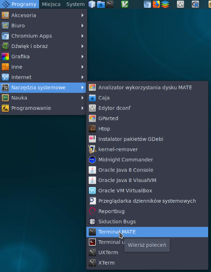

# Podstawy pracy w systemie Linux

## Czym jest i dlaczego właśnie Linux?

Popularnie Linuksem nazywamy system operacyjny oparty na jądrze Linux. Występuje on w niezliczonej liczbie odmian, zwanych dystrybucjami. W większości są one darmowe i dostępne w internecie. Zawierają jądro systemu oraz zestawy oprogramowania, różnią się miedzy innymi systemami obsługi oprogramowania, dostępnym oprogramowaniem w repozytoriach (miejscach w sieci skąd można pobrać programy), ustawieniami domyślnymi, modyfikacjami jądra itp. Pewne pojęcie na temat liczby dystrybucji może dać strona [distrowatch.com](http://distrowatch.com) lub [ilustracja z Wikipedii](https://upload.wikimedia.org/wikipedia/commons/1/1b/Linux_Distribution_Timeline.svg) pokazująca związki między różnymi dystrybucjami. Ta różnorodność, która na początku może zaskakiwać użytkowników innych systemów operacyjnych (a czasem nawet irytować), jest kolejną zaletą Linuksa. Mamy do wyboru nie tylko wiele dystrybucji ale także [środowisk graficznych](https://pl.wikipedia.org/wiki/Graficzny_interfejs_u%C5%BCytkownika) (np. KDE, Gnome, Xfce, LXDE), które można w znacznym stopniu konfigurować według własnych upodobań a nawet [powłok systemowych](https://pl.wikipedia.org/wiki/Pow%C5%82oka_systemowa). Dzięki temu można system dostosować do swoich potrzeb i upodobań, także estetycznych ale także możliwości komputera. 

Linuksa można zainstalować zamiast ale także obok innego systemu operacyjnego (np. Windows). W tym drugim przypadku przy włączeniu komputera pojawia się menu, w którym wybieramy który system załadować. Instrukcja instalacji Linuksa wychodzi poza zakres tego kursu ale bez problemu można znaleźć odpowiednie informacje w internecie. Można także zainstalować Linux jako wirtualny system operacyjny, wtedy otwiera się w naszym głównym systemie jako osobne okienko, w którym pracujemy. Można w taki sposób zainstalować Linuksa pod Windows, Mac OSX czy innym Linuksem. Instrukcja takiej instalacji z użyciem programu VirtualBox znajduje się np. na mojej stronie pod adresem [http://ggoralski.pl/?p=1408](http://ggoralski.pl/?p=1408).


W części praktycznej kursu będę się posługiwał dystrybucją wywodzącą się z Debiana, jednak większość, o ile nie wszystkie przykłady (poza instalacją i aktualizacją oprogramowania) powinny działać na dowolnym Linuksie, pod warunkiem zainstalowania używanego oprogramowania. Jedną z wielu zalet Debiana i dystrybucji pochodnych, które korzystają z jego repozytoriów, jest domyślna dostępność wielu programów bioinformatycznych zgromadzonych w repozytorium Debian Med.


Linux jest podobny do systemu UNIX. Z niego wywodzi się struktura systemu, wiele narzędzi a także ,,filozofia'' pisania programów. To ostatnie jest jednym z powodów, że to środowisko powszechnie stosowane w bioinformatyce. O filozofii Uniksa można poczytać np. w dostępnej online książce [The Art of Unix Programming](http://www.catb.org/~esr/writings/taoup/html/), ale z naszego punktu widzenia zwłaszcza istotne są tu trzy elementy:

  1. Programy nie powinny być ,,kombajnami do wszystkiego'', raczej jeden program wykonywać porządnie jedno zadanie
  2. Programy powinny być pisane tak, aby mogły ze sobą współpracować - wyniki jednego programu można przekierować do drugiego jako dane wejściowe
  3. Programy powinny przyjmować dane i produkować wyniki w formie tekstowej. 

Dlaczego to takie ważne? Dzięki takiemu podejściu do tworzenia programów możemy je traktować jak klocki, które układamy w taki sposób, że każdy z nich wykonuje określone zadanie, przekazuje wynik swojej pracy następnemu, który przerabia go dalej itd. Przykładowo: `program A` gromadzi sekwencje, `program B` je wyrównuje, `program C` tworzy drzewo filogenetyczne a `program D` generuje dendrogram. Programy te można uruchamiać po kolei ręcznie albo automatycznie pisząc odpowiedni skrypt albo łączyć za pomocą potoków (ang. _pipe_). Jeśli w pewnym momencie stwierdzimy, że np. zamiast `programu B` lepiej sprawdzi się `program Z` to po prostu podmieniamy je. Użycie tekstu jako ,,uniwersalnego'' formatu pozwala na łatwą komunikację miedzy tymi programami. Niebawem zobaczymy jak to wszystko działa w praktyce.

Taki sposób pracy wiąże się zwykle z pracą w terminalu. Co prawda większość dystrybucji zaopatrzona jest w interfejs graficzny (i to w różnych odmianach) oraz oferuje szeroką gamę ,,okienkowych'' aplikacji, także bioinformatycznych ale wiele zadań, co może się wydawać na początku dziwne, zwyczajnie łatwiej i szybciej wykonuje się używając linii komend. Oczywiście nie zawsze tak jest, w niektórych przypadkach, np. przy obróbce dendrogramów, czy ręcznym poprawianiu dopasowania sekwencji, wygodniej i efektywniej pracuje się w aplikacjach z interfejsem graficznym. Na naszych zajęciach, będziemy używać obu sposobów pracy, jednak z naciskiem na pracę w terminalu. Otwórz zatem terminal. W zależności od dystrybucji, środowiska i środowiska graficznego odpowiedni program można znaleźć w różnych miejscach menu (np. Programy->Narzędzia systemowe->Terminal MATE). Mamy też do dyspozycji różne programy, które udostępniają użytkownikowi terminal pod interfejsem graficznym, ich nazwy zazwyczaj zawierają w sobie `Terminal` lub `Term`, np. `Terminal MATE`, `XTerm`. Niektóre z nich mają dodatakowe ułatwienia, np. obsługują wiele zakładek. W każdym razie sugeruję aby od razu po odnalezieniu programu, z którego będziesz korzystać od razu umieścić do niego skrót na pulpicie lub panelu.   



## Powłoki systemowe

Otwarte okno z terminalem (ściśle rzecz biorąc jest to emulator terminala) wygląda mniej więcej tak:


Po otwarciu okna z terminalem zauważysz znak zachęty, który w zależności od konfiguracji może wyglądać np tak (w katalogu domowym):

```
user@nazwakomputera:~$
```

Albo prościej:

```
$:
```

czy np:

```
~
```

To jak wygląda można dość dowolnie modyfikować. Często znajduje się tam nazwa bieżącego katalogu, albo cała ścieżka do niego. Dla uproszczenia przyjmiemy, że wygląda tak:

```
$:
```

Więcej na temat znaków zachęty i możliwości ich ustawiania można przeczytać np. [tu](https://www.cyberciti.biz/tips/howto-linux-unix-bash-shell-setup-prompt.html)

Po znaku zachęty widzimy zwykle migający kursor.

Poniżej będę pokazywał komendy i ich wynik w terminalu. To co nie jest poprzedzone znakiem zachęty będzie wydrukiem generowanym przez polecenia.

W terminalu uruchomiona jest **powłoka systemowa** (ang. _shell_). Jest to program pełniący rolę pośrednika pomiędzy użytkownikiem i systemem operacyjnym oraz innymi programami. Ogólnie powłoki można podzielić na graficzne (ang. GUI - _Graphical User Interface_) oraz tekstowe (ang. CLI - _Command Line Interface_). Teraz zajmiemy się tymi drugimi. 

Powłoki tekstowe, jak nazwa wskazuje, przyjmują polecenia od użytkownika i zwracają wyniki działania programów (zazwyczaj) w trybie tekstowym. W Linuksie dostępnych jest (domyślnie bądź po doistalowaniu) wiele powłok (znów ta różnorodność!), np. bash, zsh, ksh, sh, fish. Bash jest zwykle domyślnie zainstalowany i uruchamiany w terminalu, zatem będę się na nim opierał. Jednak warto zaznaczyć, że często zalecany jest zsh, zwłaszcza po doinstalowaniu [oh-my-zsh](https://github.com/robbyrussell/oh-my-zsh). Udostępnia on wiele ułatwień. Podane przeze mnie przykłady powinny także działać pod zsh.

## Konsola, katalogi, pliki, uprawnienia - pierwsze starcie

W Linuksie system plików tworzy jedno wielkie drzewo, które zaczyna się w katalogu głównym (ang. _root directory_), oznaczanym jako `/`. Pod tym względem przypomina nieco drzewo filogenetyczne ;-). Jest to jedna z wielu różnic między systemami uniksopodobnymi a Windows, gdzie każdy dysk (i partycja) stanowi osobną jednostkę i jest częścią pełnej ścieżki, którą podajemy, np:

  * ścieżka w systemie Windows: `C:\Documents and Settings\student\Moje dokumenty`
  * ścieżka w systemie Linux: `/home/student/Dokumenty`
 
W powyższych przykładach widać też różnicę w znaku oddzielającym katalogi: w Windows jest to `\`, w Linuksie `/`.

Gdzie zatem znajdują się w drzewie katalogu dodatkowe dyski i partycje? Są one widoczne jako katalogi. Można je zamontować w zasadzie w dowolnym miejscu, na przykład jako podkatalogi w folderze domowych użytkownika.

Nazywając katalogi i pliki warto trzymać się kilku zasad:

  *  Nie używać spacji. Technicznie można używać spacji w nazwach katalogów i plików, ale zwłaszcza jeśli mamy zamiar pracować w terminalu lepiej tego unikać, ponieważ może to powodować komplikacje. Można je co prawda zwykle obejść ale... po co komplikować sobie pracę? Zatem, lepiej trzymać się zasady: **w nazwach katalogów i plików nie używamy spacji**. 
  * Jeśli nazwa zawiera wiele słów, można je oddzielić bp. znakami `_` czy `-`. Na przykład: `Wyniki_badan`, `atp1-Rumex.fasta`. W nazwach dobrze jest też unikać polskich znaków. 
  * Wielkość liter ma znaczenie: `atp1.fasta`, `ATP1.fasta` i `atp1.FASTA` to różne nazwy plików.

Teraz czas na trochę praktyki.

W terminalu wpisz komendy:

```
$: cd /
$: ls
```

`cd` oznacza ,,idź do katalogu'' a `/` oznacza katalog główny. 
`ls` drukuje katalogi i pliki znajdujące się w danym folderze. Jeśli po tym poleceniu podamy ścieżkę, np. `ls /var/log` otrzymamy listę elementów znajdujących się we wskazanym katalogu.

Powinniśmy zobaczyć taki (lub podobny) wynik:

```
bin   dev  home        initrd.img.old  lib64       media  opt   root  sbin  sys  usr  vmlinuz
boot  etc  initrd.img  lib             lost+found  mnt    proc  run   srv   tmp  var  vmlinuz.old
```

To są katalogi i pliki systemowe. Mają one swoje [konkretne przeznaczenie](https://pl.wikibooks.org/wiki/Linux/System_plików/Drzewo_katalogów). Na razie będzie nas interesować katalog `home`, przejdź zatem tam i sprawdź co tam się znajduje:

```
$: cd home
$: ls
```

Wynik może wyglądać różne w zależności jakie konta użytkownika znajdują się na komputerze, na przykład tak:

```
alicja grzeg krzysztof student
```

To są katalogi domowe użytkowników, którzy mają konta na tym systemie. Jest jeszcze jeden użytkownik: `root`. Jest on panem i władcą całego systemu i może WSZYSTKO (no, prawie wszystko). Jego katalog domowy znajduje się w katalogu głównym. Początkujący użytkownicy Linuksa mają często pokusę aby po prostu logować się jako `root` i pracować na tym koncie. To jednak nie jest, delikatnie mówiąc, najlepszy pomysł. Głównie z powodów bezpieczeństwa. Lepiej przyjąć zasadę, że nawet jeśli jesteś jedynym użytkownikiem systemu, tworzysz dla siebie konto ,,normalnego'' użytkownika a z konta `roota` korzystasz tylko wtedy, gdy jest konieczne, np. przy instalacji pakietów, aktualizacji systemu, czy zakładaniu kont nowym użytkownikom. Prawdę mówiąc, zwykle nawet w takich przypadkach nie jest konieczne bezpośrednie logowanie się na konta, lecz korzysta się z narzędzi takich jak `sudo`, które pozwalają uruchomić program z prawami `roota`.

Dalej zakładamy, że Twoje konto to `student` i na nim będziemy pracować.

Najpierw spróbujmy wejść do katalogu innego użytkownika:

```
$: cd grzeg
```

Okazuje się, że się nie da:

```
bash: cd: grzeg: Brak dostępu
```

I bardzo słusznie :-)

Zobaczmy z czego to wynika, używając komendy `ls` z dodatkową opcją (inaczej **flagą**) `-l`. Oznacza ona wyświetlanie dodatkowych informacji:

```
$: ls -l

razem 12
drwx------ 56 grzeg     grzeg     4096 gru  6 19:46 grzeg
drwx------ 16 krzysztof krzysztof 4096 lis 21 19:35 krzysztof
drwx------ 15 student   student   4096 gru  6 18:29 student
```

Nie będę omawiał szczegółowo wszystkich wyświetlanych informacji, skupię się na tych najistotniejszych z punktu widzenia kursu.

Na początku każdej z linii przyporządkowanej do katalogu znajduje się taki zestaw znaków:

`drwx------`

Litera `d` oznacza, że mamy do czynienia z katalogiem, ,,zwykły'' plik będzie tam miał znak `-`.

Kolejne litery należy odczytywać trójkami, oznaczają one bowiem uprawnienia kolejno dla:

  * użytkownika, który jest właścicielem pliku/katalogu, 
  * innych członków grupy do której należy właściciel (użytkowników można łączyć w grupy)
  * wszystkich pozostałych

A teraz zobaczmy co oznaczają kolejne litery w każdej trójce:

  * `r` - prawo odczytu
  * `w` - prawo zapisu/modyfikacji/usuwania 
  * `x` - dla pliku: prawo do uruchamiania, dla katalogu: prawo do wejścia do katalogu

Jeśli w danym miejscu zamiast litery znajduje się znak `-`, oznacza to brak danego uprawnienia.

Zatem ciąg znaków: `drwx------` możemy odczytać tak:

  * `d`: jest to katalog
  * `rwx`: właściciel może go odczytać, modyfikować i wejść do niego, 
  * `---`: członkowie grupy nie mogą go ani odczytać ani modyfikować ani wejść do niego
  * `---`: inni też nie mogą go ani odczytać ani modyfikować ani wchodzić do niego

Teraz staje się jasne, dlaczego będąc użytkownikiem `student` nie można wejść do katalogu użytkownika `grzeg` - może to zrobić tylko sam właściciel. Do uprawnień i ich modyfikacji jeszcze wrócimy.

Co oznaczają dalsze pola? Liczby pomijamy, następnie znajduje się nazwa użytkownika - właściciela i nazwa grupy (tu jest to grupa o nazwie takiej jak właściciel). Kolejna liczba określa wielkość elementu, w przypadku katalogu nie jest to wielkość wszystkich elementów, które zawiera. Następnie mamy datę ostatniej modyfikacji (utworzenia, modyfikacji, zapisu). W końcu widać nazwę elementu.

Przejdźmy teraz do katalogu domowego użytkownika `student` i sprawdźmy co tam się znajduje:

```
$: cd student
$: ls
Desktop  Dokumenty  Muzyka  Obrazy  Pobrane  Publiczny  Szablony  Wideo
```
Są to standardowe katalogi użytkownika tworzone przy pierwszym logowaniu. W zależności od dystrybucji i ustawień mogą być inne od powyższych.

Teraz użyjmy opcji `-a` (jak _all_ - wszystkie)

```
$: ls -a
.              .bash_logout  .config  Dokumenty   .gitignore     .inputrc  Obrazy    Publiczny  .Xauthority
..             .bashrc       Desktop  .gconf      .gnupg         .local    Pobrane   Szablony   .xsession-errors
.bash_history  .cache        .dmrc    .gitconfig  .ICEauthority  Muzyka    .profile  Wideo
```

Jak widać lista plików znacznie się powiększyła. Pojawiły się katalogi i pliki (sprawdź komendą `ls -la` co jest czym), których nazwy zawierają na początku kropkę. Są to elementy ukryte, które domyślnie się nie wyświetlają. Zazwyczaj są to pliki konfiguracyjne, albo katalogi zawierające pliki konfiguracyjne. Najbardziej zagadkowe mogą się wydawać katalogi `.` oraz `..`. Pierwszy z nich oznacza tyle co ,,bieżący katalog'' a drugi ,,nadrzędny katalog'' (w tym wypadku `/home`). Używanie tych ,,kropkowych'' oznaczeń katalogów jest bardzo wygodnie. Jeśli chcesz przejść do katalogu powyżej, wcale nie musisz pamiętać jak się nazywa, po prostu piszesz: `cd ..`. Można też wykorzystać je przy innych operacjach np. kopiowaniu czy przenoszeniu plików i katalogów. 

Przy okazji ważna uwaga. Większość komend, których będziemy używać posiada (choć np. `cd` nie) swoje manuale, które można wywołać poleceniem `man komenda`. Tam można znaleźć np. dostępne opcje. Często dostępna też jest krótsza pomoc przy użyciu opcji `-h` lub `--help`, choć trzeba pamiętać, że `-h` może też mieć inne znaczenie w niektórych programach.

Sprawdź `man ls`. Dowiedz się do czego służy opcja `-h` i jak posortować listę plików/folderów według czasu ich modyfikacji. 

Z manuala można wyjść używając klawisza `q`. 

Kolejna przydatna komenda to `pwd` - wyświetla ona ścieżkę do miejsca, w którym się znajdujemy:

```
$: pwd
/home/student
```

Jeśli chcemy szybko przenieść się do swojego katalogu domowego z dowolnego miejsca, nie musimy wpisywać pełnej ścieżki. Możemy użyć znaku `~`. Wykonaj kolejno polecenia:

```
$: cd ..
$: pwd
$: cd ..
$: pwd
$: cd ~
$: pwd
```

Ścieżki typu `/home/student/Dokumenty` są ścieżkami **absolutnymi** (bezwzględnymi), używając ich wskazujemy zawsze to samo miejsce w drzewie katalogów. Innym rodzajem ścieżek, są ścieżki **względne**, które mogą wskazywać różne miejsca w zależności od tego gdzie aktualnie się znajdujemy w linii poleceń. Prostym przykładem jest `..`, czyli ,,katalog wyżej'', ale mogą to być bardziej złożone ścieżki, np. polecenie: `cd ../../RESULTS/` oznacza ,,idź do katalogu wyżej, idź do katalogu wyżej, idź do katalogu RESULTS''. Takie ścieżki są przydatne na przykład wtedy, kiedy łatwiej jest nam określić docelowy katalog z bieżącego miejsca położenia, niż z uwzględnieniem całej ścieżki, albo gdy posługujemy się pewnym zestandaryzowanym układem podkatalogów (także w projektach bioinformatycznych).

Kolejnym przydatnym ,,skrótowcem'' jest znak `-` używany razem z komendą `cd`. Oznacza on ,,katalog w którym byłem poprzednio''. Spróbuj:

```
$: cd /
$: pwd
$: cd -
$: pwd
```

## Tworzenie plików i katalogów

Teraz w katalogu domowym stwórz nowy katalog:

```
$: mkdir Proba
```

`mkdir` to polecenie utworzenia nowego katalogu, po którym podaje się jego nazwę.

Sprawdźmy czy się udało:

```
$: ls
Desktop  Dokumenty  Muzyka  Obrazy  Pobrane  Proba  Publiczny  Szablony  Wideo
```

Przejdź do nowoutworzonego katalogu:

```
$: cd Proba
```

Wyświetl tekst na ekranie, służy do tego komenda `echo`:

```
$: echo "Witaj świecie!"
Witaj świecie!
```

Utwórz plik tekstowy i sprawdź czy się pojawił:

```
$: touch nowy_plik.txt
$ ls
nowy_plik.txt
```

Komenda `touch` tworzy plik, który jest na początku pusty. 

## Umieszczanie tekstu w plikach z linii komend

Umieśćmy więc w nim jakiś tekst:

```
$: echo "Witaj świecie!" > nowy_plik.txt
```

Operator `>` po komendzie przekazuje tekst generowany przez tą komendę (strumień) do pliku tekstowego. Sprawdźmy zatem, jaka jest zawartość pliku `nowy_tekst.txt`. Można do tego użyć edytora tekstu, ale na razie pozostańmy przy linii komend. Żeby zobaczyć zawartość pliku tekstowego można użyć kilku komend,  np. `more`, `less` (która o dziwo [może więcej niż `more`](https://unix.stackexchange.com/questions/604/isnt-less-just-more)) czy `cat`. Dwie pierwsze komendy przy dłuższych plikach są wygodniejsze, pozwalają łatwiej poruszać się po tekście, ostatnia po prostu drukuje zawartość pliku w terminalu. Przy jednolinijkowym pliku jednak nie zauważysz różnicy.

```
$: more nowy_plik.txt 
Witaj świecie!
```

Teraz coś dopiszmy do pliku:

```
$: echo "Żegnaj okrutny świecie..." >> nowy_plik.txt 
$: more nowy_plik.txt 
Witaj świecie!
Żegnaj okrutny świecie...
```

Zauważ, że tym razem użyliśmy operatora `>>`. Co się stanie jeśli ponownie użyjemy znaku `>`?

```
$: echo "...albo może jednak nie żegnaj :-)" > nowy_plik.txt 
$: more nowy_plik.txt 
...albo może jednak nie żegnaj :-)
```

Jak widać, użycie pojedynczego znaku `>` spowodowało wymazanie poprzedniej zawartości pliku. Trzeba o tym pamiętać, ponieważ łatwo o pomyłkę - możemy chcieć dopisać coś do pliku a przez użycie `>` zamiast `>>` skasujemy całą poprzednią zawartość. Ma to znaczenie zwłaszcza przy pisaniu skryptów. 

Co się stanie jeśli spróbujemy przekierować tekst do nieistniejącego pliku?

```
$: echo "Witaj Wszechświecie!" > nieistniejący_plik.txt
$: more nieistniejący_plik.txt 
Witaj Wszechświecie!
```

Jak widać w powyższym przykładzie nie było konieczne użycie poprzednio komendy `touch`. Jeśli plik nie istnieje, jest on tworzony.

Możemy też skierować strumień (danych) z pliku do polecenia, które jest w stanie go przetworzyć, używając znaku `<`:

```
$: echo "aaaa" > tekst.txt
$: more < tekst.txt 
aaaa
```

## Automatyczne uzupełnianie w terminalu

Czas na poznanie pewnego triku. Konsola potrafi nam ułatwić wpisywanie komend podpowiadając to co możemy wpisać. Wystarczy wpisać część komendy lub nazwy pliku a reszta zostaje dopełniona po naciśnięcia klawisza `<Tab>`. Na przykład wpiszemy `more nie`, naciśniemy `<Tab>`, w linii komend pojawi się pełna nazwa pliku. Jeśli istnieje wiele możliwości dopełnienia komendy czy nazwy pliku, zostaną podane istniejące możliwości. Oczywiście plik czy komenda musi istnieć, komputer nie zgadanie co mamy na myśli ;-) 
Jest to bardzo wygodne zwłaszcza, gdy podajemy jako argumenty nazwy długich plików, które co gorsza niekoniecznie pamiętamy. Aby to sprawdzić stwórz plik `plik_o_bardzo_długiej_i_skomplikowanej_nazwie-0001x7q.txt`, umieść w nim jakiś tekst i wyświetl jego zawartość. Jedynie przy pierwszej komendzie będziesz musiał wpisać pełną nazwę pliku.

## Kopiowanie tekstu z pliku do pliku

Teraz spróbujemy skopiować zawartość plików `nowy_plik.txt` i `nieistniejący_plik.txt` do kolejnego pliku:

```
$: cat nowy_plik.txt nieistniejący_plik.txt > kolejny_plik.txt
$: more kolejny_plik.txt 
...albo może jednak nie żegnaj :-)
Witaj Wszechświecie!
```

Zauważ, że komenda `cat` przyjęła jako argumenty dwie nazwy plików a ich zawartość została przez nią skierowana do trzeciego pliku. Podobnie można postępować z wieloma innymi komendami odwołującymi się do plików czy katalogów.

Na razie może to wyglądać na niespecjalnie użyteczne sztuczki, ale niebawem okaże się, że są one bardzo przydatne w bioinformatyce.

## Kopiowanie i zmiana nazwy plików i katalogów

Kolejne dwie komendy przydatne w pracy z katalogami i plikami to `cp` i `mv`.

`cp` służy do kopiowania, w przypadku katalogów należy użyć opcji `-r`
`mv` pozwala na zmianę nazwy, bądź przeniesienie plików i katalogów. Flaga `-r` jest konieczna dla folderów, które nie są puste:

```
$: mkdir Nowy_katalog
$: touch Nowy_katalog/plik.txt
$: cp Nowy_katalog/plik.txt Nowy_katalog/skopiowany_plik.txt
$: cp Nowy_katalog Kopia_katalogu
cp: nie podano opcji -r, katalog 'Nowy_katalog' został pominięty
$: cp -r Nowy_katalog Kopia_katalogu
$: mv Kopia_katalogu Zmieniony_katalog
$: mv Zmieniony_katalog/plik.txt Zmieniony_katalog/zmieniony_plik.txt
$: mv Zmieniony_katalog/zmieniony_plik.txt .
```

## Znaki wieloznaczności

Znaki wieloznaczności (ang. _wildcards_) są bardzo pomocne jeśli chcemy jednocześnie dokonać jakichś operacji na wielu plikach albo gdy dokładna nazwa nie musi być podana. Zobaczmy na przykładzie jak to działa:

Wykonaj polecenia:

```
$: mkdir Wildcards
$: cd Wildcards/
$: touch plik.txt plik1.txt plik2.txt plik22.txt plik1.md plik.txt
$: ls 
$: ls *
$: ls *.txt
$: ls plik.*
$: ls plik1.*
$: ls plik?.*
$: ls plik??.*
$: ls plik*.*
$: rm *.txt
$: ls
```

Przyjrzyj się wynikom komend, zastanów się jakie znaczenie mają znaki `*` i `?`. 

Sesja powinna wyglądać tak:

```
$: mkdir Wildcards
$: cd Wildcards/
$: touch plik.txt plik1.txt plik2.txt plik22.txt plik1.md plik.txt
$: ls 
plik1.md  plik1.txt  plik22.txt  plik2.txt  plik.txt
$: ls *
plik1.md  plik1.txt  plik22.txt  plik2.txt  plik.txt
$: ls *.txt
plik1.txt  plik22.txt  plik2.txt  plik.txt
$: ls plik.*
plik.txt
$: ls plik1.*
plik1.md  plik1.txt
$: ls plik?.*
plik1.md  plik1.txt  plik2.txt
$: ls plik??.*
plik22.txt
$: ls plik*.*
plik1.md  plik1.txt  plik22.txt  plik2.txt  plik.txt
$: rm *.txt
$: ls
plik1.md
```

Jak widać znak `*` oznacza ,,jakakolwiek liczba (także 0) jakichkolwiek znaków'' a znak `?` oznacza ,,jakikolwiek jeden znak''. Można ich używać z wieloma poleceniami operującymi na plikach i katalogach, mają one także dużo szersze zastosowanie o czym będzie jeszcze mowa. 


## Usuwanie plików i katalogów

Wiemy już jak utworzyć plik i folder, czas dowiedzieć się jak je usunąć. Do usuwania służy komenda `rm`:

```
$: rm kolejny_plik.txt
$: ls
nieistniejący_plik.txt  nowy_plik.txt
```

Teraz spróbujemy usunąć katalog:

```
$: cd ..
$: rm Proba
rm: nie można usunąć 'Proba': Jest katalogiem
```

Jak widać tu też trzeba użyć opcji `-r`:

```
$: rm -r Proba
$: ls
Desktop  Dokumenty  Muzyka  Obrazy  Pobrane  Publiczny  Szablony  Wideo
``` 

## Jeszcze o tworzeniu plików i katalogów

Czasem chcemy otworzyć katalog od razu z podkatalogiem, wtedy przy komendzie `mkdir` używamy opcji `-p`:

```
$: mkdir -p BADANIA/Rumex/DANE
$: tree BADANIA
BADANIA
└── Rumex
    └── DANE
```

Komenda `tree` pokazuje zawartość katalogu w formie drzewa (spróbuj `tree ~`). Może nie być zainstalowana w systemie, wtedy trzeba ją doinstalować (dla Debiana i pochodnych dystrybucji: `sudo apt-get install tree`).

A co jeśli chcemy stworzyć jeszcze kilka podkatalogów za jednym razem? 

```
$: rm -r BADANIA
$: mkdir -p BADANIA/Rumex/{DANE/sekwencje,INFORMACJE,ANALIZY}
$: tree BADANIA
BADANIA
└── Rumex
    ├── ANALIZY
    ├── DANE
    │   └── sekwencje
    └── INFORMACJE
```

## Pobieranie plików z linii komend

Wpisz w przeglądarce adres:

`http://ggoralski.pl/files/filogenetyka-data/Orobanchaceae-trnL-trnF-aligned.fasta`

Pokaże się plik z wyrównanymi sekwencjami w formacie `FASTA` (który omawiałem w części teoretycznej w lekcji [Podstawy filogenetyki](../wyklady/02-Podstawy_filogenetyki.md)).

Gdybyśmy chcieli pobrać ten plik, można by użyć odpowiedniej opcji z menu przeglądarki pozwalającej zapisać stronę. Ale jest to dobry przykład, żeby poznać sposoby pobierania plików z linii komend. Do najczęściej stosowanych w tym celu programów należą `curl` i `wget`.

Stwórz katalog `Pobieranie` a następnie wykonaj komendę:

```
$: curl http://ggoralski.pl/files/filogenetyka-data/Orobanchaceae-trnL-trnF-aligned.fasta
```

W oknie terminala pokaże się zawartość pliku. Jeśli chcemy go zapisać trzeba ją przekierować do pliku:

```
$: curl http://ggoralski.pl/files/filogenetyka-data/Orobanchaceae-trnL-trnF-aligned.fasta > sekwencje.fasta
  % Total    % Received % Xferd  Average Speed   Time    Time     Time  Current
                                 Dload  Upload   Total   Spent    Left  Speed
100  9254  100  9254    0     0   9254      0  0:00:01 --:--:--  0:00:01 73444
$: ls
sekwencje.fasta
```

Sprawdź komendą `more` zawartość utworzonego pliku

Teraz użyjemy `wget`:

```
$: wget http://ggoralski.pl/files/filogenetyka-data/Orobanchaceae-trnL-trnF-aligned.fasta
--2017-12-16 15:51:06--  http://ggoralski.pl/files/filogenetyka-data/Orobanchaceae-trnL-trnF-aligned.fasta
Translacja ggoralski.pl (ggoralski.pl)... 87.98.239.3
Łączenie się z ggoralski.pl (ggoralski.pl)|87.98.239.3|:80... połączono.
Żądanie HTTP wysłano, oczekiwanie na odpowiedź... 200 OK
Długość: 9254 (9,0K)
Zapis do: `Orobanchaceae-trnL-trnF-aligned.fasta'

Orobanchaceae-trnL-trnF 100%[==============================>]   9,04K  --.-KB/s     w 0,003s  

2017-12-16 15:51:06 (2,56 MB/s) - zapisano `Orobanchaceae-trnL-trnF-aligned.fasta' [9254/9254]

$: ls -l
razem 28
-rw-r--r-- 1 grzeg grzeg 9254 gru 16 15:34 Orobanchaceae-trnL-trnF-aligned.fasta
-rw-r--r-- 1 grzeg grzeg 9254 gru 16 15:50 sekwencje.fasta
```

Jak widać jedną z różnic pomiędzy oboma programami jest to, że `curl` domyślnie wyświetla zawartość pobieranego pliku w terminalu a `wget` zapisuje go pod oryginalną nazwą. O innych różnicach można poczytać np. [tu](https://daniel.haxx.se/docs/curl-vs-wget.html) albo w manualach i pomocy (`man curl`, `man wget`, `curl -h`, `wget -h`).


