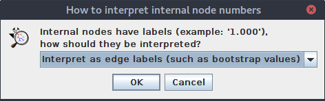
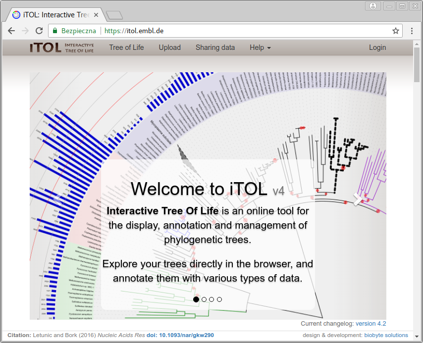
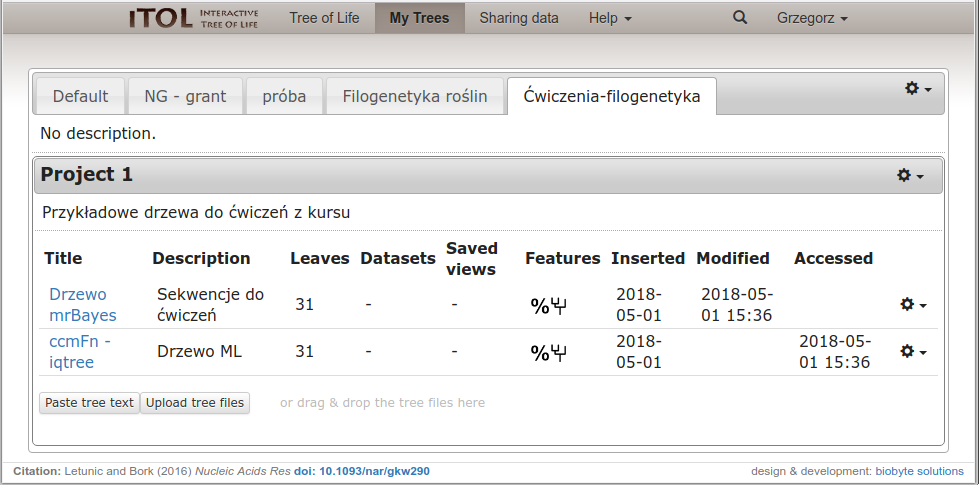
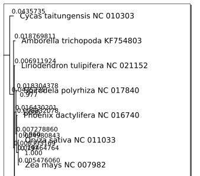

# Wizualizacja drzew filogenetycznych

## Uwagi ogólne

Wygenerowane drzewa należy odpowiednio zwizualizować, tak aby w czytelny sposób pokazały wyniki badań. Poniżej krótko scharakteryzuję kilka wybranych (subiektywnie) programów, o różnych możliwościach i sposobie użytkowania, które można wykorzystać w tym celu. Nieco dłużej zatrzymam się na dostępnym przez przeglądarce narzędziu `iTOL`. Warto jednak samemu sprawdzić dokładniej dostępne opcje i możliwości każdego z nich.

Szerszą listę można znaleźć np. [na Wikipedii](https://en.wikipedia.org/wiki/List_of_phylogenetic_tree_visualization_software).

## Etapy wizualizacji drzew

Każdy program generuje dendrogram w formie domyślnej, która rzadko odpowiada temu co chcemy osiągnąć. Zwykle zatem dopasowujemy wygląd drzewa posługując się funkcjami oferowanymi przez program. Do najczęściej stosowanych modyfikacji należą:

  * wybór typu drzewa (filogram, dendrogram)
  * wybór wyglądu drzewa (prostokątny, trójkątny, kołowy, radialny...)
  * dopasowanie wyświetlanych wartości i ich formatu (boostrap, prawdopodobieństwo _aposteriori_, długość gałęzi...)
  * ukorzenianie drzewa
  * obracanie gałęzi
  * łączenie gałęzi (np. poniżej określonej wartości bootstrap)
  * ustalenie wielkości i proporcji drzewa (wysokość i szerokość)
  * umieszczenie nazw liści na końcach gałęzi lub wyrównanie ich w kolumnie
  * korekta nazw liści
  * dopasowanie innych aspektów wizualnych (wielkość i rodzaj czcionki, grubość i kolor gałęzi...)
  * zaznaczanie kladów i innych części drzew
 
Programy do wizualizacji drzew w różnym stopniu pozwalają na wykonanie powyższych czynności, zatem dobór programu zależy m. in. od tego w jakim stopniu drzewo zamierzamy modyfikować. Często chcemy jeszcze dokonać dodatkowej edycji drzewa w sposób, który nie jest możliwy z poziomu używanego programu albo na przykład ułożyć kilka drzew w postaci jednej ilustracji. W takim przypadku warto zapisać drzewo w formacie graficznym `SVG` lub `PDF` a następnie otworzyć w programie służącym edycji grafiki wektorowej (np. darmowym [`Inkscape`](https://inkscape.org)) i dokonać dalszych poprawek. Oczywiście nie mogą one zmieniać drzewa w sposób, który prowadziłby do zafałszowania wyników badań.

W tym miejscu warto poświęcić kilka słów na temat formatów graficznych w których możemy zapisywać drzewo. Formaty plików przechowujących grafikę, można podzielić na dwie podstawowe kategorie: [grafikę rastrową](https://pl.wikipedia.org/wiki/Grafika_rastrowa) i [grafikę wektorową](https://pl.wikipedia.org/wiki/Grafika_wektorowa). Każda z nich ma swoje zalety i wady. Nie wchodząc w szczegóły, generalnie w przypadku obrazów składających się z kształtów, które można sprowadzić do figur geometrycznych, jak drzewa filogenetyczne, lepiej stosować grafikę wektorową, ponieważ jest ona skalowalna (przy powiększaniu nie ma zjawiska ,,pikselozy'') oraz łatwiej można ją modyfikować. Wspomniane powyżej formaty `SVG` i `PDF` to właśnie formaty grafiki wektorowej. Sugeruję zawsze zapisać drzewo w formacie wektorowym, jeśli tego potrzebujemy to także w jednym z formatów rastrowych (`jpg`, `png`, `tiff`...), przy czym należy pamiętać, że programy do grafiki wektorowej (np. `Inkscape`, `Ilustrator`, `CorelDraw`) mają funkcje eksportu do grafiki rastrowej. Zmiana formatu w drugą stronę jest dużo bardziej skomplikowana.

## Wybrane programy do wizualizacji drzew filogenetycznych 

## FigTree

Strona domowa: [http://tree.bio.ed.ac.uk/software/figtree/](http://tree.bio.ed.ac.uk/software/figtree/)

Z programem `FigTree` spotkaliśmy się w poprzednim rozdziale. Do zalet należą: dość prosty i czytelny interfejs, spore możliwości dopasowania wyglądu drzewa, odczyt złożonego formatu plików generowanych przez program `MrBayes`, eksport do kilku formatów zapisu drzewa (`NEXUS`, `Newick` `JSON`).


## Dendroscope

Strona domowa: [http://http://dendroscope.org](http://dendroscope.org)

`Dendroscope` to również program desktopowy. Przy otwieraniu pliku z drzewem pokazuje się okienko z zapytaniem o sposób interpretacji wartości przypisanych do węzłów, są to zwykle wartości bootstrap lub prawdopodobieństw, w taki wypadku należy wybrać opcję ,,Interpret as edge labels (such a bootstrap values)''.



Program oferuje wiele możliwości ustawienia typu i wyglądu drzewa, sposobu jego wyświetlania a także edycję nazw liści. Jest także sporo dostępnych formatów zapisu drzew (w formie plików tekstowych) oraz dendrogramów.


## iTOL

Strona domowa: [http://itol.embl.de](http://itol.embl.de)

Kolejne narzędzie, które przedstawię to `iTOL`. Nazwa jest skrótem od _Interactive Tree of Life_. W przeciwieństwie do poprzednich, jest obsługiwany przez przeglądarkę internetową. Posiada wiele możliwości modyfikacji wyglądu drzew, ich opisywania a także po założeniu konta, można gromadzić i organizować online własne drzewa filogenetyczne. Można te także udostępniać publicznie. Poświęcę mu nieco więcej uwagi.

Po wejściu na witrynę [http://itol.embl.de](http://itol.embl.de) pokazuje się strona główna programu:



Na górze znajduje się pasek nawigacyjny. Po kliknięciu na ,,Tree of Life'' pokazuje się, jak nazwa wskazuje, ,,drzewo życia'', zawierające organizmy z różnych gałęzi ewolucyjnych. Domyślnie otwierają się także trzy okienka z różnymi opcjami pozwalającym na modyfikację drzewa. Ma ono charakter interaktywny, np. po najechaniem kursora na takson, pojawia się okienko z informacjami na jego temat, łącznie ze zdjęciem i linkami do dodatkowych informacji.


Drzewo życia daje dość dobry podgląd na możliwości `iTOL`. Poeksperymentuj z różnymi ustawieniami wyświetlania drzewa. Drzewo można zapisać w formacie `SVG` w zakładce `Export` w okienku `Controls`.

Warto też zajrzeć w galerię drzew (_Tree gallery_) znajdującą się w menu `Help`. Znajdują się tam przykłady różnych form drzew utworzonych przez użytkowników,

Pozycja ,,Upload'' otwiera stronę na której możemy załadować z pliku, lub wkleić drzewo (zawartość pliku tekstowego z drzewem), które chcemy zwizualizować. Zanim zdecydujemy się na to, warto przeczytać ostrzeżenia, które tam się znajdują. Nasze drzewo będzie publicznie dostępne i każdy będzie mógł je zmodyfikować. Jeśli zamierzamy pracować w `iTOL` to zdecydowanie lepszą opcją jest utworzenie tam prywatnego konta. W tym celu wybieramy ,,Login'' i dalej link ,,create a personal iTOL account'' znajdujący się na górze lub ,,please register first'' na dole strony.
Tam znajdziemy standardowy formularz. 

Po utworzeniu konta możemy się zalogować. Na pasku menu pojawia się link ,,My Trees'' prowadzący do strony umożliwiającej załadowanie własnych drzew i ich organizację.



Po kliknięciu w link prowadzący do drzewa zostajemy przekierowani do strony edycji. Po lewej znajduje się okno z narzędziami.


Zwykle domyślny widok drzewa nie jest satysfakcjonujący. Jeśli wolisz, żeby nazwy taksonów wyświetlały się na końcu gałęzi kliknij w okienku narzędziowym na opcję ,,At tips'' w ustawieniach ,,Labels'' (zakładka ,,Basic'').

Aby ukorzenić drzewo, należy kliknąć w wybraną gałąź prowadzącą do outgrupy a następnie w okienku, które się pojawi wybrać ,,Tree structure'' -> ,,Reroot the tree here''. Przy okazji zwróć uwagę na inne opcje pozwalające na modyfikację gałęzi.


Domyślnie nie wyświetlają się wartości bootstrap/prawdopodobieństw. Aby to zmienić wybierz w oknie narzędzi zakładkę ,,Advanced'', kliknij w linii ,,Bootstraps / metadata'' na ,,Display'' a następnie poniżej na ,,Text''. Teraz możesz ustawić parametry tekstu dla tych wartości (wielkość, miejsce, zaokrąglanie) a także zakres wyświetlanych wartości. 


To oczywiście tylko niewielka część możliwości modyfikacji wyglądu drzewa oferowanych przez `iTOL`. Warto spędzić trochę czasu aby poznać bliżej to narzędzie.

Kiedy wygląd drzewa będzie (przynajmniej z grubsza) odpowiadał naszym oczekiwaniom, pobieramy plik w formacie `SVG` w zakładce export (wybierz opcję ,,Full image''). Dendrogram zwykle trzeba jeszcze dopracować, zwłaszcza przesunąć skalę i dopasować wielkość obrazka do drzewa. Jak wspomniałem wcześniej można do tego użyć np. `Inkscape`.

### Poprawki dendrogramu w Inkscape

Po otwarciu pliku w `Inkscape`, drzewo wygląda mniej więcej tak:


Wykonamy teraz dwie operacje: przesuniemy skalę na dół drzewa a następnie dopasujemy stronę do obrazka.

Rysunek wektorowy składa się z ,,obiektów'' (figur, liter itd), które domyślnie są ze sobą zgrupowane. Zaczniemy więc od ich rozdzielenia. Kliknij na drzewo tak aby rysunek był zaznaczony, następnie wybierz z menu ,,Obiekt'' -> ,,Rozdziel grupę''.
 Teraz można osobno zaznaczyć skalę i drzewo. Gdybyś chciał zmodyfikować poszczególne elementy drzewa, np. zmienić opisy taksonów czy skrócić korzeń, należy proces rozdzielania grupy (drzewa) prowadzić wielokrotnie aż do uzyskania poszczególnych obiektów. Łatwiej to zrobić używając skrótu klawiszowego `Shift+Ctrl+G`.

 Skalę możesz teraz przeciągnąć w odpowiednie miejsce, np. w lewy dolny róg obrazka.


Teraz wybierz z menu ,,Plik'' -> ,,Właściwości dokumentu''. Pojawi się okno w którym m. in. możemy ustawić właściwości strony. Rozwiń ,,Dopasuj stronę do zawartości'' i ustaw wartości marginesów np. na 10 pikseli.


Następnie kliknij w ,,Dopasuj stronę do rysunku lub zaznaczenia'' i zamknij okno.

Teraz strona jest dopasowana do rysunku:


Używając odpowiednich opcji w menu ,,Plik'' możemy teraz zapisać plik do jednego z formatów wektorowych (,,Zapisz jako'', ,,Zapisz kopię...'') lub bezpośrednio wyeksportować do rastrowego formatu `PNG` (,,Wyeksportuj jako PNG...'').

Jeśli chcemy aby `iTOL` zapamiętał zmiany w wyglądzie drzewa, zapisujemy je klikając na ,,Save/restore view'' w zakładce ,,Export'' i dalej  wybieramy ,,Save as default view''.

`Inkscape` jest bardzo rozbudowanym programem do pracy z grafiką wektorową, warto we własnym zakresie go bliżej poznać, niekoniecznie tylko w celu obróbki dendrogramów.

## Newick Utilities

Strona domowa: [http://cegg.unige.ch/newick_utils](http://cegg.unige.ch/newick_utils)

`Newick Utilities` to kolekcja programów uruchamianych z linii komend służących do pracy z drzewami filogenetycznym. Warto przejrzeć dokumentację choćby w celu poznania listy programów i ich zastosowań. Teraz będą nas interesować dwa z nich: `nw_reroot` oraz `nw_display`. Pierwszy z nich służy ukorzenianiu drzewa, drugi do jego wizualizacji.
 Warto ich używać np. jako elementów ciągu poleceń generujących robocze drzewa i dendrogramy, zwłaszcza gdy je tworzymy seryjnie. Zobaczmy jak to działa na przykładzie.

Utwórz katalog `fasttree` do którego skopiuj plik `ccmFn.fasta`. Korzystaliśmy z niego w poprzedniej lekcji, jeśli go nie masz, można do pobrać z adresu: [http://ggoralski.pl/files/filogenetyka-data/ccmFn.fasta](http://ggoralski.pl/files/filogenetyka-data/ccmFn.fasta).

W katalogu wykonaj komendę:

```
fasttree -nt -gtr ccmFn.fasta > ccmFn.tree
```

Zostaje utworzony plik `ccmFn.tree` z drzewem zapisanym w formacie `Newick`. Teraz trzeba je ukorzenić.

```
nw_reroot ccmFn.tree Cycas_taitungensis_NC_010303 > ccmFn-rooted.tree
```

Teraz utworzymy dendrogram, najpierw w formacie tekstowym:

```
nw_display ccmFn-rooted.tree > ccmFn-dendrogram.txt
```

Sprawdź zawartość pliku.

Oczywiście zwykle jednak potrzebujemy dendrogramu w formie graficznej. W tym celu użyjemy opcji `-s`:

```
nw_display -s ccmFn-rooted.tree > ccmFn-dendrogram.svg
```
Zostanie utworzony plik w formacie `SVG`, możemy go otworzyć np. w `Inkscape`.

Niestety, drzewo nie wygląda zbyt dobrze:



Spróbujmy zatem nieco zmodyfikować jego wygląd:

```
nw_display -w 1000 -v 25 -b 'opacity:0' -s ccmFn-rooted.tree > ccmFn-dendrogram.svg
```

Teraz drzewo wygląda zdecydowanie lepiej:


Co znaczą nowo użyte opcje? 

  * `-w 1000` - szerokość drzewa, dendrogram został poszerzony
  * `-v 25` - odległość między liśćmi w pionie, dendrogram został zmniejszony w pionie
  * `-b 'opacity:0'` - zmiana wyglądu etykiet gałęzi, ustawiliśmy je jako przeźroczyste, więc zniknęły z dendrogramu

Zmianę wyglądu, którą zastosowaliśmy dla usunięcia opisu gałęzi, dotyczy także innych elementów drzewa i aspektów wyglądu. Stosuje się tu tzw. [kaskadowe arkusze stylów](https://pl.wikipedia.org/wiki/Kaskadowe_arkusze_styl%C3%B3w) (`CSS`), których jednak nie będziemy to bliżej omawiać. 


Format `SVG` jest wygodny w dalszej edycji, np. w programie `Inkscape` ale niekoniecznie w szybkim podglądzie wyniku. Bardziej przydałby się tu format `PDF`. Konwersji możemy dokonać z linii komend przy użyciu `Inkscape`:

```
inkscape -f ccmFn-dendrogram.svg -A ccmFn-dendrogram.pdf
```

Powyższe narzędzia uruchamiane w linii komend można wykorzystać do utworzenia skryptu, który automatycznie wygeneruje dendrogramy w formatach `SVG` i `PDF` dla wszystkich plików `*.fasta` (muszą zawierać dopasowane sekwencje) w bieżącym katalogu. Dla uproszczenia zakładam, że wszystkie mają taką samą outgrupę (tu Cycas_taitungensis_NC_010303)
, której nazwę podajemy jak parametr przy uruchamianiu skryptu, który nazwiemy `utworz-drzewa.sh`.

```
#!/bin/bash

# Tworzenie katalogów dla dendrogramów
mkdir SVG
mkdir PDF

# Outgupa dla drzew podana jako argument skryptu
outgupa=$1

# Skrypt generuje drzewa dla wszystkich plików fasta w bieżącym katalogu
for file in *.fasta
do 
    echo "Plik: $file"
    # generowanie drzewa
    fasttree -nt -gtr $file > $file.tree 
    # ukorzenianie drzewa
    nw_reroot $file.tree $outgrupa > $file-rooted.tree
    # Generowanie dendrogramu w formacie SVG
    nw_display -w 1000 -v 25 -b 'opacity:0' -s $file-rooted.tree > SVG/$file-dendrogram.svg
    # Konwersja drzewa 
    inkscape -f SVG/$file-dendrogram.svg -A PDF/$file-dendrogram.pdf
done
```

Uruchamiamy skrypt:

```
./utworz-drzewa.sh Cycas_taitungensis_NC_010303
```

W katalogach `SVG` i `PDF` powinny znaleźć się dendrogramy.


