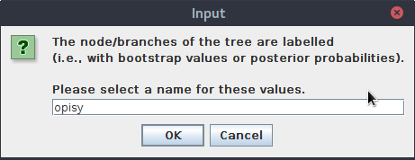
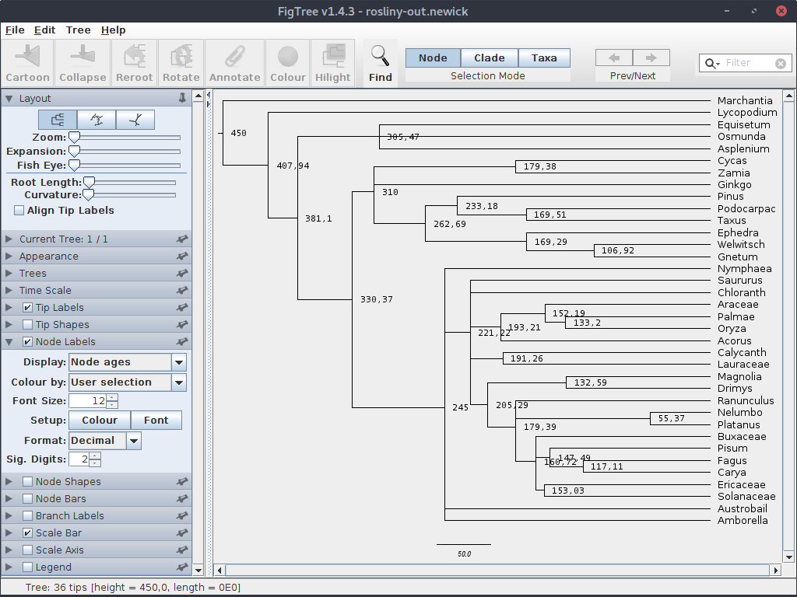
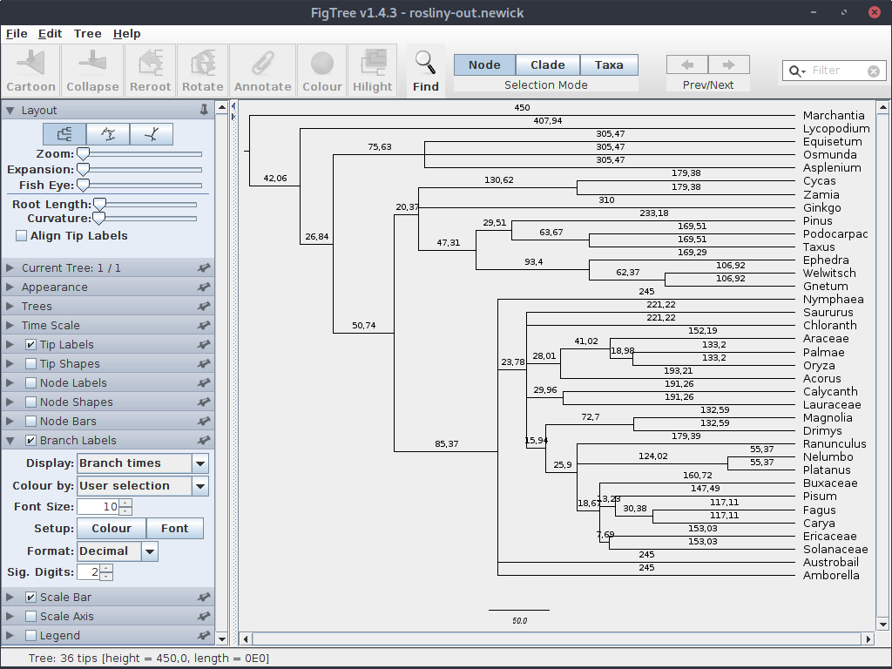

# Drzewa filogenetyczne i zegar molekularny

Drzewa filogenetyczne, które tworzyliśmy dotychczas pokazywały relacje filogenetyczne pomiędzy badanymi organizmami i ich stopień podobieństwa, jednak nie pozwalały na odniesienie poszczególnych wydarzeń, takich jak rozdzielanie się kladów, do czasu w którym mogły się wydarzyć.

Drzewa posiadające informacje na temat długości gałęzi (filogramy) pozwalają szacować względne odległości między taksonami ale aby dopasować je do ram czasowych potrzebujemy sposobu ich ,,wykalibrowania'' tak aby można było znaleźć relacje pomiędzy liczbą mutacji a czasem. 

Kalibracja drzewa może przebiegać na przynajmniej dwa sposoby. Jeśli znamy tempo ewolucji badanych sekwencji to można dopasować skalę czasową na podstawie liczby mutacji na poszczególnych gałęziach. Można też podejść do problemu z drugiej strony. Znając przybliżony czas w którym doszło do rozdzielenia się kladów, na przykład opierając się na danych opartych na skamieniałościach, można dopasować go do odpowiedniego węzła na drzewie i na tej podstawie wyliczyć związek między czasem a liczbą mutacji. Tutaj pokażę prosty przykład tego drugiego podejścia.

W praktyce trzeba pamiętać, że nie tylko różne rodzaje sekwencji ewoluują z różną prędkością, ale także ten sam typ sekwencji może mieć różne tempo ewolucji u różnych grup organizmów. Oznacza to, że różne części naszego drzewa mogą mieć różne tempo ewolucji. Zatem lepiej jest wyznaczyć kilka ,,markerów'' - w przypadku pierwszego podejścia wyznaczyć tempo ewolucji dla różnych kladów, dla drugiego oznaczyć czas dla kilku węzłów.

Do najczęściej używanych programów pozwalających na użycie zegara molekularnego do drzew filogenetycznych należą obsługiwany z linii komend `r8s` oraz ,,okienkowy'' i dużo bardziej złożony `BEAST`. Skupimy się na tym pierwszym.

# `r8s`

Program `r8s` można pobrać z internetu ze strony: [https://sourceforge.net/projects/r8s](https://sourceforge.net/projects/r8s). Następnie należy rozpakować pobrany plik.

Niestety, w pobranej formie program nie uruchamia się pod Linuksem, trzeba go skompilować. Co więcej, przynajmniej w dystrybucji, której używam (Debian 7.3.0-16) należało dokonać pewnych zmian w pliku `Makefile.linux` aby kompilacja się powiodła. Poniżej zamieszczam zawartość skryptu, który napisałem, automatyzującego proces pobierania, modyfikacji i kompilacji programu. Możesz go zapisać (np. pod nazwą `install-r8s.sh`) i uruchomić.

```
#!/bin/bash

# Skrypt pobierający i kompilujący program r8s

# Instalacja potrzebnych pakietów do kompilacji
sudo apt-get install make gcc gfortran 
cd ~

# Pobranie i rozpakowanie plików
wget https://sourceforge.net/projects/r8s/files/r8s1.81.tar.gz
tar -xvzf r8s1.81.tar.gz

# Zmiana nazwy na krótszą
mv r8s1.81 r8s

# Idziemy do katalogu z plikami źródłowymi
cd r8s/src/  
# usuwamy plik r8s
rm r8s

# Poprawki w pliku Makefile.linux - inaczej się nie skompiluje
sed -i 's/continuousML.o:continuousML.h/#continuousML.o:continuousML.h/' Makefile.linux
sed -i 's/blas.o tn.o TNwrapper.o continuousML.o ancestral.o covarion.o/blas.o tn.o TNwrapper.o ancestral.o covarion.o #continuousML.o/' Makefile.linux
sed -i 's|CFLAGS|LPATH = -L/usr/local/gfortran/lib # correct location as of August 2011.\nCFLAGS|' Makefile.linux
sed -i 's|memory.o: /usr/include/errno.h /usr/include/sys/errno.h|memory.o: /usr/include/errno.h # /usr/include/sys/errno.h|' Makefile.linux
sed -i 's|memory.o: /usr/include/stdlib.h memory.h|memory.o: /usr/include/stdlib.h # memory.h|' Makefile.linux
sed -i 's|CFLAGS = -g -std=c99 -pedantic|#CFLAGS = -g -std=c99 -pedantic |' Makefile.linux

#Kompilacja
make -f Makefile.linux

# Uprawnienia do wykonywania
chmod u+x r8s

# Kopiujemy program do katalogu głównego programu 
cp r8s ..
cd ..
```

Po uruchomieniu skryptu, w katalogu domowym użytkownika powinien znaleźć się katalog `r8s` z gotowym programem. Zajrzyj do niego. W katalogu znajdziemy kilka plików i katalogów:

```
examples
LICENSE
r8s
r8s1.7.manual.pdf
README
src
```

Katalog `examples`, jak wskazuje nazwa, zawiera przykładowe pliki z danymi oraz konfiguracjami programu. Zaraz do niego wrócimy.
`LICENCE` i `README` to pliki, których nazwy jasno wskazują na ich znaczenie.
`r8s` jest plik programu, będziemy go uruchamiać.
`8s1.7.manual.pdf` zawiera manual, warto zauważyć, że odnosi się do starszej wersji programu.
W katalogu `src` znajdują się głównie pliki źródłowe programu, po jego skopmilowaniu nie będą raczej nas już interesować.

Otwórz w edytorze tekstu plik `examples/SAMPLE_SIMPLE`. Jest to prosty plik wejściowy dla programu `r8s`, przejrzyj jego zawartość. Teraz na postawie tego i innych plików przykładowych z tego katalogu stworzymy własny plik, będziemy go uruchamiać i stopniowo rozwiać poznając wybrane, podstawowe możliwości programu. Trzeba zaznaczyć, że `r8s` nie wylicza drzew, ale korzysta z już gotowych.

Utwórz katalog roboczy, np. `zegar` a w nim plik `rosliny.set` (przedłużenie pliku nie ma specjalnego znaczenia). 

Umieść w nim poniższą zawartość:

```
#NEXUS 

[ * Blok trees, obowiązkowy ]

begin trees;

tree rosliny = (Marchantia:0.033817,(Lycopodium:0.040281,((Equisetum:0.048533,(Osmunda:0.033640,Asplenium:0.036526):0.000425):0.011806,((((Cycas:0.009460,Zamia:0.018847):0.005021,Ginkgo:0.014702):1.687e-86,((Pinus:0.021500,(Podocarpac:0.015649,Taxus:0.021081):0.006473):0.002448,(Ephedra:0.029965,(Welwitsch:0.011298,Gnetum:0.014165):0.006883):0.016663):0.006309):0.010855,((Nymphaea:0.016835,(((((Saururus:0.019902,Chloranth:0.020151):1.687e-86,((Araceae:0.020003,(Palmae:0.006005,Oryza:0.031555):0.002933):0.007654,Acorus:0.038488):0.007844):1.777e-83,(Calycanth:0.013524,Lauraceae:0.035902):0.004656):1.687e-86,((Magnolia:0.015119,Drimys:0.010172):0.005117,(Ranunculus:0.029027,((Nelumbo:0.006180,Platanus:0.002347):0.003958,(Buxaceae:0.013294,((Pisum:0.035675,(Fagus:0.009848,Carya:0.008236):0.001459):0.001994,(Ericaceae:0.019136,Solanaceae:0.041396):0.002619):1.687e-86):0.004803):1.687e-86):0.006457):0.002918):0.007348,Austrobail:0.019265):1.687e-86):1.687e-86,Amborella:0.019263):0.003527):0.021625):0.012469):0.019372);

end;
```

Na początku pliku znajduje się deklaracja, że jest to plik w formacie `NEXUS`. Dalej znajduje się komentarz - jak widać ograniczony jest parą nawiasów klamrowych.

Polecenia `begin`, po którym następuje nazwa oraz `end` ograniczają blok kodu. W tym przypadku jest to blok `trees`, niezbędny do działania programu (co jest zrozumiałe). Zauważ, ze komendy kończą się średnikiem.

W bloku znajduje się drzewo (komenda `tree`), zapisane w formacie `newick`, które będzie miało nazwę `rosliny`. Zawartość drzewa została skopiowana z pliku `SAMPLE_SIMPLE`.

Teraz zapisz plik i uruchom program:

```
$: ~/r8s/r8s -b -f rosliny.set
Reading tree rosliny
```

Opcja `-f` oznacza wczytanie pliku, `-b` to tzw. _batch mode_, czyli tryb wsadowy co oznacza w tym przypadku odczytanie pliku i zakończenie działania. Bez tej flagi program wczyta zawartość pliku i będzie oczekiwał na kolejne polecenia. Z programu można wyjść przez podanie komendy `q`.

Jak widać program wczytał drzewo i zakończył działanie.

Dopisz do pliku blok z poleceniami dla programu `r8s`:

```
[* Blok z komendami ]

begin rates;

[ * Informacje na temat drzewa]

blformat nsites=952 lengths=persite;

[ * Komenda, która pozwala programowi radzić sobie z gałęziami o zerowej długości ]

collapse;

[* Definicje wybranych elementów drzewa ]

mrca LAND_PLANTS marchantia pisum;
mrca GYMNOSPERMS Ginkgo Gnetum;
mrca ANGIOSPERMS amborella pisum;

[ * Ustawianie sztywnych wartości czasowych dla węzłów ]

fixage taxon=LAND_PLANTS age=450;
constrain taxon=GYMNOSPERMS min_age=310;
constrain taxon=ANGIOSPERMS min_age=200 max_age=245;

[ * Wyliczanie czasów przy użyciu zadeklarowanej metody i algorytmu ]

divtime method=lf algorithm=tn;

[ * Czytelna prezentacja wyników ]

showage;

[ * Generowanie chronogramu (tryb tekstowy)- gałęzie proporcjonalne do czasu ]

describe plot=chronogram;

[ * Generowanie filogramu (tryb tekstowy)- gałęzie proporcjonalne do liczby zmian ]

describe plot=phylogram;

[ * Generowanie drzewa w formacie nexus ]

describe plot=tree_description;

[ * Sprawdzamy, czy nie ma innych rozwiązań ]

set num_time_guesses=3;
divtime method=lf algorithm=tn;

end;
```

Komenda `blformat` opisuje drzewo, które badamy. `nsites` to liczba miejsc w sekwencjach, które zostały użyte przy tworzeniu drzewa. `lengths` informuje o znaczeniu liczb określających długość gałęzi: opcja `persite` oznacza liczbę mutacji na miejsce w sekwencji, jeśli oznaczałyby całkowitą liczbę mutacji to użylibyśmy opcji `total`.

Komenda `collapse`, nie wchodząc w szczegóły pozwala radzić sobie programowi w sytuacjach, w których gałęzie mają zerową długość. 

Następnie definiujemy/nazywamy, używając komendy `mrca` dwa wewnętrzne węzły. Nazwa komendy to skrót od _recent common ancestor_, czyli ostatni wspólny przodek. Podając nazwy dwóch taksonów, określamy, że podana nazwa odnosi się do węzła w którym rozdzieliły się ich drogi ewolucyjne.

W naszym przykładzie oznaczamy węzły ostatnich wspólnych przodków (badanych) roślin lądowych (`LAND_PLANTS`), nagonasiennych (`GYMNOSPERMS`) oraz okrytonasiennych (`ANGIOSPERMS`).

Dalej, wykorzystujemy utworzone wcześniej nazwy do umiejscowienia ich w czasie, co pozwala na ,,wyskalowanie'' drzewa. Komenda `fixage` ustawia ,,na sztywno'' czas, natomiast `constrain` pozwala określić zakres czasowy w którym doszło do rozdzielenia się linii ewolucyjnych, poprzez wyznaczenie jednej (maksymalną lub minimalną) lub obu granic. W naszym pliku czas jest określony w milionach lat.

Komenda `divtime` wylicza czasy dla pozostałych węzłów przy użyciu wybranej metody i algorytmu. Nie będziemy ich analizować. Wyniki zostają wypisane w sposób mało czytelny, dlatego dalej używamy komendy `skowage`, która je prezentuje w sposób bardziej przejrzysty.

Następnie trzykrotnie zostaje wywołana komenda `descriptions` z różnymi wartościami parametru `plot`, dzięki której otrzymujemy wyniki w formie drzew w różnych formatach. Dwa pierwsze drzewa prezentowane są w trybie wizualno-tekstowym: chronogram, w którym długości gałęzi odpowiadają czasowi (dlatego są wyrównane do prawej krawędzi) oraz filogram, posiadający gałęzie o długościach proporcjonalnych do  liczby mutacji. Trzecie drzewo jest zapisane w formacie `nexus`.

Istnieje możliwość, że dla danego zestawu danych istnieje więcej niż jedno optymalne rozwiązanie. Dlatego na końcu sprawdzamy trzykrotnie (można ustawić inną wartość) obliczenia, za każdym razem program (nie wchodząc w szczegóły) używając innych wewnętrznych wartości startowych. Jeśli otrzymujemy dla każdej serii wyliczeń otrzymujemy inne wyniki, oznacza to, że istnieją różne optymalne rozwiązania.

Zapisz plik i uruchom, obejrzyj wyniki na ekranie i spróbuj dopasować je do kolejnych poleceń. Wynik warto też zapisać w pliku:

```
~/r8s/r8s -b -f rosliny.set > rosliny.out
```

Teraz skopiuj z pliku wynikowego (lub z terminala) drzewo wynikowe w formacie `newick` i zapisz je w osobnym pliku (np. `rosliny-out.newick`)

```
tree rosliny = (Marchantia:450.000000,(Lycopodium:407.944406,((Equisetum:305.471826,Osmunda:305.471826,Asplenium:305.471826):75.632633,(((Cycas:179.379676,Zamia:179.379676):130.620324,Ginkgo:310.000000,((Pinus:233.179335,(Podocarpac:169.510283,Taxus:169.510283):63.669052):29.512298,(Ephedra:169.287671,(Welwitsch:106.917284,Gnetum:106.917284):62.370386):93.403963):47.308367)GYMNOSPERMS:20.366923,(Nymphaea:245.000000,(Saururus:221.224524,Chloranth:221.224524,((Araceae:152.187678,(Palmae:133.203210,Oryza:133.203210):18.984468):41.024457,Acorus:193.212135):28.012388,(Calycanth:191.261350,Lauraceae:191.261350):29.963173,((Magnolia:132.585525,Drimys:132.585525):72.700419,(Ranunculus:179.388935,(Nelumbo:55.366372,Platanus:55.366372):124.022563,(Buxaceae:160.720310,(Pisum:147.492625,(Fagus:117.113994,Carya:117.113994):30.378631):13.227685,(Ericaceae:153.034649,Solanaceae:153.034649):7.685662):18.668625):25.897009):15.938580):23.775476,Austrobail:245.000000,Amborella:245.000000)ANGIOSPERMS:85.366923):50.737536):26.839947):42.055594)LAND_PLANTS;
```

Zauważ, że zawiera ono opisy węzłów, które im nadaliśmy a także wyliczone czasy. Brak natomiast wartości odpowiadających długości gałęzi w odniesieniu do liczby mutacji. 

Otwórz plik w programie `FigTree`. Przy pytaniu o nazwę etykiet dla węzłów wpisz ,,Opis''.



Jak zwykle dopasuj czcionki itp. aby drzewo było bardziej czytelne. Następnie zaznacz zakładkę ,,Node Labels'' wyświetlaną wartość na ,,Node ages''. Po dopasowaniu parametrów czcionki i liczby miejsc po przecinku powinieneś uzyskać mniej więcej taki obraz:



Jak widać, na drzewie widoczny jest wyliczony (i ustawiony przez nas) wiek dla poszczególnych węzłów, oznaczający miliony lat, które upłynęły od momentu rozdzielnia się poszczególnych linii ewolucyjnych.

Ustawiając ,,opisy'' zamiast ,,Node ages'', otrzymasz drzewo z etykietkami, które przypisaliśmy do węzłów.

Teraz (dla przejrzystości) wyłącz wyświetlanie ,,Node Labels'' a włącz w ,,Branch labels'' i ustaw tam wyświetlanie wartości na ,,Branch times''.



Teraz widać czas przypisany do każdej gałęzi, odpowiadający milionom lat, które upłynęły pomiędzy rozdzieleniem się kolejnych kladów.

Powyższy przykład pokazał podstawy używania programu `r8s`. Studiując dołączone do programu pliki z przykładami a zwłaszcza tutorial można dowiedzieć się znacznie więcej na temat jego możliwości, do czego zachęcam.


