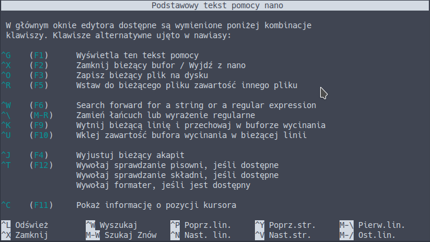
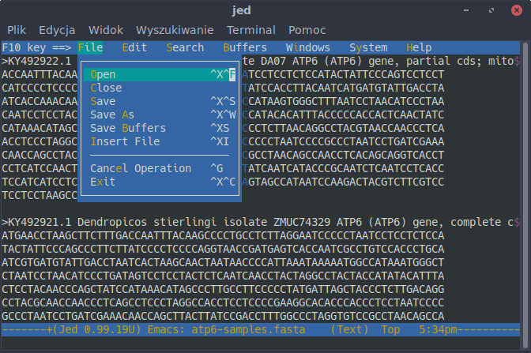
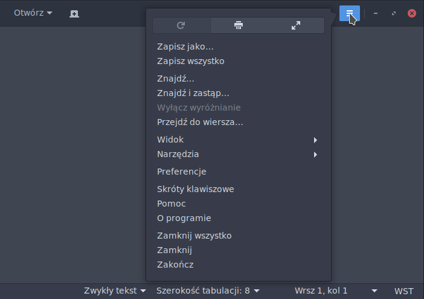
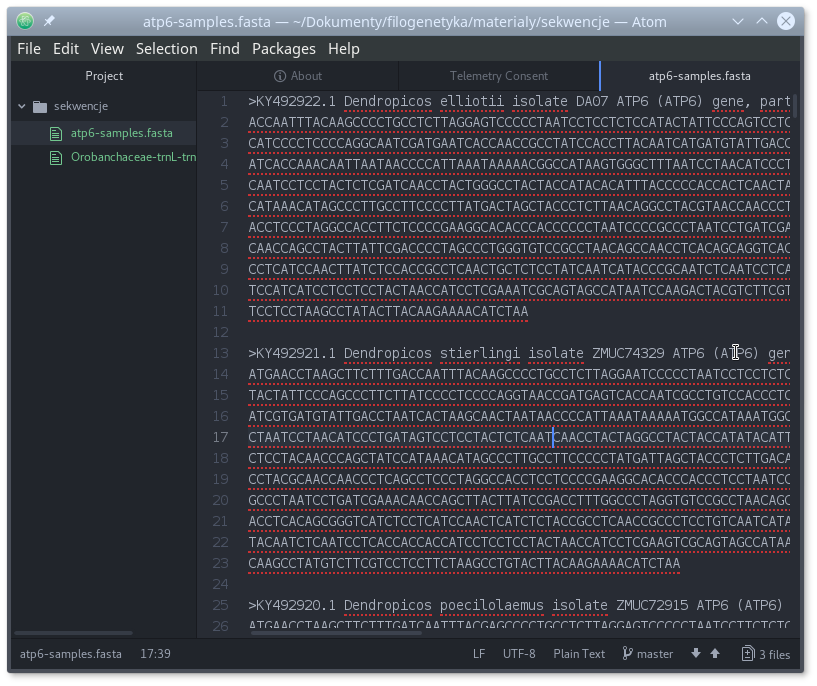
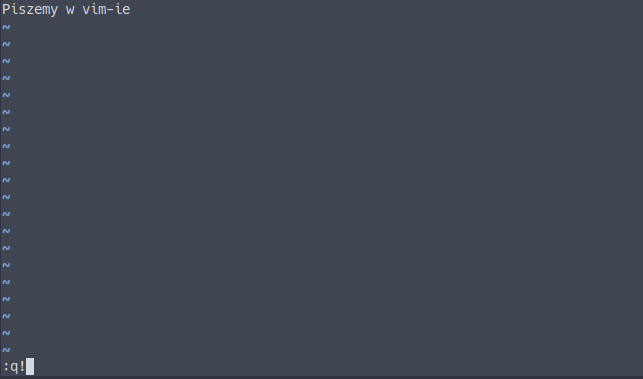

# Edytory tekstu

## Wybór edytora tekstu

Edytory tekstu, jak nazwa wskazuje, służą do edycji tekstu, zwykle w formie plików tekstowych. Nie należy mylić edytorów tekstu z procesorami tekstu (np. Word). Ponieważ praca filogenetyczna, przynajmniej w jej części bioinformatycznej, polega w dużej mierze właśnie na pracy z plikami tekstowymi, edytor należy do najważniejszych narzędzi a wybór odpowiedniego narzędzia decyduje o jej późniejszym komforcie i wydajności. Dlatego warto poświęcić chwilę czasu na jego wybór a także nieco więcej czasu na jego poznanie. Dobre edytory tekstu mają wiele funkcji, które potrafią taką pracę bardzo usprawnić.

Edytory można podzielić na dwie kategorie w zależności od interfejsu, poniżej podaję przykłady edytorów darmowych (o ile mi wiadomo):

  * Pracujące w trybie tekstowym, mogą mieć także interfejs graficzny, zwykle wieloplatformowe, np.: Pico, Nano, JED, Emacs, Vim. 
  * Pracujące w trybie graficznym, często dla jednego systemu operacyjnego np.: Atom (Linux, Mac OS X, Windows), TextMate2 (Mac OS X), Notepad++ (Windows), Notepadqq (Linux), Gedit (Linux, Mac OS X, Windows), Kate (Linux, Mac OS X, Windows), TextWrangler (Mac OS X)

Który z nich wybrać? To zależy od upodobań, oczekiwań i potrzeb. Jeśli przygoda z filogenetyką i bioinformatyką jest jedynie epizodyczna to powinien wystarczyć prosty w użyciu edytor. Natomiast jeśli mamy w planach spędzić dużo czasu na pracy z edytorem tekstowym to warto poświęcić czas i wysiłek na poznanie edytora, który niekoniecznie na początku jest łatwy i przyjazny w użyciu ale później z zapasem zwróci poświęcony na jego naukę czas. 

Poniżej krótko scharakteryzuję kilka darmowych edytorów tekstu dostępnych (choć niekoniecznie wyłącznie) na systemie Linux o różnym stopniu trudności i możliwości.

## `nano`

Nano (GNU nano) to dość prosty edytor służący do pracy w terminalu. Jego główną zaletą jest prostota. Uruchamia się go poleceniem `nano`, można też otworzyć plik podając jego nazwę (ewentualnie ze ścieżką) jako argument: `nano plik.txt`. Podobnie zresztą można otwierać pliki w innych edytorach. Podstawowe funkcje, dostępne za pomocą skrótów klawiszowych, są wypisane na dole okna (`[^O]` oznacza skrót `Ctrl+O`). Powinien być zainstalowany domyślnie w systemie.


Pozostałe opcje i możliwości można poznać po otwarciu pomocy (`[^G]`)



Nano jest rozsądnym wyborem jeśli chcemy pracować w terminalu a nie mamy potrzeby nauczenia się edytora o znacznie większych możliwościach (np. vim)

## JED

Nieco bardziej przyjaznym w użyciu dzięki paskowi z rozwijanym menu, przynajmniej zdaniem twórców programu, edytorem działającym w trybie tekstowym jest JED. Jest dostępny na wiele systemów operacyjnych, z DOS-em włącznie. Uruchamia się go w terminalu komendą `jed`.

Uwaga praktyczna: Aby dostać się do paska menu, należy użyć klawisza `F10`. Może jednak on być przypisany do funkcji programu obsługującego emulator systemu lub samego systemu operacyjnego. Na przykład w MATE Terminal `F10` jest przypisany do własnego paska menu. Aby użyć tego klawisza w JED, należy to przypisanie usunąć wybierając w menu: `Edycja->Skróty klawiszowe...` a następnie w okienku odznaczyć opcję `Klawisz skrótu menu (domyślnie F10)`.

[Strona domowa JED: https://www.jedsoft.org/jed/index.html](https://www.jedsoft.org/jed/index.html)

Instalacja (pod Debianem i dystrybucjami pochodnymi):

```
sudo apt install jed
```



JED sprawdzi się jako prosty edytor działający w trybie tekstowym.

## Pluma, gedit

Pluma jest edytorem związanym ze środowiskiem graficznym Mate, choć może być (po zainstalowaniu) używany pod innymi środowiskami. Wywodzi się z edytora gedit, który dostępny jest także dla innych niż Linux systemów operacyjnych. Oba są przeznaczone po pracy w środowisku okienkowym i posiadają interfejs graficzny. Podstawowe funkcje związane z edycją tekstu mogą być rozszerzane przy użyciu wtyczek. Otwierając plumę widzimy rozwijany pasek z menu oraz ikony, co pozwala od razu rozpocząć pracę z tym edytorem. 


Nowsze wersje gedit nie posiadają paska z ikonami, ale polecenia są dostępne z rozwijanego menu lub menu kontekstowego.

Instalacja (pod Debianem i dystrybucjami pochodnymi):

```
sudo apt install pluma
sudo apt install gedit
```



Oba programy sprawdzą się jako niewyszukane, ale łatwe w obsłudze edytory w środowisku graficznym.

## Kate

Po otwarciu Kate widać bardziej złożony interfejs niż w przypadku poprzednio omawianych edytorów. Posiada też więcej funkcji. Jest związany ze środowiskiem KDE, ale może być oczywiście uruchamiany pod innymi, co więcej jest dostępny nie tylko dla Linuksa ale też dla Mac OS X i Windows. Ciekawą możliwością Kate jest włączenie ,,VI mode'', które pozwala pracować w sposób wzorowany na edytorze `vi`. 

Instalacja (pod Debianem i dystrybucjami pochodnymi):

```
sudo apt install kate
```

[Strona domowa Kate: https://kate-editor.org/](https://kate-editor.org/)


Kate sprawdzi się w podobnych sytuacjach jak pluma czy gedit, choć jest (przynajmniej pod pewnymi względami) edytorem bardziej zaawansowanym.

## Atom 

Atom to edytor, który jest polecany między innymi ze względu na łatwość użycia, duże możliwości konfiguracji ustawień i poszerzania funkcjonalności przy pomocy licznych wtyczek (pakietów) w tym [vim-mode-plus](https://github.com/t9md/atom-vim-mode-plus) przystosowującą Atom do sposobu pracy edytora `vim`. Edytor jest dostępny dla systemów Linux, Mac OS X i Windows. 

[Strona domowa Atom: https://atom.io](https://atom.io)

Instalacja:

Ze [strony domowej edytora Atom](https://atom.io) należy pobrać plik instalacyjny i zainstalować. 
Na Debianie i dystrybucjach pochodnych można to zrobić poleceniem:

```
sudo dpkg -i atom-amd64.deb
```




Ciekawą opcją Atom-a jest podgląd edytowanych plików w formacie `markdown` o którym będzie mowa w dalszej części kursu.


Atom powinien zadowolić bardziej zaawansowanych użytkowników chcących używać edytora opartego na graficznym interfejsie.

## Vim

Vim to edytor tekstu, któremu poświęcę nieco więcej uwagi, głównie ze względu na jego ogromne możliwości. Nieprzypadkowo, wg. sondy serwisu [stackoverflow](https://insights.stackoverflow.com/survey/2016#technology-development-environments) Vim w 2016 był najpopularnieszy wśród [,,Data Scientists''](https://pl.wikipedia.org/wiki/Data_scientist) a wśród wszystkich uczestników zajął czwarte miejsce. Nie kryję, że jest to także mój ulubiony edytor tekstu. Wywodzi się z edytora `vi` (`VIM` = _VI iMproved_), jeśli na systemie Uniksowym nie ma zainstalowanego `vim`-a to prawie na pewno jest tam `vi`. 

Zalety (wybrane) vim-a:

  * Jest dostępny na wiele systemów operacyjnych z Androidem czy iOS-em włącznie
  * Ma małe wymagania, można na nim edytować duże pliki a także pracować zdalnie
  * Jest edytorem przeznaczonym do pracy w terminalu, ale posiada także wersje z interfejsem graficznym (np. gVim)
  * Pracuje się na nim z użyciem klawiszy co znacznie przyspiesza pracę, choć w wersji z GUI można także używać myszy, ikon i rozwijanych menu
  * Łatwo można modyfikować i poszerzać jego funkcjonalność m. in. przy pomocy licznych wtyczek
  * Łatwa współpraca z powłoką - można uruchomić komendę w terminalu a jej wynik wstawić do edytowanego pliku
  * Wiele czynności na tekście można wykonać za pomocą komend, na przykład analogicznych do tych dostępnych w programie `sed`
  * ...

Skoro wymieniłem liczne zalety `vim`-a wypadałoby także wspomnieć o jego wadach a raczej wadzie. Na początku jest mało przyjazny.

`Vim` uruchamiamy za pomocą komendy `vim` z opcjonalną nazwą pliku. Jeśli wolisz wersję z GUI to użyj polecenia `gvim` lub odpowiedniej ikony. Instalacja obu programów wygląda tak (vim prawdopodobnie jest już zainstalowany):

```
sudo apt install vim
sudo apt install gvim
```


Po uruchomieniu programu pojawia się takie okno:


W przypadku `gVim`:


Jak widać, po uruchomieniu nie widać menu czy ikon. Znajduje się tam krótka informacja o programie, jak wyjść z programu i jak uruchomić pomoc. Nawet nie bardzo wiadomo jak zacząć pisać. Podpowiem: naciśnij `i` i wprowadź jakiś tekst.


Teraz spróbuj wyjść z programu nie zamykając okna terminala. Jeśli nie zapamiętałeś odpowiedniej komendy z ekranu powitalnego - będzie to trudne, choć po naciśnięciu niektórych kombinacji klawiszy podpowiedź może się pojawić na dole ekranu.

Jak zatem wyjść z `vim`-a?
Naciśnij klawisz `<Esc>`, kursor pojawi się w linii na dole ekranu, tam wpisz `:q!`



Wciśnij `<Enter>`.

Obsługa `vim`-a to temat na osobną lekcję o ile nie kurs (których jest wiele w internecie), tu postaram się przekazać tylko kilka ogólnych informacji oraz aspektów pracy w tym edytorze, które pokażą dlaczego warto się podjąć jego nauki. 

Pierwszą trudnością (poza wyjściem z programu) w pracy z `vim`-em, a co odróżnia go od większości innych edytorów, jest przyzwyczajenie się się do tego, że pracuje on w różnych trybach, a w każdym z nich zachowuje się nieco inaczej. Do najbardziej podstawowych należą:

  * Tryb normalny (_normal_) - wbrew intuicji nie wpisujemy w nim bezpośrednio tekstu, ale przy pomocy klawiszy wydajemy komendy, które służą m. in. poruszaniu się, usuwaniu czy kopiowaniu tekstu. Po uruchomieniu `vim` znajduje się w tym trybie, przenosimy się do niego zhttps://www.oliversherouse.com/2017/08/21/vim_zero.html innych trybów za pomocą klawisza `<Esc>`, czasem trzeba go wcisnąć kilkukrotnie.
  * Tryb edycji (_insert_) - to w tym trybie wprowadzamy tekst, niektóre komendy są także dostępne za pomocą skrótów klawiszowych. Z trybu normalnego wchodzimy do niego używając odpowiednich poleceń (np. `i` - wprowadź tekst w miejscu kursora, `A` - wprowadź tekst na końcu linii)
  * Tryb linii komend/EX (_command line/ex_) - służy wprowadzaniu komend i wyszukiwaniu tekstu. Uruchamiamy go z trybu normalnego klawiszami `:` w celu wpisania komendy, `/` lub `?` aby wyszukać tekst, `!` żeby filtrować tekst. Jeśli znajdujesz się w innym, niż normany, trybie, najpierw należy wejść do trybu normalnego (`<Esc>`). Na dole pokazuje się linia, do której przeniesiony jest kursor, tam wpisujemy komendy. Spróbuj `:help vim-modes`. W tym trybie m. in. wykonuje się komendy wyjścia z programu, otwieranie i zapisywanie pliku, zamianę tekstu czy zmiany ustawień programu.
  
Krótki ale treściwy samouczek można uruchomić komendą `vimtutor`. Pokaże się okno `vim`-a z otwartym plikiem tutoriala, który podczas nauki będziemy modyfikować zgodnie z instrukcjami:

.

Obszerną pomoc dostarcza także sam `vim` wywoływaną przez komendę `:help` ewentualnie uzupełnianą o temat (jak powyżej).

Teraz wykonaj parę ćwiczeń:

Otwórz `vim`

```
$: vim
```

Otwórz plik `/Orobanchaceae-trnL-trnF-aligned.fasta` w trybie _command line_ (przy wpisywaniu ścieżki możesz posłużyć się klawiszem `<Tab>`, który ,,podpowie'' nazwy plików i katalogów:

```
:e sciezka/Orobanchaceae-trnL-trnF-aligned.fasta
```

Teraz usuniemy wszystkie znaki indeli (`-`):

```
:%s/-//g
```

Zmiany można cofnąć za pomocą klawisza `u` (w trybie _normal_)

Zauważ, że składnia jest podobna, do tej znanej z narzędzia `sed`. Znak `%` oznacza, że zmiana dotyczy wszystkich linii w pliku. Jeśli zmiana ma dotyczyć tylko konkretnej linii, w zamian podajemy jej numer. Jeśli numery linii się nie wyświetlają można to zmienić ustawiając odpowiednią opcję: `:set number`.

Komenda:

```
:2s/-//g
```

Dokona zmiany w linii 2. Można też podać zakres linii, których ma dotyczyć polecenie:

```
:1,8s/-//g
```

Jeśli zmiany mają ograniczyć się do linii pasujących do danego wzorca, podajemy go:

```
:g/^>/s/-//g
```

W pliku `Orobanchaceae-trnL-trnF-aligned.fasta` akurat nie ma znaku `-` w opisach sekwencji ale w innych plikach mogą być, zwłaszcza w nazwach gatunków (np. _Orobanche artemisiae-campestris_).
Jeśli zatem chcemy usunąć znaki `-` w liniach, które **nie** są opisem sekwencji użyjemy znaku `!` w odpowiednim miejscu:

```
:g!/^>/s/-//g
```

Podpowiedź: jeśli jesteś w linii komend (po wciśnięciu `:`) można przywołać poprzednie polecenia używając klawiszy ze strzałkami w górę i dół. Można je edytować przed powtórnym wywołaniem.

Poruszanie się po pliku może odbywać się przy pomocy klawiszy ze strzałkami, ale zalecane jest używanie klawiszy `h`, `j`, `k`, `l` (sprawdź jak działają). Kilka innych przydatnych klawiszy i komend do poruszania się w trybie _normal_:

  * `w` - następne słowo (ang. _word_)
  * `b` - poprzednie słowo (ang. _backward_)
  * `0` - początek linii
  * `$` - koniec linii
  * `)` - następne zdanie
  * `(` - poprzednie zdanie
  * `}` - następny paragraf
  * `{` - poprzedni paragraf
  * `gg` - początek pliku
  * `G` - koniec pliku

Podając liczbę, można zmienić miejsce docelowe, np:

  * `5w` - pięć słów naprzód
  * `5G` - piąta linia

Kilka poleceń edycyjnych w trybie _normal_:

  * `x` - usuń znak
  * `yy` - kopiuj linię (ang. _yank_)
  * `yw` - kopiuj słowo (ang. _yank word_)
  * `dd` - usuń linię (ang. _delete_)
  * `dw` - usuń do końca słowo (ang. _delete word_)
  * `daw` - usuń całe słowo (ang. _delete all word_)
  * `d$` - usuń tekst do końca linii
  * `p` - wklej po kursorze (poniżej) (ang. _paste_)
  * `P` - wklej przed kursorem (powyżej)
  * `J` - połącz linię z następną (ang. _Join_)
  * `u` - cofnij zmianę lub edycję (ang. _undo_)
  * `<Ctrl>-r` - cofnięcie cofnięcia (ang. _redo_)

Jak widać, przynajmniej niektóre, polecenia edycji można łączyć z komendami poruszania się. Polecenia takie jak `d` czy `y` trzeba uzupełnić o informację o ruchu. Można je także dodatkowo uzupełnić o liczbę:

  * `4J` - połącz cztery linie
  * `5dw` - usuń pięć kolejnych słów
  * `5yy` - skopiuj pięć linii

Kilka podstawowych komend (w trybie _command line_):

  * `:e nazwa_pliku` - otwórz plik
  * `:w` - zapisz plik
  * `:q` - wyjdź (jeśli zmiany w pliku nie zostały zapisane, wyjście nie jest możliwe)
  * `:q!` - wyjdź mimo niezapisania zmian
  * `:wq` - zapisz zmiany w pliku i wyjdź
  * `:w nowa_nazwa` - zapisz plik pod nową nazwą (zapisana jest kopia pliku)
  * `:saveas nowa_nazwa` - zapisz plik pod nową nazwą i kontynuuje edycję pod nową nazwą
  * `:r inny_plik` - wczytaj zawartość innego pliku i wstaw go w bieżącym (poniżej kursora)

Powyżej pokazałem jedynie małą cząstkę możliwościach edytora `vim`. Nie pokazałem w ogóle jak można poszerzyć jego funkcjonalność i dopasować do własnych potrzeb i upodobań. Dalszą naukę można zacząć na przykład od wspomnianego `vimtutor`-a. Sposób pracy z `vim`-em może się wydawać (jak wspomniałem powyżej) nieintuicyjny ale przy pewnej wprawie pozwala na dużo efektywniejszą pracę niż z ,,tradycyjnymi'' edytorami. Dlatego warto poświęcić mu trochę czasu, z pewnością się odwdzięczy.


