# Bazy sekwencji - wyszukiwanie (GenBank i Blast)

## Czym jest GenBank?

[GenBank](https://www.ncbi.nlm.nih.gov/genbank/) jest jedną z baz [The National Center for Biotechnology Information](https://www.ncbi.nlm.nih.gov) (NCBI) gromadzącą i udostępniającą publicznie sekwencje DNA. W ramach [International Nucleotide Sequence Database Collaboration](http://www.insdc.org/) współpracuje z [DNA DataBank of Japan](http://www.ddbj.nig.ac.jp) (DDBJ) oraz the [European Nucleotide Archive](https://www.ebi.ac.uk) (ENA) z którymi regularnie wymienia dane. Zachęcam do odwiedzenia i sprawdzenia możliwości pozostałych dwu baz danych, jednak na naszych zajęciach zajmiemy się bazą GenBank.

Najpierw pokażę podstawy pobierania sekwencji DNA przez stronę internetową GenBank-u, później zaprezentuję kilka sposobów pobierania danych z linii komend.

## Proste wyszukiwanie danych z bazy GenBank przez stronę WWW

W przeglądarce internetowej wejdź na stronę [https://www.ncbi.nlm.nih.gov/genbank](https://www.ncbi.nlm.nih.gov/genbank).
Pokaże się strona początkowa z paskiem wyszukiwania u góry:

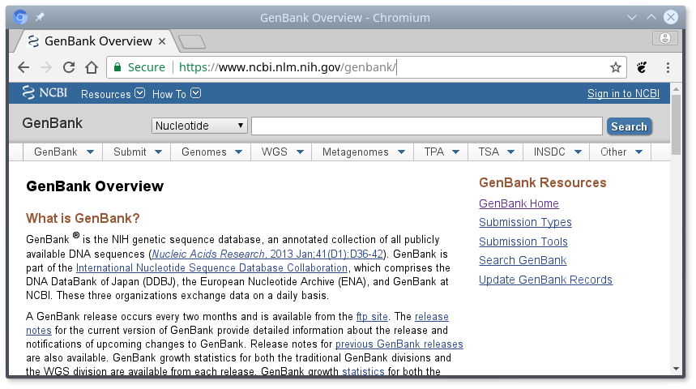

Po lewej stronie paska wyszukiwania, znajduje się rozwijane menu, gdzie można wybrać bazę danych NCBI, z której chcemy korzystać. 

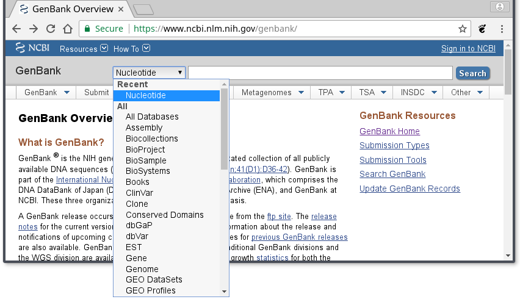

Jak widać jest ich wiele, m. in. baza zawierająca sekwencje proteinowe czy baza taksonomiczna. Nas teraz interesuje ,,Nucleotide'', która odpowiada bazie GenBank.

Wpisz w pasku wyszukiwania atp6 i kliknij ,,Search''.
Po chwili pokazuje się okno z wynikami wyszukiwania:


Poniżej paska wyszukiwania, strona jest podzielona na trzy kolumny. Oprócz samych wyników wyszukiwania w kolumnie środkowej, na stronie widzimy wiele dodatkowych informacji a także dodatkowych narzędzi. Krótko omówię niektóre z nich.

Na górze środkowego panelu mamy możliwość zmiany sposobu wyświetlania wyników a także eksportu pliku np. do pliku czy schowka.


Na przykład zmieniając sposób wyświetlania ,,Summary'' na ,,FASTA''...

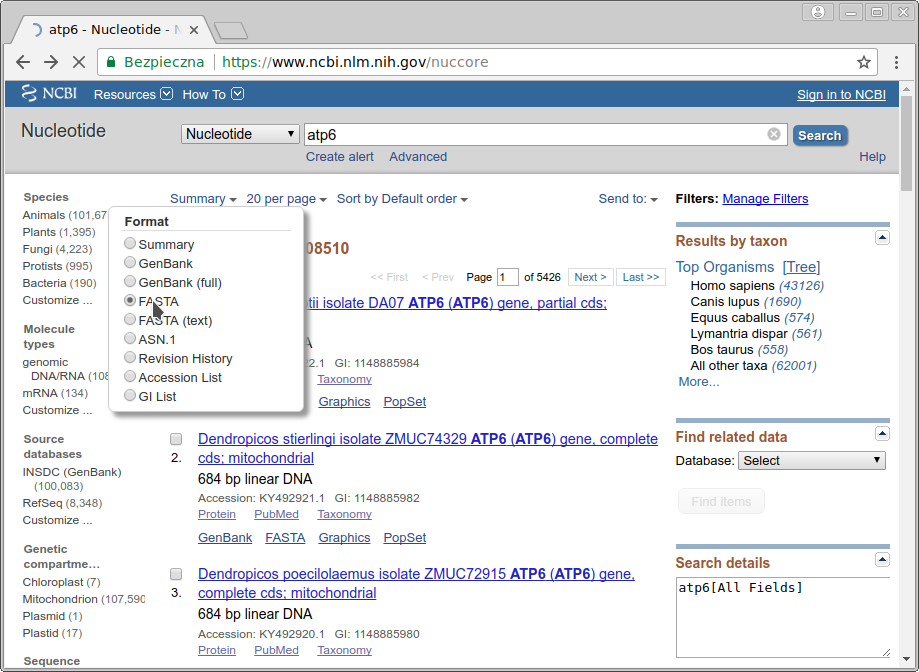

... uzyskujemy w wynikach podgląd sekwencji w formacie `FASTA`.


Wyniki (wszystkie lub wybrane przez zaznaczenie odpowiednich rekordów) można skopiować do schowka na stronie (tu są pewne limity), dodać do kolekcji na swoim koncie albo zachować w pliku o wybranym formacie, np. `FASTA`:

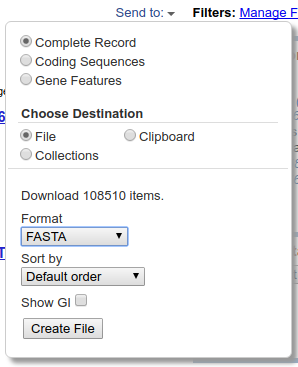

Poniżej znajduje się ramka z pełniejszą nazwą sekwencji i linkiem do informacji o niej.

Przyjrzyjmy się teraz jak wygląda pojedynczy rekord wyświetlany w formacie domyślnym - ,,Summary'':

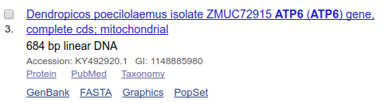

Na górze znajduje się opis sekwencji, który jest linkiem do szczegółowych informacji wyświetlanych w formacie `GenBank`. Następna linia informuje o długości i rodzaju sekwencji.
Następnie widać numer dostępowy (,,Accession''), który jest unikalnym numerem danej sekwencji. Po tym numerze można ją jednoznacznie zidentyfikować, toteż zazwyczaj podaje się go w publikacjach, drzewach filogenetycznych itp. Drugi z podanych numerów (,,GI'') jest numerem identyfikacyjnym GenBank i ma mniejsze znaczenie z naszego punktu widzenia.

W kolejnej linii wyświetlone są odsyłacze do innych baz, można dzięki nim sprawdzić sekwencję aminokwasów dla danego genu (,,Protein''), zobaczyć powiązaną publikację (,,PubMed'') czy poznać pozycję systematyczną organizmu (,,Taxonomy''). 

Na dole umieszczone są linki, które pozwalają wyświetlić wynik w formacie `GenBank` i `FASTA`, w sposób graficzny i w końcu (,,PopSet'') wyświetlić listę sekwencji, które były wysłane do GenBank-u razem z daną sekwencją a więc są na ogół w jakiś sposób z nią powiązane. 

W lewym panelu znajdują się informacje na temat liczby znalezionych sekwencji w różnych kategoriach, wydzielonych na podstawie grupy organizmów (,,Species''), rodzaju cząsteczek (,,Molecule types''), źródła danych (,,Source databases'') czy rodzaju genomu (,,Genetic compartments''). Klikając w odpowiednie kategorie można zawęzić wyniki np. do roślin czy genomów mitochondrialnych. Można kategorie łączyć. NA przykład klikając w ,,Plants'' i ,,Mitochondrion'' otrzymujemy wyniki dla roślinnych sekwencji mitochondrialnych.

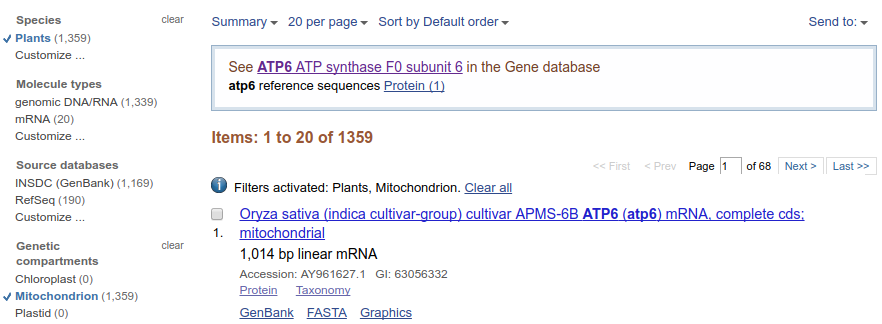

Na dole lewego panelu można także zawęzić wyszukiwanie sekwencji do konkretnego zakresu długości sekwencji, czasu publikacji czy daty aktualizacji. Najbardziej przydatna wydaje się być pierwsza możliwość, pozwala wyeliminować zbyt krótkie sekwencje.

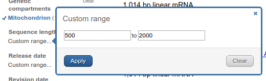

Teraz przenieśmy się na prawy panel. Przy zawężonym zakresie wyszukiwania teraz wygląda tak (porównaj z poprzednim wyglądem):


Sekcja ,,Results by taxon'' pokazuje organizmy o największej liczbie wyników. Klikając na ,,Tree'' otrzymujemy widok drzewa. 

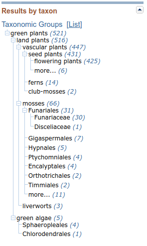

Klikając na odpowiednie pozycje możemy zawęzić wyniki do określonej grupy organizmów, drzewo można także rozwijać do mniejszych jednostek taksonomicznych.

Teraz przejdźmy nieco niżej do sekcji ,,Search details''. Tam w okienku widzimy w formie tekstowej treść naszego zapytania, razem z ustawionymi filtrami ograniczającymi zakres wyszukiwania. Zauważ, że w parach nawiasów kwadratowych znajdują się nazwy pól wyszukiwania, tak więc np. `atp6` wyszukiwane jest we wszystkich polach a `plants` i `mitochondrion` w polu `Filter`, ograniczenie do grupy organizmów można uzyskać używając pola `porgn`. Jeśli zechcesz się pokusić o ręczne wpisywanie zapytań (lub ich części) to warto zapoznać się ze znaczeniem nazw pól, które można znaleźć w dokumentacji pod adresem [https://www.ncbi.nlm.nih.gov/books/NBK49540/](https://www.ncbi.nlm.nih.gov/books/NBK49540/). Warto też zwracać uwagę jak zmienia się tekst zapytania w zależności od zmian w ustawianych filtrach. Poszczególne części zapytania można łączyć za pomocą operatorów `AND`, `OR` oraz `NOT` a także grupować za pomocą nawiasów.

Zapytanie można oczywiście wpisywać także w pasek wyszukiwania u góry strony. Warto też obserwować jak zmienia się treść zapytania w polu ,,Search details'' w zależności od tego co wpisujemy w pasek wyszukiwania. 

Na przykład wpisując w pasku wyszukiwania `atp6 Orobanche` widzimy w okienku ,,Search details'' zapytanie: `atp6[All Fields] AND ("Orobanche"[Organism] OR Orobanche[All Fields])`. Operator `AND` oznacza, że oba łączone nim wyrażenia powinny być spełnione. Jak widać, jest to domyślny operator wyszukiwania. Zauważ też, że słowo `Orobanche` jest wyszukiwane nie tylko w polu `Organism` (które oczywiście oznacza konkretny organizm) ale we wszystkich polach danego rekordu, co może tłumaczyć dlaczego w wynikach widzimy także sekwencje innych gatunków. 

Teraz wpisz zapytanie: `atp6[All Fields] AND "Orobanche"[Organism]` i sprawdź jakie będą wyniki.

Jeśli chcemy wykluczyć część wyników, użyjemy operatora `NOT`. Zapytanie `atp6[All Fields] NOT "Orobanche"[Organism]` zwróci sekwencje `atp6` nienależące do `Orobanche`.

Działanie ostatniego z operatorów `OR` pokażę na przykładzie, razem z zastosowaniem nawiasów. Zapytanie `atp6[All Fields] AND ("Orobanche"[Organism] OR "Phelipanche"[Organism])` pozwoli znaleźć sekwencje `atp6` należące do `Orobanche` lub `Phelipanche`. Otrzymamy więc sekwencje roślin należących do obu rodzajów.  

Na dole prawego panelu znajdziemy linki do poprzednich wyszukiwań.

Przy wyszukiwaniu danych w GenBank-u należy pamiętać o tym, że w przeciwieństwie do popularnych wyszukiwarek internetowych, które tolerują literówki tu trzeba być bardzo dokładnym, nie otrzymamy pomocy w postaci linku ,,Czy chodziło Ci o....?". 

Poniżej pasku wyszukiwania na górze znajduje się link `Advanced`. Jak można się domyślić, znajdziemy tam narzędzie pozwalające tworzyć złożone i/lub precyzyjne zapytania:

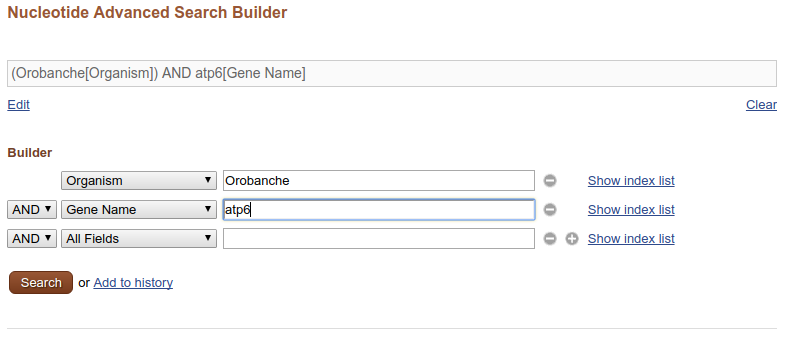

Jeśli znasz numer GenBank-u szukanej sekwencji to dobrym pomysłem jest wpisanie go (zamiast gatunku i nazwy sekwencji) do paska wyszukiwań. Wtedy, jeśli numer jest prawidłowy od razu przejdziesz do strony z wynikiem, tej samej, którą otworzysz klikając w wynik wyszukiwania.

Wpisz numer `KU180474`. 

## Sekwencja - informacje i pobieranie

Strona z wynikiem składa się z dwu paneli (pomijając pasek wyszukiwania). W prawym znajdują się narzędzia, które teraz pominiemy, choć do niektórych jeszcze wrócimy. Przeanalizujmy panel lewy z informacjami dotyczącymi sekwencji. 

Na górze znajduje się nagłówek z opisem sekwencji, numerem GenBank i linkami, które już omawialiśmy przy okazji listy wyników wyszukiwania.

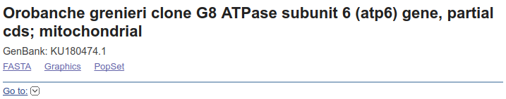

Poniżej znajduje się sekcja z polami opisującymi ogólnie sekwencje. Odpowiadają one polom używanym w trakcie wyszukiwania. W zasadzie nie wymagają one wyjaśnienia. Warto zwrócić uwagę, że często można znaleźć tam nazwę artykułu w którym opublikowano badania dotyczące sekwencji. Trzeba jednak uważać - autorzy wprowadzają do bazy sekwencje zwykle przed opublikowaniem artykułu, jest to więc zazwyczaj tytuł roboczy. Co prawda po ukazaniu się publikacji powinni dane zaktualizować, ale nie zawsze tak się dzieje. 

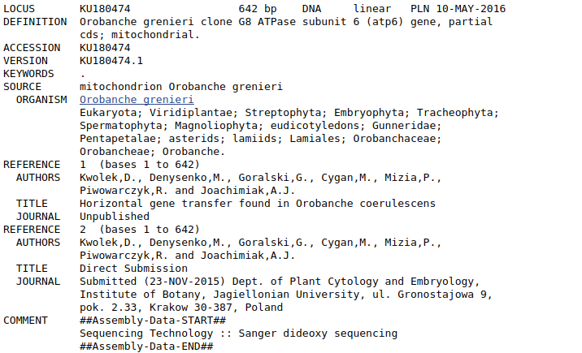

Następne pole `FEATURES` zawiera kolejne pola dokładniej opisujące sekwencje, łącznie z genami i innymi specyficznymi fragmentami DNA, miejscami kodującymi i translacją sekwencji. Jest ona zwłaszcza przydatna, gdy chcemy pobrać jedynie część sekwencji. Sekwencja nie musi bowiem odpowiadać jednemu genowi - może to być np. genom mitochondrialny czy sekwencja całego chromosomu. Wtedy możemy chcieć np wyciąć z niej jeden gen. Wrócimy jeszcze do tego tematu.

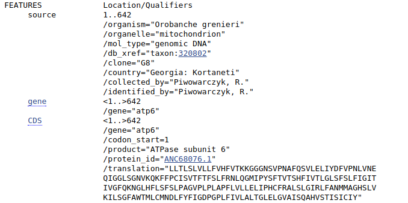

Dalej znajduje się sekwencja nukleotydów, czyli to czego zazwyczaj szukamy w GenBank-u.

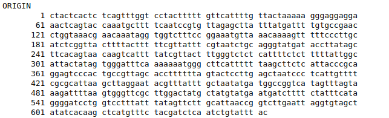

Mogłoby się wydawać, że teraz można zaznaczyć fragment z sekwencją nukleotydów, skopiować i wkleić do edytora tekstu aby po uzupełnieniu linii z opisem sekwencji (zaczynającej się od znaku `>`) otrzymać plik `FASTA`. Można, ale nie jest to najlepszy pomysł. Przede wszystkim ze względu na to, że skopiowany tekst zawiera numery i spacje, które trzeba by usunąć. Jak zatem otrzymać sekwencje w formacie `FASTA`? Na górze strony znajdują się linki `FASTA` oraz `Send to`. Po kliknięciu pierwszego z nich uzyskujemy stronę z wynikiem w tym właśnie formacie, który można skopiować i wkleić do edytora tekstu, łącznie z linią opisu sekwencji. 

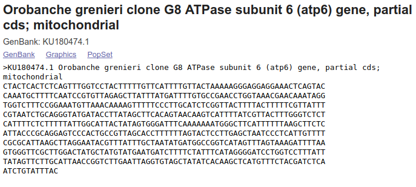

Klikając w `Send to` otwiera się okienko, które pozwala m. in. zapisać sekwencję do pliku `FASTA` (patrz wyżej).

Dużo dokładniejszy opis poszczególnych pól opisujących sekwencję można znaleźć w dokumentacji GenBank-u pod adresem [https://www.ncbi.nlm.nih.gov/Sitemap/samplerecord.html](https://www.ncbi.nlm.nih.gov/Sitemap/samplerecord.html).

### Zadanie

Utwórz plik `atp6.fasta` w którym umieść następujące sekwencje:

```
Artemisia campestris KU180471
Centaurea scabiosa KU180476
Helianthus annuus FJ595983
Magnolia stellata KC879635
Mimulus guttatus HQ593782
Orobanche alba KU180469
Orobanche grenieri KU180474
Peucedanum cervaria KU180475
Phelipanche purpurea KU180468
Phelipanche ramosa KU180466
Solanum tuberosum AF095276
```

## Pobieranie sekwencji genu z genomu

Dotychczas wyszukiwaliśmy sekwencje, które zostały umieszczone w GenBank-u jako oddzielne sekwencje genów. Nie zawsze jednak sytuacja jest tak wygodna. W wielu przypadkach sekwencje genów są częścią dużo dłuższych odcinków DNA, na przykład chromosomów, genomów plastydowych czy mitochondrialnych. Pokażę teraz jak z nich wydobyć interesujące nas sekwencje. 

Wyszukaj w GenBank-u sekwencję 'NC_001284'. Pokaże się taki wynik:


Jak widać z opisu oraz informacji poniżej znaleźliśmy sekwencję genomu mitochondrialnego _Arabidopsis thaliana_. Teraz wyszukajmy w niej sekwencję genu `cox3`. W tym celu w sekcji `FEATURES` należy znaleźć pole `gene` z wartością `\gene="cox3"`. Ponieważ liczba opisanych sekwencji jest bardzo długa, nie ma sensu przeglądać całości w poszukiwaniu żądanego genu. 

Jednym ze sposobów znalezienia go jest użycie wbudowanej w wyszukiwarce internetowej wyszukiwarce tekstu, wywoływanej skrótem <Ctrl+F>. W okienku wpisujemy `cox3` i szukamy odpowiedniej części wyniku.

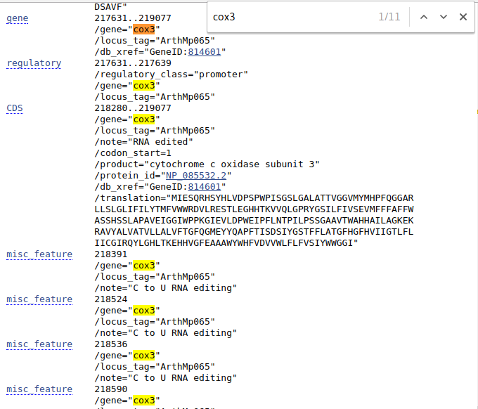

Pole `gene` odnosi się do regionu oznaczonego jako gen, niekoniecznie zawierający wyłącznie miejsca kodujące. Te są opisane w części oznaczonej jako `CDS` (_coding sequence_).

Przy `gene` mamy podany zakres odcinka `217631..217639`, dla `CDS` jest to `218280..219077`. Mamy też podane inne, dotyczące genu informacje jak miejsce zajmowane przez promotor czy miejsca edycji RNA. Dla `CDS` jest także pokazana sekwencja aminokwasów. 


Kliknij teraz na `gene`. 


Pokazuje się, zaznaczony na brązowo, fragment genomu mitochondrialnego odpowiadający żądanej sekwencji. Na dole pojawia się także pasek nawigacyjny pomiędzy cechami (`Features`), ,,dymek'' z różnymi informacjami a także linki umożliwiające wyświetlenie sekwencji w odpowiednim formacie, w tym `FASTA`.

Jeśli zamiast `gene` klikniemy `CDS` otrzymamy podobny wynik, ale z informacjami charakterystycznymi dla sekwencji kodującej:


Po kliknięciu w link `FASTA`  na dole ekranu pojawia się sekwencja w formacie `FASTA`. 


Podobny widok widzieliśmy wcześniej ale zwróć uwagę, ze po prawej znajduje się okienko, w którym znajdują się edytowalne pola z zakresem wyświetlanej sekwencji. Czasem chcemy pobrać nieco dłuższy (lub krótszy) fragment niż wyświetlany domyślnie, wtedy można zmienić numery i kliknąć `Update View`. Wyświetli się zmodyfikowany zakres nici DNA.


Sekwencję można pobrać tak jak opisywałem poprzednio.

## Sekwencje komplementarne

Czasem przy opisie sekwencji znajdujemy informację, że jest ona komplementarna (`complement`), co oznacza, że znajduje się ona na nici komplementarnej. Znajdź gen `rpl16`.

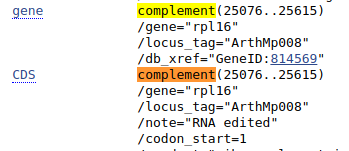

Taka sekwencja przy dopasowaniu do innych powinna być przekształcona w sekwencję odwróconą komplementarną. Na szczęście jeśli wyświetlimy ten fragment w formacie `FASTA` otrzymamy od razu sekwencję w odpowiedniej formie. Zauważ, że zakres sekwencji jest podany w odwrotnej kolejności:

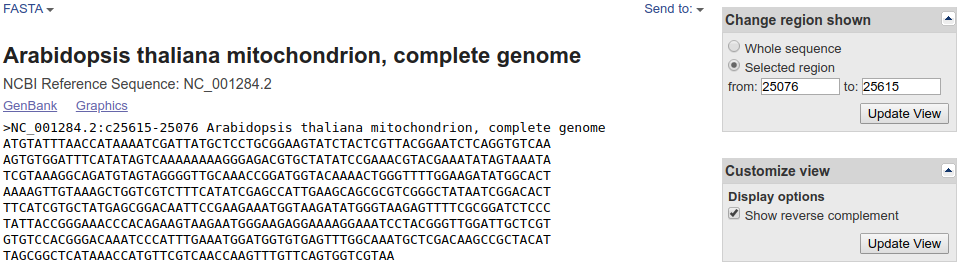

## Sekwencje we fragmentach

Znajdź teraz gen `nad2`. 

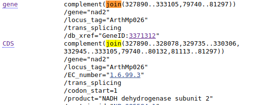

Zauważ, że przy opisie genu znajduje się nie tylko informacja, że jest ona komplementarna ale, że aby uzyskać sekwencję genu (lub `CDS`) trzeba połączyć kilka fragmentów (`join`). Czasem niektóre fragmenty są komplementarne inne nie, mogą też pochodzić z różnych sekwencji w bazie (np. rożnych chromosomów). Sprawdź na przykład gen `nad1` w sekwencji `KF754803`.  Kompletna, złożona sekwencja powinna pokazać się po kliknięciu linku `FASTA` w lewym dolnym rogu, ale nie zawsze to działa. W takim wypadku można po kolei wyświetlać kolejne fragmenty genomu w formacie `FASTA` (jak pokazałem powyżej) a następnie je łączyć w edytorze tekstu lub programie do obróbki sekwencji. Jeśli sekwencja jest komplementarna, jak w przypadku `nad2`, trzeba będzie ją zmienić na odwróconą, komplementarną. Łączenie fragmentów może być nużące, jest to jeden z przypadków, w których wygodniejsze może być użycie narzędzi działających w linii komend.


