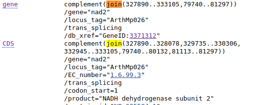

# Pobieranie sekwencji z bazy GenBank i praca w plikami `FASTA` przy pomocy linii komend

## Dlaczego linia komend?

Pobieranie sekwencji przy użyciu narzędzi uruchamianych z linii komend jest w niektórych sytuacjach łatwiejsze, zwłaszcza gdy wiemy, które sekwencje (albo ich fragmenty) i/lub chcemy pobrać ich wiele.

## Dostęp do GenBank-u przy pomocy narzędzi Entrez Direct

,,Entrez Direct'' to grupa programów opublikowanych przez NCBI umożliwiających dostęp do baz danych tej organizacji. Podręcznik do pakietu (wraz z instrukcją instalacji) pt. [Entrez Direct: E-utilities on the UNIX Command Line](https://www.ncbi.nlm.nih.gov/books/NBK179288/) można znaleźć pod adresem [https://www.ncbi.nlm.nih.gov/books/NBK179288/](https://www.ncbi.nlm.nih.gov/books/NBK179288/). Nie będziemy oczywiście poznawać dogłębnie wszystkich narzędzi ale pokażę kilka przydatnych komend i sposobów ich wykorzystania.

### Wyszukiwanie sekwencji - `esearch`

Do wyszukiwania informacji w bazach danych służy narzędzie `esearch`. Przy podstawowym użyciu, przyjmuje dwa argumenty: 

  * `-db` - określający bazę do której zostanie wysłane zapytanie
  * `-query` - zapytanie

Wywołanie programu będzie wyglądało tak:

```
esearch -db identyfikator_bazy -query zapytanie
```

Jeśli zapytanie składa się z wielu słów, należy je zamknąć w cudzysłowach.

Lista identyfikatorów wybranych baz danych znajduje się pod adresem [https://www.ncbi.nlm.nih.gov/books/NBK25497/table/chapter2.T._entrez_unique_identifiers_ui/?report=objectonly](https://www.ncbi.nlm.nih.gov/books/NBK25497/table/chapter2.T._entrez_unique_identifiers_ui/?report=objectonly). Jak widać jest ich wiele. Nas będzie interesowała teraz baza ,,Nucleotide'', która ma identyfikator `nuccore` lub `nucleotide`. To właśnie z niej wcześniej korzystaliśmy przez stronę internetową.  

Warto też przejrzeć wbudowaną pomoc programu, gdzie znajdziemy nie tylko identyfikatory baz ale też opisy innych opcji programu. Uruchamiamy ją wpisując:

```
$: esearch -h
```

Uruchom  polecenie:

```
$: esearch -db nucleotide -query "atp6 Orobanche"
```

Pokaże się wynik:

```
<ENTREZ_DIRECT>
  <Db>nucleotide</Db>
  <WebEnv>NCID_1_33234224_130.14.18.34_9001_1517069868_100176055_0MetA0_S_MegaStore_F_1</WebEnv>
  <QueryKey>1</QueryKey>
  <Count>17</Count>
  <Step>1</Step>
</ENTREZ_DIRECT>
```

Nie wydaje się zbyt przydatny, ale można zrozumieć, że znaleziono 17 wyników. Nie widać żadnych sekwencji. Zaraz pokażę jak uzyskać bardziej użyteczny rezultat. 

### Pobieranie sekwencji - `efetch`

Drugim narzędziem pakietu Entrez Direct z którego będziemy korzystać jest `efetch` służący, jak wskazuje nazwa, do pobierania danych. 

Znając numer dostępowy sekwencji można ją pobrać w ten sposób:

```
efetch -db identyfikator_bazy -format format_wyniku -id numer_dostępowy
```

Na przykład:

```
$: efetch -db nucleotide -id KU180461 -format fasta
```

Wynik jest zgodny z oczekiwaniami:

```
>KU180461.1 Orobanche coerulescens clone 12 ATPase subunit 6 (atp6) gene, partial cds; mitochondrial
CTGCTAACTCTCAGTTTGGTCCTACTTCTGATTCATTTTGTTACTAAAAAGGGAGGAGGAAACTCAGTAC
CAAATGCTTGGCAATCCGTGGTAGAGTTTATTTATGATTTCGTGCTGAACCTGGTAAACGAACAAATAGG
GGGTCTTTCCGGAAATGTTAAACAAAAGTTTTTCCCTTGCATCTTGGTCACTTTTACTTTTTTGTTATTT
TGTAATCTTCAGGGTATGATACCTTATAGCTTCACAGTTACAAGTCATTTTCTCATTACTTTAGGTCTCT
CATTTTCTCTTTTTATTGGCATTACTATAGTGGGATTTCAAAGAAATGGGCTTCATTTTTTAAGCTTCTT
ATTACCCGCAGGAGTCCCACTGCCATTAGCACCTTTTTTAGTACTCCTTGAGCTAATTTCTTATTGTTTT
CGCGCATTAAGCTTAGGAATACGTTTATTTGCTAATATGATGGCCGGTCATAGTTTAGTAAAGATTTTAA
GTGGGTTCGCTTGGACTATGCTATGTATGAATGATCTTTTGTATTTTATAGGGGATCTTGGTCCTTTATT
TATAGTTCTTGCATTAACCGGTCTTGAATTAGGTGTAGCTATATCACAAGCTCATGTTTCTACGATCTCA
ATCTGTATTTAC
```

Wynik oczywiście możemy zapisać w pliku używając znaku `>`:

```
efetch -db nucleotide -id KU180461 -format fasta > atp6.fasta
```

Przejrzyj pomoc programu, którą wywołasz komendą:

```
efetch -h
```

Poeksperymentuj z różnymi formatami wyniku.

Teraz sprobujemy użyć polecenia `efetch` do pobrania serii sekwencji, tych samych, które należało pobrać przy pomocy przeglądarki w poprzedniej części.
Zapisz ich numery, po jeden w każdej linii w pliku `atp6_numery.txt`

```
KU180471
KU180476
FJ595983
KC879635
HQ593782
KU180469
KU180474
KU180475
KU180468
KU180466
AF095276
```

Teraz napiszemy skrypt (`, który w pętli będzie kolejno odczytywał numery sekwencji i przekazywał je do polecenia `efetch`, które będzie je pobierało i zapisywało w pliku. Nazwę pliku z danymi i nazwę pliku wynikowego będziemy podawać jako argumenty przy wywoływaniu skryptu.

```
#!/bin/bash

# Nazwa pliku z danymi podana jako pierwszy argument
dane=$1
# Nazwa pliku wynikowego podana jako drugi argument
fileout=$2

# Tworzony jest plik wynikowy, jeśli istnieje zostaje nadpisany
echo > $fileout

# Pętla odczytująca numery sekwencji z pliku $dane,
# są one przechowywane w zmiennej nrGB
while read nrGB
do
	# Informacje o obieraniu i zapisywaniu sekwencji
	echo "Pobieram sekwencję $nrGB i zapisuję do pliku $fileout"
	# Pobieranie i zapisywanie sekwencji
	efetch -db nucleotide -id $nrGB -format fasta >> $fileout
done < $dane
```

Następnie uruchamiamy skrypt:

```
$: ./pobierz_sekwencje.sh atp6_numery.txt atp6_sekwencje.fasta

Pobieram sekwencję KU180471 i zapisuję do pliku atp6_sekwencje.fasta
Pobieram sekwencję KU180476 i zapisuję do pliku atp6_sekwencje.fasta
Pobieram sekwencję FJ595983 i zapisuję do pliku atp6_sekwencje.fasta
Pobieram sekwencję KC879635 i zapisuję do pliku atp6_sekwencje.fasta
Pobieram sekwencję HQ593782 i zapisuję do pliku atp6_sekwencje.fasta
Pobieram sekwencję KU180469 i zapisuję do pliku atp6_sekwencje.fasta
Pobieram sekwencję KU180474 i zapisuję do pliku atp6_sekwencje.fasta
Pobieram sekwencję KU180475 i zapisuję do pliku atp6_sekwencje.fasta
Pobieram sekwencję KU180468 i zapisuję do pliku atp6_sekwencje.fasta
Pobieram sekwencję KU180466 i zapisuję do pliku atp6_sekwencje.fasta
Pobieram sekwencję AF095276 i zapisuję do pliku atp6_sekwencje.fasta
```

Sprawdź zawartość pliku wynikowego.


## `efetch` - pobieranie fragmentów sekwencji

Dzięki programowi `efetch` można też uzyskać fragment sekwencji podając miejsce pierwszego i ostatniego nukleotydu żądanego fragmentu. Służą do tego opcje: `-seq_start` i `-seq_stop`. 

Na przykład wytnijmy sekwencję genu `nad2` z genomu mitochondrialnego _Arabidopsis thaliana_ o identyfikatorze `NC_001284`. Miejsca początku i końca genu odczytamy z wyniku wyszukiwania:


Teraz przekażmy je do polecenia:

```
efetch -db nuccore -id NC_001284 -format fasta -seq_start 134071 -seq_stop 138153
```

Otrzymamy żądany fragment genomu.

Teraz powróćmy do problemu pobieraniu sekwencji we fragmentach z którym zetknęliśmy się [w lekcji poświęconej pobieraniu sekwencji z GenBank-u przy pomocy strony internetowej](16-genbank.md). Sekwencja genu `nad2` w genomie _Arabidopsis thaliana_ (nr. NC_001284) występowała tam w dwu, oddzielonych od siebie fragmentach, przy czym część kodująca (`CDS`) miała aż pięć części. 



W dodatku były to sekwencje komplementarne (i odwrócone). Teraz pokażę jak używając prostego skryptu pobrać żądane fragmenty i połączyć je w jedną sekwencję.

Można oczywiście po kolei wykonywać polecenia pobierania fragmentów z sekwencji, za pomocą narzędzia `efetch` jak pokazałem powyżej i dołączać wyniki do pliku `FASTA`.

```
efetch -db nuccore -id NC_001284 -format fasta -seq_start 327890 -seq_stop 328078 > nad2_A_thaliana.fasta
efetch -db nuccore -id NC_001284 -format fasta -seq_start 329735 -seq_stop 330306 >> nad2_A_thaliana.fasta
efetch -db nuccore -id NC_001284 -format fasta -seq_start 332945 -seq_stop 333105 >> nad2_A_thaliana.fasta
efetch -db nuccore -id NC_001284 -format fasta -seq_start 79740 -seq_stop 80132 >> nad2_A_thaliana.fasta
efetch -db nuccore -id NC_001284 -format fasta -seq_start 81113 -seq_stop 81297 >> nad2_A_thaliana.fasta
```

Komendy możesz wpisywać i uruchamiać w terminalu, albo umieścić je w skrypcie (np. `pobierz_odcinki.sh`) i go uruchomić.

Otrzymany plik będzie miał taką zawartość:

```

>NC_001284.2:327890-328078 Arabidopsis thaliana mitochondrion, complete genome
TTAAAGATATGAACTGAGTGCCATTTGATGAGTAACTGAGAACAAAGGAGAGGGGTATAGCAAGGATGAA
GTAATGAAAAAGGAAGTCATTGCTAGTAGTAACGACTTATTACGATCCATTGGTTCATATAGAATCCATG
TCCTAGGTGTATCAAAAAACATTCTTTTCACTAAGCGTATATAATAAAA
>NC_001284.2:329735-330306 Arabidopsis thaliana mitochondrion, complete genome
ACGACCTATAACGCTAGTCACTACTCCCACTGGGGCTAGAAAGTAAGCCCCACAACCCAAAGCGGCGAAG
AACAAATAGAATTTGCTACAAAAGCCGGCTAACGGGGGTATTCCTGCGTATGAGAACATAGTAATGGAGA
AGGTAATAGCCGAAATAGGATTCGTTTTGGCTAGAGCGCCCAAATCCGCTATATATTTGACACGGGTTTG
CCGTAATGCTGAAACTATGGCGAATGCATCCATCGTCATTAATGCATAAATAAAGATACCAATTAGTAGT
GATTGAATTCCTTCTATGGTTCCACATGAGAAACCAGTACGAATATAACCTACATGTCCAATTGAACTAT
GAGCTAGAGGTCTTTTGACTTTCGTTTGGGCCATGGCGGCCAGTGCTCCTAAGATCATAGAAGCAATGCT
GCAGAAAAAGAAGATTTGTTGCAATGTAGCTCCATAGGAACCATAAATAGAAACACGTAAAATATTAGCA
GAAATAGAGATTTTAGGCGCAATAGAAAGGAATGCTGTAACCGGGGTGGGTGAACCCTCATAGATATCTG
GTGCCCACATAT
>NC_001284.2:332945-333105 Arabidopsis thaliana mitochondrion, complete genome
GAAAAGGAACTGCAGTGATCTTGAATAGGAATCCTACAGCGATAGACAGAATCCCCATAAAAATACCACT
AGATCGAGCACCAGTGATTTCGTATCCGGTCAAAATCTTGGCTAATTGATCGAAGTGGGTAGCTCCAGTA
GACCCATAGATCATGGAACAA
>NC_001284.2:79740-80132 Arabidopsis thaliana mitochondrion, complete genome
CCAAACAATAATATTCCAGAGGAAAATGCACCTAAGATCAAATATTTCGAGCCGGCTTCCGTGGAAAATT
CAGACTTTCTTTTTGATGCTGCGATTACATAAAAACATAAACTTTGAGGCTCAATAGCTAAATACATGGC
AATTAAATCATGAGCCGAGATCATAAAGAGCATACCGCGAGTAGGAAGTGGAATTAATACAATGAATTCA
AAAGCATCAAACCTCTCTTGGTCGGAAGAATCGAAACACATCGAAATGGTACCAGCCGTACTTAATAATA
GAAAGATTTGGCAGAAATATGTAAAATTGTCCCTCCTAAAAAGATTATTCCAGAATAAATGGGCAATAGT
TAGGAGAGGTGCGCCAGCGGCGAGCAGAAGCAAGGTTATTAGA
>NC_001284.2:81113-81297 Arabidopsis thaliana mitochondrion, complete genome
ACACTAAGTAATCCAAGCCAACCCACATTACTGGCTAACGGCGGATAATCATATTTCTTAGAGGTACTAA
ATACAACTCCATGAATGAGCAAAATGGAGGTTGCATTAATGATAAAGATCTCTGGGGAAACCGCTAAAAA
AAGATTGAACATGTGTGGGAGGATCCGAACGAATTCTGCTTTCAT
```

Zamiast uruchamiać wielokrotnie tą samą komendę, można utworzyć plik tekstowy z miejscami początku i końca fragmentów sekwencji a następnie stworzyć skrypt, który w pętli po kolei je pobierze i umieści w pliku.

Najpierw utworzymy plik, w którym zapiszemy kolejne miejsca początku i końca fragmentów sekwencji oddzielone znakiem tabulatora (`odcinki.tsv`).

```
327890	328078
329735	330306
332945	333105
79740	80132
81113	81297
```

Teraz skrypt: 

```
#!/bin/bash
# Plik z danymi podany jako argument 1 przy uruchamianiu skryptu
data=$1
# Plik wyjściowy podany jako argument 2 przy uruchamianiu skryptu
fileout=$2
# Numer sekwencji w GenBank-u podany jako argument 3
nrGB=$3

# Tworzymy plik wejściowy, jeśli już istnieje to jego zawartość zostaje usunięta
echo > $fileout

# Pętla. Wartości start i stop odczytywane są z pliku $data
while read start stop
do
	# Skrypt informuje, który fragment pobiera
	echo "Pobieram fragment: $start - $stop z sekwencji $nrGB i zapisuję do pliku $fileout"
	# Pobranie fragmentu i zapisanie do pliku
	efetch -db nuccore -id $nrGB -format fasta -seq_start $start -seq_stop $stop >> $fileout
done < $data
```


```
$: ./pobierz_odcinki_petla.sh odcinki.tsv nad2_A_thaliana.fasta NC_001284 

Pobieram fragment: 327890 - 328078 z sekwencji NC_001284 i zapisuję do pliku nad2_A_thaliana.fasta
Pobieram fragment: 329735 - 330306 z sekwencji NC_001284 i zapisuję do pliku nad2_A_thaliana.fasta
Pobieram fragment: 332945 - 333105 z sekwencji NC_001284 i zapisuję do pliku nad2_A_thaliana.fasta
Pobieram fragment: 79740 - 80132 z sekwencji NC_001284 i zapisuję do pliku nad2_A_thaliana.fasta
Pobieram fragment: 81113 - 81297 z sekwencji NC_001284 i zapisuję do pliku nad2_A_thaliana.fasta
```

Sprawdź plik wynikowy.


## Łączymy `efetch`, `sed`, `tr` i `rev`

Jak widać poszczególne fragmenty występują oddzielnie. Teraz powinniśmy połączyć je w jedną sekwencję. Można to zrobić w edytorze tekstu ale od czego mamy linię komend i narzędzia [`sed`, `tr` i `rev`](12-pliki_tekstowe.md)?

Zadanie wykonamy w pięciu etapach:

  1. Usuniemy linie z opisami sekwencji
  2. Połączymy fragmenty w jedną sekwencję
  3. Przekształcimy ją w sekwencję komplementarną
  4. Odwrócimy sekwencje
  5. Dodamy opis w pierwszej linii pliku

Zastanów się, najpierw ogólnie, jak te zadania zrealizować używając programów `sed`, `tr` i `rev`? 

  1. Usunąć linie zaczynające się od znaku `>`: `tr` lub `sed`
  2. Usunąć wszystkie znaki końca linii: `\n`: `tr`
  3. Zmienić na sekwencję komplementarną: `tr`
  4. Odwrócić sekwencję: `rev`
  5. Wprowadzić do pierwszej linii pliku opis sekwencji

Teraz przekształćmy pomysł w konkretny kod. Utwórz skrypt `polacz_odcinki.sh`:

```
#!/bin/bash

# Nazwa pliku z sekwencjami
surowy=nad2_A_thaliana.fasta
# Plik wyjściowy
file=polaczony_$surowy

# Kopiujemy plik z sekwencjami do pliku wyjściowego, 
# który będziemy modyfikować
cp $surowy $file

# Usuwanie linii z opisami, czyli linii zaczynających się od znaku > 
sed -i '/^>/d' $file

# Łączymy wszystkie linie w jedną, usuwając oznaczenia końca linii
# Wynik umieszczamy w pliku tymczasowym
cat $file | tr -d "\n" > $file.tmp

# Zmieniamy na sekwencję komplementarną, wynik umieszczamy 
# w drugim pliku wyjściowym

cat $file.tmp | tr "ACGT" "TGCA" > $file.tmp2
# Odwracamy sekwencję, wynik umieszczamy w pliku wyjściowym 
# zmieniając jego zawartość

cat $file.tmp2 | rev > $file

# Wstawiamy pierwszą linię z opisem i znak nowej linii
sed -i '1s/^/>NC_001284_Arabidopsis_thaliana_nad2\n/' $file

# Usuwamy pliki tymczasowe
rm $file.tmp*

```

Można też skonstruować ,,jednolinijkowca'':

```
cat nad2_A_thaliana.fasta | sed '/^>/d' | tr -d "\n" | tr "ACGT" "TGCA" | rev | sed '1s/^/>NC_001284_Arabidopsis_thaliana_nad2\n/' > polaczony_RC_nad2_A_thaliana.fasta
```

## Łączymy `esearch` i `efetch`

Dotychczas używaliśmy dwu narzędzi: służący do wyszukiwania `esearch` i pobierający sekwencje `efetch` oddzielnie. Ale możemy je razem połączyć za pomocą potoku tak aby wyszukiwanie połączyć z pobieraniem.

```
esearch -db nucleotide -query "atp6[All Fields] AND Orobanche[Organism]" | efetch -format fasta > atp6_Orobanche.fasta
```

## `samtools faidx`- pobieranie sekwencji z pliku `FASTA`

Pobierz plik `http://ggoralski.pl/files/filogenetyka-data/Orobanchaceae-trnL-trnF-aligned.fasta`

Sprawdź jego zawartość. Używaliśmy go już we wcześniejszych ćwiczeniach, zawiera wyrównane sewkencje `trnL-trnF`.

Teraz sprawdź nazwy sekwencji używając komendy `grep`:

```
$: grep ">" Orobanchaceae-trnL-trnF-aligned.fasta 

>KY484464_O._teucrii
>KY484493_O._flava
>KY484489_O._mayeri
>KY484471_O._kochii
>KY484474_O._elatior
>KU238865_O._coerulescens
>KY484502_P._ramosa
>KY484503_P._purpurea
>KX524675_Lindenbergia_siniaca
```

Teraz będziemy chcieli pobrać z pliku sekwencję o nazwie `KX524675_Lindenbergia_siniaca`. Można to zrobić oczywiście używając edytora tekstu lub programu do pracy z plikami `FASTA`, ale czasem wygodniej to zrobić używając linii komend. Użyjemy do tego zadania programu `faidx`, który jest częścią pakietu `samtools`.

Pakiet `samtools` zawiera wiele przydatnych programów do pracy z sekwencjami, przede wszystkim w innych formatach niż `FASTA`, ale `faidx` jest dość przydatne w codziennej pracy także w tym formacie.

Strona domowa projektu znajduje się pod adresem: [http://www.htslib.org/](http://www.htslib.org/). Tam też można przeczytać manuale programów.

Na Debianie można zainstalować pakiet komendą:

```
sudo apt-get install samtools
```

W innym przypadku, można pobrać pliki źródłowe ze strony i skompilować wg. znajdującej się tam instrukcji.

Uruchamianie narzędzi z pakietu `samtools` wygląda następująco:

```
samtools nazwa_narzedzia opcje
```

W przypadku `faidx` będzie to wyglądało tak:

```
samtools faidx opcje
```

Opcjami, które użyjemy będzie kolejno nazwa pliku, z którego pobierzemy sekwencję i nazwa sekwencji.
Uruchom:

```
samtools faidx Orobanchaceae-trnL-trnF-aligned.fasta KX524675_Lindenbergia_siniaca
```

Na ekranie wyświetli się żądana sekwencja, oczywiście można ją zapisać w pliku używając `>`.

Zauważ, że podajemy pełną nazwę sekwencji (bez znaku `>`), wpisanie jej fragmentu nie zadziała. Może to być pewnym mankamentem, na przykład gdy nazwy są długie albo gdy chcemy pobrać wiele sekwencji, których nazwy mają jakąś część wspólną (np. nazwę rodzaju.). W taki przypadku pomocne będzie polecenie `grep`. 

Uruchom:

```
$: grep "O." Orobanchaceae-trnL-trnF-aligned.fasta

>KY484464_O._teucrii
>KY484493_O._flava
>KY484489_O._mayeri
>KY484471_O._kochii
>KY484474_O._elatior
>KU238865_O._coerulescens
```

W ten sposób otrzymujemy pełne nazwy wszystkich sekwencji należących do _Orobanche_. Teraz powinniśmy je przekazać do polecenia `faidx`, ale najpierw musimy pozbyć się znaków `>`:

```
$: grep "O." Orobanchaceae-trnL-trnF-aligned.fasta | sed 's/>//'

KY484464_O._teucrii
KY484493_O._flava
KY484489_O._mayeri
KY484471_O._kochii
KY484474_O._elatior
KU238865_O._coerulescens
```

Czas użyć ich przy wywołaniu `faidx`. Polecenie:

```
grep "O." Orobanchaceae-trnL-trnF-aligned.fasta | sed 's/>//' | samtools faidx Orobanchaceae-trnL-trnF-aligned.fasta
```

nie zadziała. Trzeba wykorzystać `xargs`:

```
grep "O." Orobanchaceae-trnL-trnF-aligned.fasta | sed 's/>//' | xargs samtools faidx Orobanchaceae-trnL-trnF-aligned.fasta > Orobanche-trnL-trnF.fasta
```

Sprawdź zawartość pliku wynikowego.

Przy okazji pobierania sekwencji, można je oczywiście zmodyfikować. Na przykład możemy zmienić skrót `O.` na pełną nazwę rodzajową `Orobanche` i usunąć wszystkie znaki `-` oznaczające brak nukleotydu. Użyjemy w tym celu poecenia `sed`. Przy usuwaniu `-` pamiętaj o dodaniu `g`, który pozwala na wykonaniu polecenia na wszystkich znakach w linii.:

```
grep "O." Orobanchaceae-trnL-trnF-aligned.fasta | sed 's/>//' | xargs samtools faidx Orobanchaceae-trnL-trnF-aligned.fasta | sed 's/O\./Orobanche/' | sed 's/-//g' | > Orobanche-trnL-trnF.fasta
```
