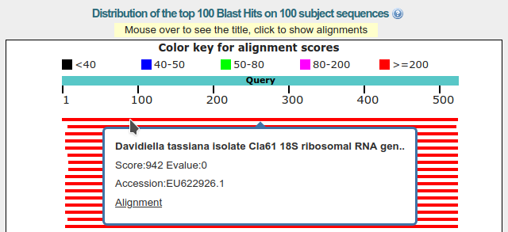

# BLAST - wyszukiwanie podobnych sekwencji

## Czym jest BLAST i do czego służy?

[BLAST](https://blast.ncbi.nlm.nih.gov) to narzędzie, dostępne przez stronę internetową pozwalające znaleźć w bazie danych sekwencje nukleotydowe lub proteinowe podobne do szukanej. Można je znaleźć pod adresem: [https://blast.ncbi.nlm.nih.gov](https://blast.ncbi.nlm.nih.gov). Jak widać w adresie strony, podobnie jak GenBank, BLAST jest udostępniany przez NCBI, oba narzędzia są ze sobą ściśle powiązane. Istnieje także BLAST w formie programu obsługiwanego z linii komend, ale nim nie będziemy posługiwać się na kursie. 

BLAST jest potężnym narzędziem o wielu możliwościach. Na kursie poznamy tylko podstawowe funkcje, ograniczone do pracy z sekwencjami DNA.

## Wyszukanie podobnej sekwencji DNA

Po wejściu [na witrynę BLAST](https://blast.ncbi.nlm.nih.gov) widzimy taką stronę:


Można na niej wybrać wyszukiwanie sekwencji nukleotydów na podstawie sekwencji nukleotydów, wyszukiwanie sekwencji aminokwasów na podstawie sekwencji aminokwasów, wyszukiwanie sekwencji aminokwasów na podstawie sekwencji nukleotydów lub odwrotnie. Skupimy się na pierwszej możliwości (`blastn`), kliknij na ,,Nucleotide BLAST'':

.

Pokazuje się strona wyszukiwarki:


Pierwsza część służy wprowadzeniu zapytania. 


Jak widać, można przesłać plik z sekwencją w formacie `FASTA` albo użyć okienka ,,_Enter accession number(s), gi(s), or FASTA sequence(s)_'' do wprowadzenia sekwencji lub numeru identyfikacyjnego używanego przez GenBank.

Wklej do niego sekwencję:

```
GGATCTACTGATCGAGGTCACCTTAGAATGGGGTTGTTTTACGGCGTACCTCCCGAACACCCTTTAGCGA
ATAGTTTCCACAACGCTTAGGGGACAGAAGACCCAGCCGGACGATTTGAGGCACGCGGCGGACCGCGTTG
CCCAATACCAAGCGAGGCTTGAGTGGTGAAATGACGCTCGAACAGGCATGCCCCCCGGAATACCAGGGGG
CGCAATGTGCGTTCAAAGATTCRATGATTCACTGAATTCTGCAATTCACATTACTTATCGCATTTCGCTG
CGTTCTTCATCGATGCCAGAACCAAGAGATCCGTTGTTAAAAGTTTTAATTTATTAATTAAGTTTACTCA
GACTGCAAAGTTACGCAAGAGTTTGAAGTGTCCACCCGGAGCCCCCGCCCGAAGGCAGGGTCGCCCCGGA
GGCAACAGAGTCGGACAACAAAGGGTTATGAATAACCAGGCCGAAGCCCGGGCGTTCTTGKAATGATCCC
TCCGCAGGTTCACCTACGGAGACCTTGTTACGACTG
```

Jest to fragment sekwencji [ITS](https://en.wikipedia.org/wiki/Internal_transcribed_spacer) jednego z gatunków rodzaju _Phelipanche_. Podczas badań filogenetycznych okazało się, że jedna z otrzymanych sekwencji (którą właśnie umieściliśmy w okienku wyszukiwarki) wyraźnie różni się od pozostałych. Teraz spróbujemy sprawdzić jakie może być jej pochodzenie. Między innymi do takich zadań stworzony został BLAST. 

W okienku ,,_Job Title_'' możemy nadać naszemu wyszukiwaniu jakąś nazwę.
Przy okazji zauważ, że w wielu miejscach znajdują ikony z pytajnikiem, kierujące nas do pomocy.


Pominiemy sekcję ,,Choose Search Set'', która pozwala zawęzić obszar poszukiwań i przejdziemy do kolejnej ,,Program selection''.


Tutaj wybieramy stopień podobieństwa wyszukiwanych sekwencji (i używany algorytm). W zależności od tego jaki stopień podobieństwa nas interesuje wybieramy jedną z trzech opcji. Zostawiamy pierwszą, domyślną.

Poniżej znajdujemy przycisk ,,BLAST'', który uruchamia wyszukiwanie oraz, poniżej link ,,_Algorithm parameters_''. Jak można się domyślić, rozwija on menu pozwalające ustawić parametry wyszukiwania.


Zostawimy domyślne ustawienia i wciskamy przycisk ,,BLAST''.

Pokazuje się strona wyświetlająca postęp wyszukiwania, nie należy jej odświeżać, robi to sama.


W końcu otwiera się strona z wynikami. Na górze znajdują się informacje dotyczące wyszukiwania oraz linki do różnych opcji, narzędzi, pobrania wyników  w różnych formatach oraz innych rodzajów podsumowania wyszukiwania.


Poniżej widzimy wyniki w formie graficznej:


Zielonkawy pasek przedstawia sekwencję, którą wysłaliśmy jako zapytanie (,,Query''). Powyżej znajduje się skala wyjaśniająca związek koloru pasków wyników z ich jakością. Poniżej znajdują się paski przedstawiające dopasowane do wyszukiwania sekwencje. Jak widać jakość wszystkich wyników znajduje się w przedziale >200 - co oznacza wysoki stopień dopasowania, co więcej większość z nich obejmuje całą długość wyszukiwanej sekwencji.
Po najechaniu kursorem na pasek z wynikiem pojawia się krótka informacja o sekwencji.


Klikając na pasku, możemy uzyskać nieco więcej informacji w tym numer GenBank-u znalezionej sekwencji a także link do dopasowania sekwencji o czym za chwilę.



Poniżej sekcji z graficznym przedstawieniem wyników znajduje się sekcja ,,_Descriptions_'' czyli z opisem wyników wyszukiwania. 


  * Pierwsza kolumna służy do zaznaczania poszczególnych wyników, np. w celu ich pobrania. 
  * Druga (,,_Description_'') to oczywiście informacja na temat znalezionej sekwencji. Klikając na nią, przechodzimy do przyrównania obu sekwencji w kolejnej sekcji.
  * Trzecia i czwarta (,,_Max score_'' i ,,_Total score_'') to punktacje wyniku, nie będziemy w nie wnikać. 
  * Piąta (,,_Query cover_'') oznacza stopień pokrycia zapytania przez wynik. 
  * Szósta (,,_E-value_'') przedstawia ,,znaczenie'' dopasowania (w sensie zbliżonym do terminu ,,znaczący statystycznie''). Wartość E mieści się między 0 a 1. Wartość 1 odpowiada losowemu podobieństwu. Im mniejsza wartość, tym wynik jest bardziej ,,znaczący''. Zauważ, że jest wynik przedstawiany jest w notacji naukowej, więc np. ,,1e-21'' to mniej niż ,,6e-20'' (akurat w tym wyniku dopasowane sekwencje mają wartość 0.0). Domyślnie tabela jest sortowana wg. tej wartości od najmniejszej do największej. Więc na górze znajdują się najbardziej ,,znaczące'' wyniki.
  * Siódma (,,_Ident_'') to oczywiście stopień identyczności obu sekwencji
  * Ósma (,,_Accession_'') zawiera numer dostępowy Gen-Banku. Klikając na niego, wchodzimy na stronę GenBank-u sekwencji.

Zwróć uwagę, jakie organizmy znalazły się na liście. Są to grzyby. Pierwszy wynik należy do _Davidella tassiana_ (inaczej _Cladosporium herbarum_), który infekuje wiele gatunków roślin, kolejne do znanego alergikom rodzaju _Cladosporium_ obejmujący grzyby rozkładające martwe szczątki organiczne oraz pasożytujące na roślinach. W zasadzie zagadka została już rozwiązana - najprawdopodobniej tajemnicza sekwencja pochodzi od grzyba, który zanieczyścił próbkę. Przyjrzyjmy się  jednak jeszcze niektórym innym informacjom, które dostarcza nam BLAST.

Kolejna sekcja zawiera znalezione przyrównania. Pierwszy rekord wygląda tak:


Na samej górze widzimy ikonę umożliwiającą nam pobranie znalezionej sekwencji w całości w formacie `FASTA`, tylko fragmentu dopasowanego w formacie `FASTA` lub całej sekwencji w formacie `GenBank` a także linki do strony GenBank sekwencji i widoku graficznego przyrównania.


Dalej umieszczone są informacje na temat sekwencji (z bazy GenBank), jego numer, funkcjonujący jako link do strony z informacjami na temat tej sekwencji w GenBank-u oraz dodatkowe informacje na temat przyrównania. Jak widać jest to sekwencja ITS (18S ribosomal RNA gene, partial sequence; internal transcribed spacer 1, 5.8S ribosomal RNA gene, and internal transcribed spacer 2, complete sequence; and 28S ribosomal RNA gene, partial sequence) należący (co stwierdziliśmy już wcześniej, do _Davidiella tassiana_.

Poniżej znajduje się informacja dotycząca długości przyrównania oraz linki do strony GenBank-u sekwencji oraz przedstawienia graficznego przyrównania. Po kliknięciu na ten drugi, pokazuje się taki widok. 


Nie będziemy go teraz analizować.

Poniżej widać dalsze informacje na temat przyrównania: wynik punktowy (_Score_), wartość E (_Expect_), liczby miejsc identycznych (_Identities_), liczba i udział indeli (_Gaps_) oraz orientację obu sekwencji (_Strand_). W tym przypadku orientacja jednej nici jest odwrócona względem drugiej. Warto na to zwrócić uwagę - jak widać BLAST wyszukuje sekwencje niezależnie od ich orientacji. Po wejściu na stronę dopasowanej sekwencji widać, że występuje ona tam w formie odwróconej i komplementarnej względem szukanej.  

Poniżej widać przyrównanie obu sekwencji wraz z numerami nukleotydów rozpoczynających i kończących każdy z odcinków. Po numerach widać, że jedna sekwencja jest odwrócona względem drugiej. Linie pionowe łączące nukleotydy oznaczają ich zgodność.

Jeśli nie znamy pozycji systematycznej znalezionych dopasowań, można na stronie sekwencji kliknąć w nazwę organizmy w polu `ORGANISM`:


Zauważ, że nazwa gatunkowa w tym polu nie jest taka sama jak w opisie. Taka rozbieżność nie musi wynikać z błędu ale z różnego nazewnictwa taksonu. Przy okazji ważna uwaga: taksonomia, którą znajdziesz w GenBank-u nie powinna być uważana za oficjalne źródło nazewnictwa i klasyfikacji organizmów, ma ona charakter wyłącznie pomocniczy. Widać to zresztą w uwadze, którą możemy przeczytać na stronie, która otworzy się po kliknięciu:


Znajdziemy tam także opis pozycji taksonomicznej organizmu. Strona na której znaleźliśmy się jest częścią kolejnej bazy `NCBI` związanej z GenBankiem. Umożliwia ona m. in. wyszukiwanie sekwencji wg. pozycji taksonomicznej organizmów. Nie będziemy jednak tego tematu teraz rozwijać. 

## Pozycja taksonomiczna wyników

Jeśli nie wiemy jaka jest pozycja taksonomiczna organizmów, które znalazły się na liście znalezionych dopasowań można skorzystać z ,,Raportu taksonomicznego''. W tym celu wracamy na górę strony z wynikami i klikamy na `Taxonomy report`:


Otrzymujemy raport pokazujący położenie systematyczne organizmów:


## Fragment genomu

Wyszukaj następującą sekwencję:

```
CATGTTAGTGTGCTGTTCATCGACTAGAAGGTGATGGGCGTTCGGATTGACTTCTGAAACGCTTAAGATA
TAGTCAGACTCTACTTGAAAAAGTACAGGGTATCGAAAGAATATCTGTTTATTGGATATTGTAATGAATG
TTACAGCTATTTAGAGGGAAAGTCCTATAATAGGATGAATTCGTATCTGGGATTACTCCAAGCCTTCGCG
GATGCACTAAAGCTTATATTAAAAGAGTACGTAT
```

Opis znalezionego dopasowania wygląda tak: 


Jak widać, jest to fragment genomu (40310 do 40553) mitochondrialnego _Claviceps purpurea_ (Buławinki czerwonej). Nie wiemy jednak nic więcej na temat tej sekwencji. W takim przypadku może pomóc przestudiowanie opisu sekwencji na stronie GenBank-u. Nie należy jednak otwierać strony całego genomu ale dopasowanego fragmentu. W Tym celu kliknij na link `GenBank` we wskazanym miejscu:


Otwiera się strona GenBank z dopasowanym fragmentem i jego opisem:


Można z niego wyczytać, że szukana sekwencja należy do genu `NAD1`.

## Zadanie

Sprawdź do jakich genów (sekwencji) i jakich organizmów należą następujące sekwencje:

Sekwencja 1:

```
CTACTCACTCTCAGTTTGGTCCTACTTTTTGTTCATTTTGTTACTAAAAAGGGAGGAGGAAAGTCAGTAC
CAAATGCTTTTCAATCCGTGTTAGAGCTTATTTATGATTTTGTGCCGAACCTGGTAAACGAACAAATAGG
TGGTCTTTCCGGAAATGTGAAACAACAGTTTTTCCCTTGCATCTCGGTTACTTTTACTTTTTCGTTATTT
CGTAATCTTCAGGGTATGATACCTTATAGCTTCACAGTAACAAGTCATTTTATCGTTACTTTGGGTCTCT
CATTTTCTCTTTTTATTGGCATTACTATAGTGGGATTTCAAAAAAATGGGCTTCATTTTTTAAGCTTCTC
ATTACCCGCAGGAGTCCCACTGCCGTTAGCACCTTTTTTAGTACTCCTTGAGCTAATCCCTCATTGTTTT
CGCGCATTAAGCTTAGGAATACGTTTATTTGCTAATATGATGGCCGGTCATAGTTTAGTAAAGATTTTAA
GTGGGTTCGCTTGGACTATGCTATGTATGAATGATCTTTTATATTTCATAGGGGATCCTGGTCCTTTATT
TATAGTTCTTGCATTAACCGGTCTTGAATTAGGTGTAGCTATATCACAAGCTCATGTTTCTACGATCTCA
ATCTGTATTTAC
```

Sekwencja 2:

```
GGGGCTGCGTGCAGACACACCAAGGAAAAAGCTCCAGGAACCAAATGAATAACATTGTGTTGGGGTGGAA
CTCCCTCGAAATTAGGAAAGAAGGGCTTTATACATATAATGCACACGTATAAATACTGACATAGCAAACG
ATTAATCACGGAACCCATATCATAATATAGGTTCTTTATTT
```

Sekwencja 3:

```
AATAAATCCAGTTTACTGATTGTGAAACGATTAATTACTCGAATGTATCAACAGAATTATTGGATTATTT
CTACTAATGATTCATCGAATCAAAATAGATTTTGGGCGCGCAACAATAATTTGTATTCTCAAATCATATC
AGAGGGGTTTGCTTTTATTGTGGAAATTCCATTTAATCTACGATTAATATCTTGTCTAGAAGGGAAAAAT
CAAAAGATAGTAAAATCTCAGAATTTACGATCAATTCATTCAATATTTCCCTTTTTAGAGGACAATTTTT
CACATTTAAATTTTTTATTAGATATACTAATACCCCACCCTGTCCATGGGGAAATCTTGGTTCAAACTCT
TCGCTATTGGGTAAAAGATGCTTCTTCTTTGCATTTATTACGATTCTTTCTCAACAAGTATTGGAGTCTT
ATTACTCCAAAGAAAGCCAGTTCCTTTTTTTCAAAAAGGAATCAAAGATTATTCTTATTCTTATATAATT
CTCATGTATGTGAATATGAATCTATTTTAGTCTTTCTACGTAACCAATCTTCTCATTTACGATCAACATC
TTTTGGAGTTCTTCTTGAACGAATCTATTTCTATGGAAAAATAGAACGTCTTGTGAACCTTTTTGTTAAG
GTTAAGGGTTTTCGGGCGAACCTATGGTTGTTCAAGGAACCTTGTATGCATTCTATTAGGTATCAAAGAA
AATCTATTCTGGCTTTAAAAGGGACGTC
```


