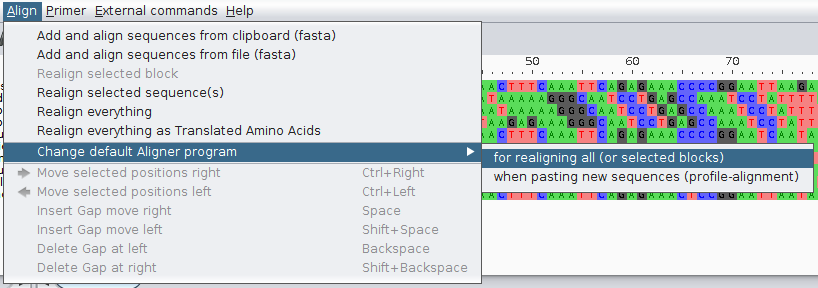
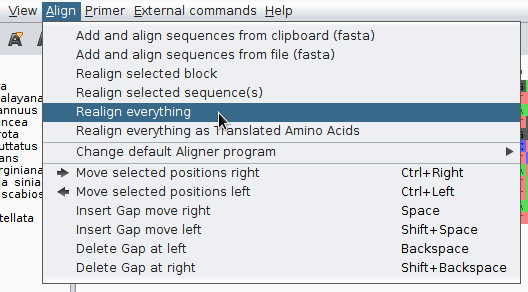
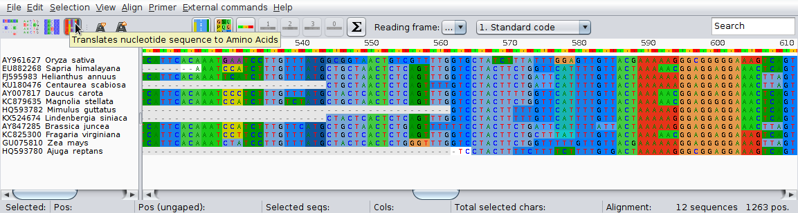
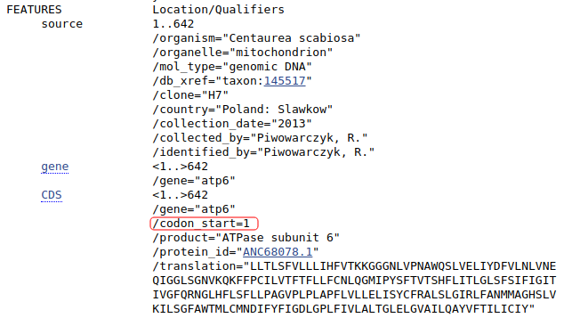
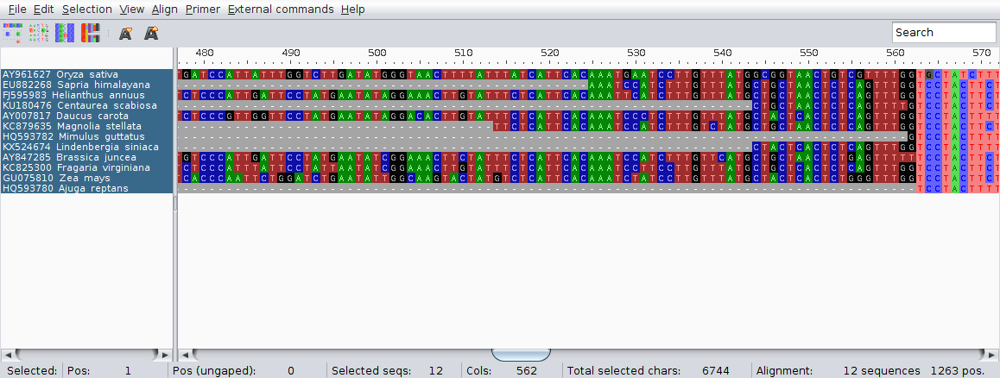
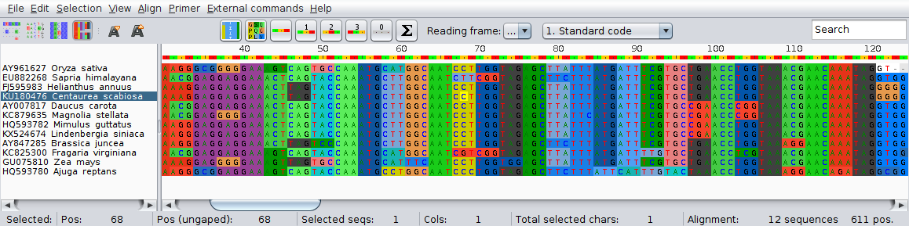
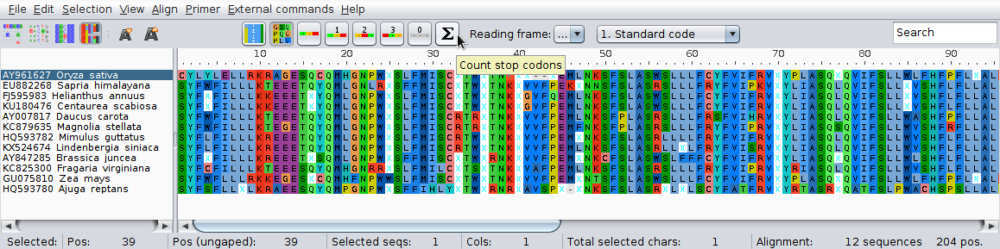
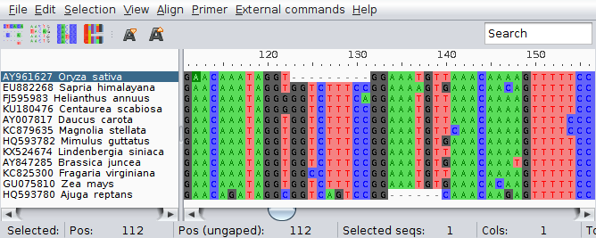
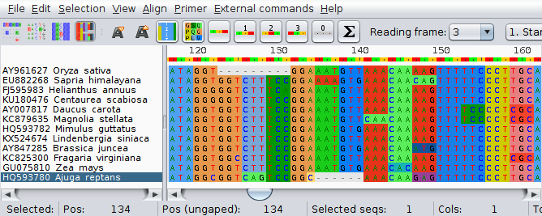

[← Spis treści](../README.md)

# Dopasowanie sekwencji

Kolejnym etapem budowania drzew filogenetycznych jest dopasowanie sekwencji. Jest to bardzo ważny proces, złe dopasowanie sekwencji skutkuje utworzeniem nieprawidłowych drzew.

## Etapy i programy 

Po zebraniu sekwencji w pliku `FASTA` przechodzimy do ich dopasowania. Dopasowanie można wykonywać przy pomocy programów uruchamianych z linii komend. Kolejnym etapem jest ręczne poprawianie dopasowania zwykle połączone z przycinaniem zebranych funkcji. Ten etap najwygodniej jest wykonywać używając programów ,,okienkowych''. Programy z interfejsem graficznym zwykle mają także funkcje dopasowania sekwencji, często zresztą poprzez uruchamianie programów działających w linii komend.

Długą listę takich programów można znaleźć np. na [Wikipedii](https://en.wikipedia.org/wiki/List_of_sequence_alignment_software)


## Programy dopasowujące wiele sekwencji uruchamiane z linii komend

Programów uruchamianych z linii komend jest wiele, zwykle każdy z nich używa osobnego algorytmu dopasowania lub jego modyfikacje. Należą do nich:

  * [Clustal W i Clustal Omega](http://www.clustal.org/)
  * [MUSCLE](http://www.drive5.com/muscle/)
  * [MAFFT](https://mafft.cbrc.jp/alignment/software/)
  * [T-Coffee](http://www.tcoffee.org/Projects/tcoffee/)
  * [PRANK](http://wasabiapp.org/software/prank/)

Można je zainstalować na Debianie lub innych debianopodobnych dystybucjach komendą (usuń nazwy programów, których nie chcesz instalować):

```
sudo apt-get install clustalw clustalo muscle mafft t-coffee prank
```

W internecie można także łatwo znaleźć strony, które umożliwiają procesu dopasowania online z wykorzystaniem tych (i innych) programów. 

## Programy z interfejsem graficznym do edycji dopasowań

W pracy z zestawami sekwencji praktyczne są programy z interfejsem graficznym, które posiadają szereg użytecznych funkcji ułatwiających ich porządkowanie i edycję.  a także np. uruchamianie programów dopasowujących wstępnie sekwencje czy obliczanie i rysowanie drzew.


## Praktyka: Proste dopasowanie sekwencji `atp6`

Pobierz z GenBank-u następujące sekwencje i zapisz je w pliku `atp6-surowe.fasta`:

```
AY007817 Daucus carota
AY847285 Brassica juncea
AY961627 Oryza sativa
EU882268 Sapria himalayana
FJ595983 Helianthus annuus
GU075810 Zea mays
HQ593780 Ajuga reptans
HQ593782 Mimulus guttatus
KC825300 Fragaria virginiana
KC879635 Magnolia stellata
KU180476 Centaurea scabiosa
KX524674 Lindenbergia siniaca
```

Zmień domyślne nazwy ,,GenBankowe'' na nazwy wg. schematu: `nr_rodzaj_gatunek`, np: `AY007817_Daucus_carota`. Wykonaj poprawki w edytorze tekstu. Zapisz jako `atp6-surowe.fasta`.

Zanim przejdziemy do dopasowania sekwencji w linii komend, użyjemy programu *AliView*, który można pobrać ze strony domowej programu: [http://ormbunkar.se/aliview/](http://ormbunkar.se/aliview/). AliView pozwala na wygodne przeglądanie i edycję zestawu sekwencji a także posiada szereg innych przydatnych funkcji do których z pewnością należy możliwość uruchamiania programów dopasowujących sekwencje. Warto zajrzeć na stronę programu [http://ormbunkar.se/aliview/](http://ormbunkar.se/aliview/) gdzie przedstawione są jego możliwości.

Uruchom AliView i otwóż plik z sekwencjami. 


Aliview dopasowuje sekwencje używając zewnętrznych programów. 

Można zmienić uruchamiany program wybierając z menu 



Pokazuje się okno:


Tu można wybrać program z domyślnie udostępnionych przez program, dodać inne i dostosować opcje ich uruchamiania. Instrukcje można znaleźć na stronie programu. Teraz zmień program na `Mutt` (ten wyżej).

Wybierz z paska narzędziowego `Align->Realign everything`



Program zapyta czy na pewno dopasować sekwencje, zatwierdzamy. Pokazuje się okno z postępem pracy programu i w końcu widać wynik. Przesuń suwakiem na dole ekranu zestawienie sekwencji w prawo. Przyjrzyj się jak wyglądają dopasowane sekwencje.

Jak widać mają one różną długość, w końcu jednak znajduje się strefa dopasowania, która obejmuje odcinki wszystkich sekwencji, od 563 miejsca dopasowania. Przy okazji przyjrzyj się informacjom widocznym w pasku na dole okna. Są one dość jasne:


Teraz kliknij na czwartą ikonę od lewej. Zaznaczone zostają kolorami kodony odpowiadające różnym aminokwasom.



Pojawiają się także nowe ikony pozwalające na zmianę m. in. sposobu wyświetlania a także ustawienia początkowego nukleotydu dla odczytu kodonów. Domyślnie ,,translacja'' rozpoczyna się od pierwszej pozycji zestawienia. Prawidłową pozycję startu odczytywania kodonu można odczytać np. z GenBanku. Sprawdź dane dla sekwencji `KU180476`. Sprawdź gdzie zaczyna się prawidłowe miejsce początku pierwszego kompletnego kodonu w części wspólnej dopasowanych sekwencji.



Teraz wróć do domyślnego widoku sekwencji i zaznacz wszystkie kolumny na lewo od miejsca, w którym rozpoczyna się wspólna część sekwencji:



Następnie usuń je używając skrótu klawiszowego `<Ctrl>+<Del>` (warto go zapamiętać) lub odpowiedniej pozycji w pasku menu: `Edit->Delete selected`.

Podobnie przytnij prawą część dopasowania.

Teraz znów możesz sprawdzić ,,translację'' sekwencji, przy okazji zauważ, że (co nie jest zaskoczeniem) przy złym ustawieniu miejsca początku kodonu pojawia się wiele miejsc `STOP` oznaczonych szarym kolorem. 



Jeśli ustawimy podgląd za pomocą jednoliterowych oznaczeń aminokwasów, miejsca `STOP` będą wyświetlone jako litera `x`. 



Teraz zastanów się, jak można znaleźć prawidłowe miejsce początku kodonów w działających genach, jeśli go nie znamy.

Wróć teraz do standardowego wyświetlania sekwencji i znajdź miejsce, w którym znajdują się indele w dwu sekwencjach. Zauważ, że pierwszym nukleotydem flankującym indel w sekwencji _Oryza sativa_ jest `G`, który w zasadzie pasowałby równie dobrze po obu stronach indelu. Nieco inaczej jest w _Ajuga reptans_, tam nukleotyd `C` nie pasuje do żadnego nukleotydu w innych sekwencjach:



W ich prawidłowym umieszczeniu może pomóc podświetlenie kodonów:


Pamiętając, że indele w działających genach kodujących białka powinny obejmować trójki nukleotydów lub ich wielokrotność (inaczej zmienia się ramka odczytu), widać że `G` w pierwszej sekwencji zostało umieszczone prawidłowo, natomiast `C` przy drugim indelu należy przesunąć w lewo. Nukleotydy przesuwamy klikając na nie i przeciągając kursorem myszy, przy więcej niż jednym nukleotydzie należy wcześniej zaznaczyć odcinek, który chcemy przemieścić.

Teraz kodony są kompletne:



Zapisz plik jako `atp6-dopasowane.fasta`.

Przy pracy z AliView warto korzystać z licznych dostępnych opcji ułatwiających pracę. Przejrzyj te dostępne w menu, zazwyczaj łatwo domyślić się jakie mają zastosowanie.


## Dopasowanie sekwencji z linii komend

Teraz przyszedł czas na dopasowanie sekwencji z użyciem linii komend. Najpierw użyjemy w tym celu programu `muscle`. Sprawdź jak go używać używając komendy:

```
muscle -h 
```

lub

```
man muscle
```

W najprostszej formie podajemy plik wejściowy i nazwę pliku wyjściowego:

```
muscle -in atp6-surowe.fasta -out atp6-wyrownanie-muscle.fasta
```

Sprawdź plik wynikowy w `Aliview`.

Program `mafft` oferuje dużo więcej opcji niż `muscle`, uruchom:

```
man mafft
```

Jak widać można w tym programie ustawiać np. wartości kar za otwieranie czy wydłużanie indeli, co może być przydatne przy sekwencjach, które mają ich wiele, zaraz się z takimi spotkamy, na razie uruchom `mafft` bez dodatkowych opcji:

```
mafft atp6-surowe.fasta > atp6-wyrownanie-mafft.fasta
```

Po otwarciu pliku wynikowego w `Aliview` widać, `mafft` domyślnie zmienia wielkość liter w sekwencjach na małe, raczej tego nie chcemy, dlatego użyjemy opcji `--preservecase`

```
mafft --preservecase atp6-surowe.fasta > atp6-wyrownanie-mafft.fasta
```

Teraz pobierz sekwencje o poniższych numerach i zapisz je w pliku `trnL-trnF-GB.fasta`:

```
JX073793
KU238878
GU818008
KX524675 
AY743457
AY575533
KU238873
KU238869
KU238874
KU238865
KU238864
KU238875
KU238866
KU238871
KU238876
KU238867
KU238877
KU238868
KU238872
KU238870
GU323356
```

Sugeruję zrobić to za pomocą skryptu. W takim wypadku sprawdź czy pierwsza linia pliku `FASTA` nie jest pusta, jeśli tak to usuń ją.

Zmień nazwy sekwencji wg. schematu dla sekwencji `atp6`.

Teraz spróbuj dopasować sekwencje za pomocą programu `muscle`.

Następnie spróbuj `mafft`, także z opcją `--auto` oraz `--op` (sprawdź co oznaczają).

Porównaj wyniki i spróbuj poprawić wybrane dopasowanie ręcznie.


[← Spis treści](../README.md)
