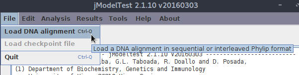
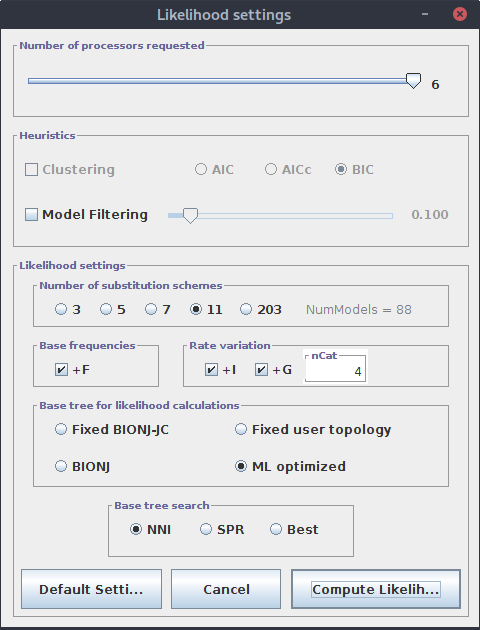
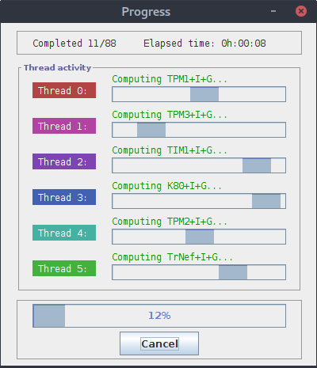

# Dopasowanie modelu ewolucji molekularnej

Mając dopasowane zestawy sekwencji powoli dochodzimy do etapu konstruowania drzew filogenetycznych. Najpierw jednak należy do naszego zestawu sekwencji dopasować odpowiedni model ewolucji molekularnej (substytucji).

## Dopasowanie modelu ewolucji molekularnej: jModelTest 2 - GUI

Niektóre programy konstruujące drzewa filogenetyczne, jak na przykład omawiany dalej `iqtree` potrafią same oszacować, który model jest odpowiedni dla danego zestawu sekwencji.  W innych przypadkach powinniśmy wcześniej go znaleźć. Jednym z programów, które dobrze się do tego nadają jest `jModelTest 2`. Można go uruchomić z linii komend ale posiada też interfejs graficzny. 

Program można pobrać ze strony [https://github.com/ddarriba/jmodeltest2/releases](https://github.com/ddarriba/jmodeltest2/releases).

Pobrany plik należy rozpakować. W powstałym katalogu znajdziemy m. in. pliki uruchamiające program. Warto też pobrać obszerny manual. Czynności te można oczywiście wykonać z linii komend:

```
cd ~
wget https://github.com/ddarriba/jmodeltest2/files/157117/jmodeltest-2.1.10.tar.gz
# rozpakowanie pliku
tar -xvzf jmodeltest-2.1.10.tar.gz
# zmiana nazwy katalogu na bardziej przyjazny i uniwersalny
mv jmodeltest-2.1.10 jmodeltest
# pobranie manuala do katalogu programu
cd jmodeltest
wget https://github.com/ddarriba/jmodeltest2/files/157130/manual.pdf
```

Powyższe linki kierują do najnowszej wersji programu w chwili pisania tego skryptu. Warto najpierw sprawdzić czy w międzyczasie nie ukazała się kolejna wersja i w takim wypadku zaktualizować adresy do plików.

Teraz wejdźmy do katalogu programu:

```
$: cd jmodeltest
$: ls
CHANGELOG     INSTALL         resources
conf          jModelTest.jar  runjmodeltest-cluster.sh
COPYING       lib             runjmodeltest-gui.bat
example-data  log             runjmodeltest-gui.sh
exe           manual.pdf      THIRDPARTYLICENSES
extra         README          trees
```

Uruchamiany plik programu to `jModelTest.jar`. Jest to program napisany w języku Java i uruchamiamy go wydając komendę:

```
java -jar jModelTest.jar
```

Nie jest to zbyt wygodne, dlatego użyjemy dostarczonego skryptu ` runjmodeltest-gui.sh` (sprawdź jego zawartość).

```
./runjmodeltest-gui.sh
```

Możesz oczywiście zmienić jego nazwę na jeszcze wygodniejszą, np `run.sh`.

Po uruchomieniu programu pojawia się okno:


Teraz trzeba wybrać zestaw dopasowanych (!) sekwencji. Wybieramy z menu `Load DNA alignment` (lub używamy skrótu `<Ctrl>+O`).



Przejdź do katalogu, w którym zostały zapisane dopasowane sekwencje z poprzedniej lekcji. 
Niestety, okienko służące do wybierania plików domyślnie wyświetla tylko pliki o nazwach  `*.phy, *.fas, *.nex`, jeśli więc nasze zestawienie zostało zapisane z przedłużeniem `fasta` to nie będzie widoczne. 


Nie jest to duży problem, wystarczy zmienić opcję na `All files`:


Wybierz plik w którym znajdują się dopasowane i przycięte sekwencje `atp6` tu: `atp6-dopasowane.fasta`.

Po otwarciu pliku a dole okna głównego pojawia się informacja dotycząca liczby sekwencji i miejsc:


Przy okazji zwróć uwagę na komunikat na dole ekranu w czerwonym kolorze. Zanim znajdziemy model ewolucji musimy obliczyć ,,Likelihood scores'' co można przetłumaczyć jako ,,Wyniki wiarygodności''.


Pokazuje się okno w którym można ustawić parametry:



Oczywiście wartość ,,Number of processors requested'' odpowiadająca liczbie rdzeni procesora(ów), które mogą być użyte w obliczeniach zależy od parametrów komputera na którym uruchamiamy obliczenia. Nie będę omawiał wszystkich sekcji, zwrócę jedynie uwagę na ,,Number of substitution schemes'' gdzie wybieramy liczbę testowanych schematów substytucji. Nie jest to liczba testowanych modeli, ponieważ dany schemat podstawień może uwzględniać lub nie zmienną frekwencję nukleotydów. Na przykład modele JC i F81, mają taki sam schemat substytucji, zakładają takie same prawdopodobieństwo zmiany każdej zasady w inną ale w F81 poszczególne zasady mogą mieć różne frekwencje, czego nie uwzględnia JC. Tak więc wybierając wartość 11 tak naprawdę testowanych jest 14 modeli (o ile zaznaczona jest opcja ,,Base frequences''). Dodatkowo domyślnie badane są parametry G i I (sekcja ,,Rate variation'') oraz ich kombinacja, co daje w tym przypadku 88 możliwości.

Mogło by się wydawać, że im większą wartość zaznaczymy, tym lepiej. Jednak niekoniecznie jest to prawda. Jednym z powodów ograniczenia testowanej liczby modeli jest czas obliczeń. Czasem jednak po prostu program, który będziemy później używać do wyliczania drzew, przyjmuje ograniczony zestaw modeli (np. `mrBayes`).

Dokładniejszy opis poszczególnych opcji można znaleźć w manualu jModelTest, przy opisie parametrów podawanych przy uruchamianiu programu z linii komend. 

Po ustaleniu opcji, klikamy ,,Compute Likelih...''

Pokazuje się okno pokazujące postęp obliczeń:



Po zakończeniu obliczeń w oknie głównym pokazują się wyniki dla poszczególnych modeli i ich parametrów.
Nie będziemy ich tu omawiać, ale przejrzyj je i spróbuj z nich jak najwięcej odczytać.

Wyniki dla poszczególnych modeli można wygenerować w wersji tabelarycznej wybierając w menu:

`Results->Show results table`


Sprawdź teraz pozycję ,,Analysis'' w menu. Kilka opcji wcześniej nieaktywnych teraz jest odblokowanych.
Teraz będą nas interesowały dwie: `Do AIC calculations...` oraz `Do BIC calculations...`.

`AIC` (_Akaike Information Criterion_) oraz `BIC` (_Bayesian Information Criterion_) to kryteria wyboru modelu z dostępnych oparte na zasadzie znalezienia tak złożonego modelu jak to potrzebne, ale nie bardziej. Czyli ,,karane'' są modele zbyt złożone, przy czym `BIC` jest pod tym względem bardziej restrykcyjny. Jak zwykle, na pytanie ,,który jest lepszy'' nie podam jednoznacznej odpowiedzi. Rozważania na ten temat można znaleźć na przykład [tu](https://stats.stackexchange.com/questions/577/is-there-any-reason-to-prefer-the-aic-or-bic-over-the-other). 

Najpierw wybierz `Analysis->Do AIC calculations...`. 


Pozostawiamy ustawienia domyślne i klikamy `Do AIC calculations``.
Wynik pojawia się w oknie głównym programu. 
Na górze widać wybrany model i dopasowane do niego parametry:

```
 Model selected: 
   Model = GTR+G
   partition = 012345
   -lnL = 2120.8289
   K = 31
   freqA = 0.2348 
   freqC = 0.2056 
   freqG = 0.1950 
   freqT = 0.3646 
   R(a) [AC] =  2.2923
   R(b) [AG] =  1.9116
   R(c) [AT] =  0.3302
   R(d) [CG] =  1.2019
   R(e) [CT] =  4.6955
   R(f) [GT] =  1.0000
   gamma shape = 0.3990 
```

Jak widać, jest to model `GTR+G`

Poniżej znajduje się coś co wygląda znajomo:

```
Tree for the best AIC model = 
(AY961627_Oryza_sativa:0.02366168,GU075810_Zea_mays:0.01789166,(AY847285_Brassica_juncea:0.02137636,(HQ593780_Ajuga_reptans:0.22926226,((FJ595983_Helianthus_annuus:0.00917802,KU180476_Centaurea_scabiosa:0.00000013):0.00768867,(EU882268_Sapria_himalayana:0.04572619,((HQ593782_Mimulus_guttatus:0.00495932,KX524674_Lindenbergia_siniaca:0.00186868):0.01282359,(AY007817_Daucus_carota:0.02199468,(KC825300_Fragaria_virginiana:0.03215909,KC879635_Magnolia_stellata:0.01610002):0.00190086):0.01009171):0.00901775):0.03013788):0.00218864):0.00652333):0.06453377);
``` 

Tak to drzewo zapisane w formacie `Newick`. Można szybko podejrzeć jego topologię np. na stronie [Trex-online](http://www.trex.uqam.ca/index.php?action=newick). 

Dalej znajduje się tabela z wynikami dla poszczególnych modeli:

```
* AIC MODEL SELECTION : Selection uncertainty
 
Model             -lnL    K      AIC       delta       weight   cumWeight
------------------------------------------------------------------------- 
GTR+G       2120.82891   31  4303.657820   0.000000    0.427531   0.427531 
GTR+I+G     2120.16864   32  4304.337280   0.679460    0.304386   0.731916 
TIM1+G      2124.06649   29  4306.132980   2.475160    0.124020   0.855937 
TIM1+I+G    2123.49268   30  4306.985360   3.327540    0.080984   0.936921 
GTR+I       2123.25396   31  4308.507920   4.850100    0.037825   0.974746 
...
```
Zwróć uwagę na kolumnę `AIC`. Wybrany model to ten, który ma najniższą wartość.

Przejdźmy teraz na koniec wygenerowanych informacji. 

```
* AIC MODEL SELECTION : Best Model's command line
 
phyml  -i /tmp/jmodeltest1199799651667664719.phy -d nt -n 1 -b 0 --run_id GTR+G -m 012345 -f m -c 4 -a e --no_memory_check -o tlr -s NNI
```

Tak, to jest podana komenda uruchomienia programu `phyml`, który generuje drzewa filogenetyczne, wraz z potrzebnymi parametrami.
Sprawdź zawartość podanego przy parametrze `-i` pliku. Zapewne u Ciebie będzie miał inną nazwę niż w podanym przykładzie. Zachowaj jego kopię w dogodnym miejscu na później. Teraz możesz wypróbować zaproponowaną komendę i podejrzeć wynik na podanej powyżej stronie internetowej wizualizującej drzewa.


Sprawdźmy teraz jaki wynik da nam kryterium `BIC`. Okienko z opcjami również pozostawiamy bez zmian:


Format wyników jest podobny jak poprzednio, choć wynik inny. W tym przypadku najmniejszą wartość `BIC` otrzymał model TIM1+G. 

Wejdź teraz w menu do opcji `Results->Show results table`. Zauważ, że teraz aktywne stały się zakładki z wynikami `AIC` i `BIC`. 
Kliknij w zakładkę `AIC`. Jak można było przypuszczać, znajdują się tam wyniki w formie tabelarycznej. Model o najlepszym wyniku, czyli najniższej wartości `AIC` jest zaznaczony na czerwono. Klikając w nagłówek kolumny `AIC` tabela zostanie posortowana wg. tej wartości, więc ,,zwycięzca'' znajdzie się na szczycie.


Teraz w menu wybierz `Results->Build HTML log`.
Wygenerowany plik zapisz w miejscu domyślnym, czyli w katalogu programu `jModelTest 2`.
Otwórz go w przeglądarce internetowej i sprawdź co potrafisz z niego odczytać.
Można również skorzystać z linków pozwalających podejrzeć wizualizację drzew. Przy czym w zależności od systemu operacyjnego, przeglądarki i ustawień może się ta sztuka nie udać ze względu na zablokowanie apletu Javy. 

## Dopasowanie modelu ewolucji molekularnej: jModelTest 2 - linia poleceń

Na razie używaliśmy programu `jModelTest 2` przez interfejs graficzny. Teraz sprawdźmy jak można uzuskać wyniki przez linię poleceń. 

Uruchom polecenie (dopasuj ścieżki jeśli to konieczne):


```
java -jar ~/jmodeltest/jModelTest.jar -d atp6-dopasowane.fasta -g 4 -i -f -AIC -BIC -o atp6-jmodeltest-results.txt
```

Użyte opcje oznaczają:

  * `-d atp6-dopasowane.fasta` - plik wejściowy
  * `-g 4` - sprawdź cztery kategorie gamma. <sup id="a1">[1](#f1)</sup>
  * `-i` - sprawdź modele z parametrem `I` (_Invariable sites_)
  * `-f` - sprawdź modele z nierównym udziałem różnych zasad
  * `-AIC` - oblicz kryterium `AIC`
  * `-BIC` - oblicz kryterium `BIC`
  * `-o atp6-jmodeltest-results.txt` - plik w którym zostaną zapisane wyniki.

Domyślnie program sprawdza trzy pary (-f) modeli, co w raz z parametrami `G` oraz `I` daje w sumie 24 testowane modele. Można zwiększyć ich liczbę używając parametru `-s` i jednej z liczb z zestawu (3, 5, 7, 11, 203). Więcej szczegółów można znaleźć w manualu programu.

Zgodnie z powyższymi ustawieniami wyniki obliczeń zapisane zostały w pliku `atp6-jmodeltest-results.txt`. Jeśli chcesz przejść od razu do podsumowania użyj polecenia `tail`. Z kolei polecenie `grep 'phyml'` pozwoli znaleźć ustawienia dla programu `phyml`.

Programu można użyć także do konwersji pliku z dopasowanymi sekwencjami do formatu `PHYLIP`, wymaganego przez niektóre programy wyliczające drzewa filogenetyczne (np. `phyml`). Służy do tego opcja `-getPhylip`:

```
java -jar ~/jmodeltest/jModelTest.jar -d atp6-dopasowane.fasta -getPhylip
```

Nazwa pliku wynikowego będzie miała przedłużenie `.phy` 

Program posiada jeszcze wiele innych parametrów, warto zajrzeć do manuala. 

## Dopasowanie modelu ewolucji molekularnej za pomocą programu `iqtree`

Program [`iqtree`](http://www.iqtree.org), będziemy niebawem używać do konstruowania drzew filogenetycznych metodą _Maximum Likelihood_. Można jednak zastosować go do znalezienia optymanego modelu ewolucji molekularnej. Prosty przykład wygląda tak:

```
iqtree -m TESTONLY -nt AUTO -s atp6-dopasowane.fasta
```

Program wygeneruje kilka plików z wynikami, wśród których znajdziesz także drzewo filogenetyczne. 

Znaczenie użytych opcji:

  * `-m TESTONLY` - znajdź model i wyjdź
  * `-nt AUTO` - automatycznie dopasuj liczbę użytych wątków podczas obliczeń

Inną pożyteczną opcją jest `-mset`, która pozwala m. in. dopasować listę badanych modeli do tych, które są obsługiwane przez niektóre programy.

Na przykład poniższe polecenie wyszuka model dla programu `mrBayes`:

```
iqtree -m TESTONLY -nt AUTO -mset mrbayes -s atp6-dopasowane.fasta
```

Jeśli używamy `iqtree` do wygenerowania drzewa filogenetycznego, znaleziony model zostanie automatycznie użyty w dalszych etapach obliczeń, o czym więcej w następnej części.

____

<sup><b id="f1">1</b></sup> Ciekawą dyskusję na temat liczby kategorii gamma przy konstruowaniu drzew filogenetycznych można przeczytać [tu](https://www.researchgate.net/post/How_do_you_establish_the_number_of_discrete_gamma_categories_in_ML_tree_construction).
 [↩](#a1)

