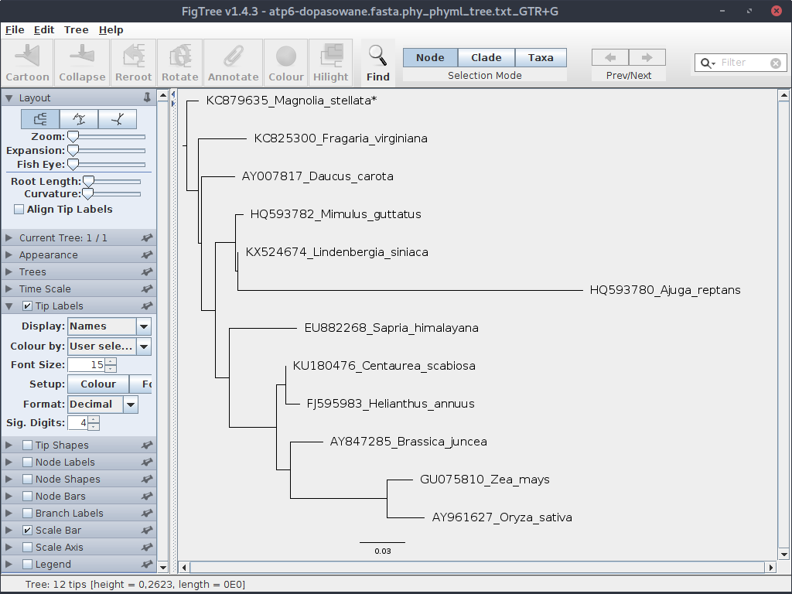
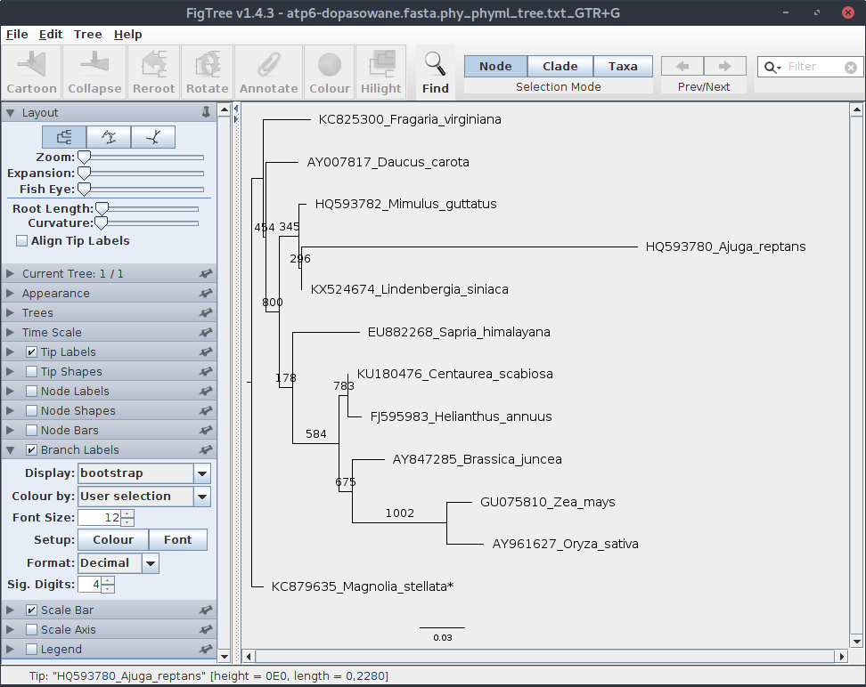
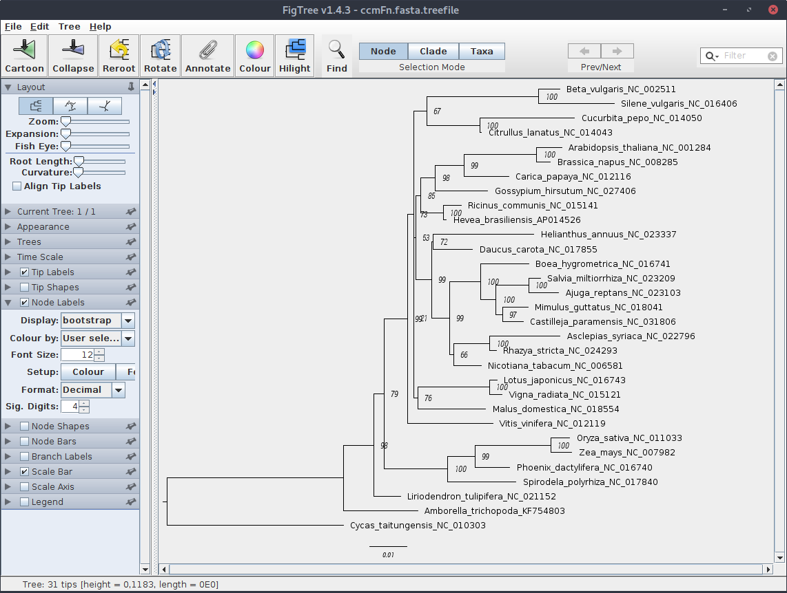

# Konstruowanie drzew filogenetycznych

## Generowanie drzew metodą _Maximum Likelihood_ za pomocą programu `phyml`

Jednym z popularnych programów liczących drzewa filogenetyczne z użyciem algorytmu _Maximum Likelihood_ jest `phyml`. 
Utwórz katalog `phyml`, następnie wejdź do niego i skopiuj tam plik `atp6-dopasowane.fasta`.

W poprzedniej części pokazałem jak dopasować model ewolucji molekularnej dla zestawu sekwencji przy użyciu programu `JModelTest 2`:

```
java -jar ~/jmodeltest/jModelTest.jar -d atp6-dopasowane.fasta -g 4 -i -f -AIC -BIC -s 11 -o atp6-jmodeltest-results.txt
```

Wspomniałem też, że w pliku wynikowym można łatwo znaleźć parametry dla programu `phyml`:

```
$: grep phyml atp6-jmodeltest-results.txt 

 Phyml path = /home/grzeg/jmodeltest/exe/phyml/
phyml  -i /tmp/jmodeltest9047391708413796278.phy -d nt -n 1 -b 0 --run_id GTR+G -m 012345 -f m -c 4 -a e --no_memory_check -o tlr -s BEST
phyml  -i /tmp/jmodeltest9047391708413796278.phy -d nt -n 1 -b 0 --run_id TIM1+G -m 012230 -f m -c 4 -a e --no_memory_check -o tlr -s BEST
```

Jeden z nich jest zestawem dla kryterium `AIC`, drugi dla `BIC`. Użycie polecenia `grep` z parametrem `-B` (jak _Before_), które pokazuje także linie poprzedzające linię z dopasowaniem szukanego ciągu znaków pozwala zidentyfikować, który jest który (nawiasem mówiąc jest też parametr `-A` od _After_):

```
$: grep phyml -B 2 atp6-jmodeltest-results.txt

 Phyml version = 20130103
 Phyml binary = PhyML_3.0_linux64
 Phyml path = /home/grzeg/jmodeltest/exe/phyml/
--
* AIC MODEL SELECTION : Best Model's command line
 
phyml  -i /tmp/jmodeltest9047391708413796278.phy -d nt -n 1 -b 0 --run_id GTR+G -m 012345 -f m -c 4 -a e --no_memory_check -o tlr -s BEST
--
* BIC MODEL SELECTION : Best Model's command line
 
phyml  -i /tmp/jmodeltest9047391708413796278.phy -d nt -n 1 -b 0 --run_id TIM1+G -m 012230 -f m -c 4 -a e --no_memory_check -o tlr -s BEST

```

Skupmy się na wyniku dla `AIC`. Używając zainstalowanego manuala (`man phyml`) sprawdź co oznaczają poszczególne opcje.

Kilka z nich zmodyfikujemy. Zaczniemy od pliku z sekwencjami. Powyższy wynik wskazuje na plik `phy` w katalogu tymczasowym, możesz sprawdzić czy istnieje. Jeśli tak to można go wykorzystać do dalszej pracy, ale zrobimy inaczej. 

Najpierw stworzymy (zgodnie z instrukcją z poprzedniej części) plik w formacie `PHYLIP`:

```
java -jar ~/jmodeltest/jModelTest.jar -d atp6-dopasowane.fasta -getPhylip
```

W katalogu pojawił się plik `atp6-dopasowane.fasta.phy`. To jego użyjemy jako pliku wejściowego. Zmodyfikuj zatem komendę i wykonaj ją:

```
phyml  -i atp6-dopasowane.fasta.phy -d nt -n 1 -b 0 --run_id GTR+G -m 012345 -f m -c 4 -a e --no_memory_check -o tlr -s BEST
```

W katalogu pojawiły się dwa nowe pliki:

```
atp6-dopasowane.fasta.phy_phyml_stats.txt_GTR+G
atp6-dopasowane.fasta.phy_phyml_tree.txt_GTR+G
```

Sprawdź ich zawartość. Jak widać, drugi z nich (jak zresztą wskazuje nazwa) zawiera drzewo zapisane w formacie `Newick`.

Teraz sprawdźmy jak to drzewo może wyglądać. Użyjemy do tego celu programu `FigTree`. Po jego uruchomieniu, otwórz plik z drzewem.


Drzewo nie wygląda zbyt pięknie, ale kwestiami wizualnymi zajmiemy się kiedy indziej. Drzewo, które się wyświetliło wyraźnie nie jest ukorzenione.
Można to zmienić, zaznaczając (klikając) gałąź z grupą zewnętrzną (outgrupą) i klikając odpowiednią ikonę (,,Reroot''). Grupą zewnętrzna w naszym zestawie jest _Magnolia stellata_. 
Jednak spróbujemy to zrobić inaczej, tak aby `phyml` od razu wygenerował ukorzenione drzewo. Otwórz plik `*.phy` w ulubionym edytorze tekstu i dodaj gwiazdkę na końcu nazwy sekwencji z outgrupą, usuń przy tym nadmiarową spację tak aby sekwencje były wyrównane:

```
...
KU180476_Centaurea_scabiosa    TCCTACTTCT GATTCATTTT GTTACTAAAA AAGGAGGAGG AAACTTAGTA 
AY007817_Daucus_carota         TCCTACTTTT GGTTCATTTT GTTACTAAAA ACGGAGGAGG AAACTCAGTA 
KC879635_Magnolia_stellata*    TCCTACTTCT GGTTCATTTT GTTACTAAAA ACGGAGGGGG AAACTCAGTA 
HQ593782_Mimulus_guttatus      TCCTACTTTT TGTTCATTTT GTTACTAAAA AGGGAGGAGG AAACTCAGTA 
KX524674_Lindenbergia_siniaca  TCCTACTTTT TGTTCATTTT GTTACTAAAA AGGGAGGAGG AAACTCAGTA 
...
```

Ponownie wygeneruj drzewo i otwórz w `FigTree`. Przy okazji w rozwijanym menu po lewej możesz zwiększyć czcionkę dla tekstu opisującego liście:



Zauważ, że teraz drzewo jest ukorzenione. 

Naszemu drzewu brakuje jednak jeszcze jednego elementu - bootstrapu. Zmieniamy więc opcje w poleceniu, ustawiając wartość parametru `-b` na 1000:

```
phyml  -i atp6-dopasowane.fasta.phy -d nt -n 1 -b 1000 --run_id GTR+G -m 012345 -f m -c 4 -a e --no_memory_check -o tlr -s BEST
```

To chwilę potrwa. Jeśli masz powolny komputer, dla celów testowych możesz ustawić mniejszą wartość, np. 100.

Ponownie otwórz plik wynikowy w programie `FigTree`. Tym razem pojawi się okienko, w którym możemy wpisać nazwę wartości:


Wpisz `bootstrap`.

Jeśli drzewo nie jest prawidłowo ukorzenione, czyli _Magnolia stellata_ nie stanowi wyraźnej grupy zewnętrznej, to je ukorzeń. Ustaw odpowiednią wielkość czcionki, a następnie zaznacz i otwórz zakładkę ,,Branch Label'' i ustaw parametry wyświetlania bootstrapu.



Wartości bootstrap generowane przez `phyml` przedstawiają liczbę wygenerowanych drzew na których występuje dana gałąź. Przy czym, jak widać, choć podaliśmy `1000` jako liczbę powtórzeń, w sumie było ich 1002, ponieważ program dostosowuje tą wartość do liczby używanych procesorów/rdzeni/wątków. W tym przypadku było ich 3, więc liczba powtórzeń musiała być podzielna przez 3. 

Zwykle wartości bootstrapu nie przestawia się jako wartości bezwzględnych ale raczej jako wartość procentową (bez znaku `%`). Toteż należałoby je poprawić w pliku z zapisanym drzewem, albo później poprawiając plik graficzny.

## Generowanie drzew metodą _Maximum Likelihood_ za pomocą programu `IQ-TREE`

Innym programem wykorzystującym metodę ,,Maximum Likelihood'' do generowania drzew filogenetycznych jest `IQ-TREE`, z którym zetknęliśmy się w poprzednim rozdziale. Na stronie domowej programu, pod adresem [http://www.iqtree.org](http://www.iqtree.org/), można znaleźć m. in. pliki instalacyjne dla różnych systemów operacyjnych a także dokumentację.
Pod Debianem i pokrewnymi dystrybucjami Linuksa można zainstalować go poleceniem:
```
sudo apt-get install iqtree
```

Jedną z zalet `IQ-TREE` jest to, że automatycznie dobiera dobiera model ewolucji molekularnej, który jest następnie używany przy generowaniu drzew filogenetycznych. Ponadto można zastosować ultraszybki bootstrap (_ultrafast bootstrap_), który jak nazwa wskazuje, znacznie przyspiesza etap oceny wiarygodności wyników.

Pobierz zestaw sekwencji:
[http://ggoralski.pl/files/filogenetyka-data/ccmFn.fasta](http://ggoralski.pl/files/filogenetyka-data/ccmFn.fasta)

Teraz utwórz katalog, np. o nazwie `iqtree`, umieść tam plik z sekwencjami. W katalogu wykonaj komendę:

```
iqtree -s ccmFn.fasta -m TEST -nt AUTO -bb 1000 -o Cycas_taitungensis_NC_010303
```

Znaczenie parametrów jest takie:

  * `-s ccmFn.fasta` - plik wejściowy 
  * `-m TEST` - należy znaleźć model substytucji
  * `-nt AUTO` - automatyczne dopasowanie liczby rdzeni procesora do obliczeń
  * `-bb 1000` - ultraszybki bootstrap, 1000 powtórzeń
  * `-o Cycas_taitungensis_NC_010303` - outgrupa: podajemy nazwę sekwencji z pliku `FASTA`

Obserwuj komunikaty, które pokazują się w trakcie obliczeń. Jak widać w początkowej fazie program wyszukuje model ewolucji molekularnej wg. trzech kryteriów, a następnie do dalszych analiz wybrany ten, który został dopasowany wg. kryterium `BIC` (co można oczywiście zmienić). W końcu zostaje wygenerowanych kilka plików z wynikami, najbardziej nas będzie interesował `ccmFn.fasta.treefile`, w którym zapisane jest drzewo. Z kolei w pliku `ccmFn.fasta.log` zapisane zostają komunikaty wyświetlane przez program.

Po otwarciu pliku z drzewem w programie `FigTree`, ręcznemu wskazaniu outgrupy (_Cycas_) i dopasowaniu wyglądu powinien pokazać się mniej więcej taki widok:



Program `IQ-TREE` posiada wiele dodatkowych opcji i możliwości dopasowania parametrów obliczeń dla drzewa. Warto zajrzeć do dokumentacji i tutoriala dostępnego na [stronie domowej programu](http://www.iqtree.org).


## Szybkie drzewo - `FastTree`

Kolejnym programem służącym do generowania drzew metodą _Maximum Likelihood_ jest `FastTree`. Nie jest to program posiadający zbyt wiele opcji, ma natomiast niewątpliwą zaletę - jak sama nazwa wskazuje generuje drzewa szybko. Warto go wykorzystać szczególnie gdy generujemy wiele drzew, które mają raczej wstępny charakter. 

Przykładowe uruchomienie programu może wyglądać tak:

```
fasttree -nt -gtr atp6.fasta > atp6.tree
```

Opcja `-nt` oznacza, że mamy do czynienia z plikiem zawierającym nukleotydy, `-gtr` że używamy modelu `GTR`.

Do oceny wiarygodności program używa test Shimodaira-Hasegawa, którego nie omawialiśmy.

## Generowanie drzew metodą bayesowską - `MrBayes` 

`MrBayes` jest jednym z programów pozwalających na wygenerowanie drzew filogenetycznych metodą bayesowską. O ile metoda _Maximum Likelihood_ wyszukuje drzewa, dla którego dane są najbardziej prawdopodobne, to metoda bayesowska wyszukuje najbardziej prawdopodobne drzewo dla bieżącego zestawu sekwencji. Sposób szukania takiego drzewa przypomina nieco proces ewolucji. Wygenerowane losowo drzewa w każdym ,,pokoleniu'' zmieniają się (,,mutują''), co oznacza zmianę ich parametrów. Zmiany które zwiększają ich prawdopodobieństwo są akceptowane, te które je zmniejszają zostają na ogół odrzucane, choć czasem (w sposób losowy) są również akceptowane, co pomaga uniknąć wpadnięcia drzewa w ,,lokalne optimum''. Domyślnie prowadzone są obliczenia dla dwóch drzew, które są porównywane ze sobą. Obliczenia kończą się, automatycznie lub decyzją użytkownika (parametr `stoprule`) kiedy różnice między nimi spadną poniżej określonego poziomu (parametr `stopval`) albo zostanie przekroczona ustawione liczna pokoleń (parametr `ngen`).

`MrBayes` umożliwia pracę w dwu trybach - obu tekstowych. W pierwszym uruchamiamy program (polecenie `mb`) a następnie wprowadzamy kolejno komendy i ustawiamy parametry obliczeń. W drugim trybie przygotowujemy wszystko w odpowiednio sformatowanych plikach, które program odczytuje i uruchamia proces generowania drzewa. Przyjrzymy się drugiej metodzie.

Jak zwykle, warto zajrzeć na stronę domową programu: [http://mrbayes.sourceforge.net](http://mrbayes.sourceforge.net) gdzie znajdziemy m. in. manual. 

Instalacja pod Debianem (i dystrybucjach pokrewnych) przebiega standardowo:

```
sudo apt-get install mrbayes
```

Utwórz katalog, np. o nazwie `mrbayes`. Skopiuj do niego plik z sekwencjami `ccmFn.fasta`

Najpierw znajdziemy model substytucji spośród obsługiwanych przez program `mrbayes`, użyjemy w tym celu `IQ-TREE` (zob. poprzedni rozdział).

```
iqtree -m TESTONLY -nt AUTO -mset mrbayes -s ccmFn.fasta
```

W wynikach znajdujemy dopasowany model: `GTR+F+G4` czyli `GTR` + `gamma`.

Teraz należy przekonwertować plik z formatu `FASTA` do formatu `Nexus`. Można do tego wykorzystać program `AliView`. Otwórz w nim plik `ccmFn.fasta`, następnie wybierz z menu `File->Save as Nexus`. Należy pamiętać, że `mrBayes` jest wrażliwy na ,,niewłaściwe'' znaki znajdujące się w opisach sekwencji co może prowadzić do błędów po uruchomieniu obliczeń. Zatem jeśli nie ma pewności, że używamy wyłącznie dozwolonych znaków, lepiej wybrać przy eksporcie opcję `Save as Nexus (illegal name chars replaced by _ (e.g. for MrBayes)`.


Plik zapisz jako `ccmFn.nexus`, otwórz go w edytorze tekstu, zobacz jak zapisane są w nim dane.

Następnie przygotuj plik `mrBayes.bay` o treści:

```
begin mrbayes;
	execute ccmFn.nexus;
	outgroup Cycas_taitungensis_NC_010303; 
	lset applyto=(all) nst=6 rates=gamma;            
	mcmcp ngen=1000000;
	mcmcp stoprule = yes; 
	mcmcp stopval = 0.01; 
	mcmcp savebrlens=yes; 
	mcmc;
	sumt;	
end;
```

Jest to proste ustawienie komend i parametrów dla programu.

Uruchom obliczenia:

```
$: mb mrBayes.bay
```

Obliczenia chwilę potrwają. Podczas działania programu przyjrzyjmy się znaczeniu użytych poleceń nie zagłębiając się jednak w szczegóły.

  * `execute ccmFn.nexus` - wczytanie pliku z sekwencjami
  * `outgroup Cycas_taitungensis_NC_010303` - wskazanie outgrupy
  * `lset applyto=(all) nst=6 rates=gamma` - ustawienie modelu substytucji `GTR+G+I`
  * `mcmcp ngen=1000000` - liczba pokoleń
  * `mcmcp stoprule = yes` - obliczenia zatrzymają się gdy wartość różnice pomiędzy generowanymi drzewami spadną poniżej określonego poziomu (zob. poniżej)
  * `mcmcp stopval = 0.01` - wartość graniczna dla opcji `stoprule`
  * `mcmcp savebrlens=yes` - zapisanie długości gałęzi drzewa w pliku wynikowym
  * `mcmc` - uruchomienie obliczeń
  * `sumt` - zapis wyników

Powyższy plik zmienia domyślne ustawienia programu w minimalnym stopniu, pozostałe opcje, ich wartości domyślne oraz znaczenie można poznać studiując manual dostępny pod adresem [http://mrbayes.sourceforge.net/mb3.2_manual.pdf](http://mrbayes.sourceforge.net/mb3.2_manual.pdf) lub wbudowaną pomoc (komenda `help` w trybie interaktywnym).

Teraz wróćmy do uruchomionych obliczeń. Program w końcu powinien przekroczyć minimalną wartość różnic między generowanymi drzewami i zakończyć działanie. W katalogu znajdziemy szereg plików z wynikami. Drzewo znajduje się w pliku przedłużeniu `.tre`. Otwórz plik w programie FigTree


W sekcji `Node Labels` ustaw parametr `Display` na `prob` z liczbą znaków znaczących (`Sig. Digits`) na 2. Ukorzeń drzewo i ustaw parametry wyświetlania.


Zauważ, że o ile wartości bootstrap mieściły się w zakresie 0-100, to prawdopodobieństwa _a posteriori_ obecne na drzewie bayesowskim  znajdują się między 0 a 1. 

Otwórz plik z drzewem (`ccmFn.nexus.con.tre`). Jego format bardziej skomplikowany niż pliki w formacie `newick`, które analizowaliśmy wcześniej. Jest to format `Nexus`. Zawiera on też więcej danych, m. in. różne wartości statystyczne opisujące gałęzie. Niestety, wiele programów nie jest ich w stanie odczytać. Można plik wynikowy zapisać w prostszym, bardziej uniwersalnym formacie dodając w linii z komendą `sumt` odpowiednią opcję:
```
sumt conformat = simple;
```

Otwórz plik wynikowy w edytorze tekstu i przejrzyj go. Zauważ, że zapisane są tam dwa drzewa: jedno zawierające topologię, długości gałęzi oraz wartości prawdopodobieństw, drugie przedstawiające tylko topologię i długość gałęzi. Jeśli jedno z nich jest zbędne (zwykle to drugie) to możesz je po prostu usunąć ale uważaj, żeby przy okazji nie usunąć komendy `end;` z końca pliku.


