# Wstęp do filogenetyki molekularnej i tworzenia drzew filogenetycznych


## Czym się zajmuje filogenetyka molekularna?

**Filogenetyka** to nauka zajmująca się badaniem historii ewolucyjnej (filogenezy) organizmów lub ich grup z użyciem różnych metod w tym paleontologicznych, anatomii porównawczej, genetyki itd. **Filogenetyka molekularna**, jak wskazuje nazwa, skupia się na badaniach cząsteczek (DNA, białek) w celu rekonstrukcji filogenezy. W dalszej części mówiąc o filogenetyce będę miał na myśli głównie filogenetykę molekularną. Zwykle badania filogenetyczne zmierzają do stworzenia **drzewa filogenetycznego**, które w formie wizualnej pozwala przedstawić pokrewieństwa taksonów (zwykle gatunków) w badanej grupie, kolejność ich wyodrębniania oraz szacowane różnice genetyczne między nimi. 


## Etapy tworzenia drzew filogenetycznych

Proces tworzenia drzew filogenetycznych składa się z kilku etapów:  

*   Wybór rodzaju sekwencji odpowiedniej dla zestawu badanych taksonów (zmienność, dostępność sekwencji etc.)
*   Zebranie sekwencji (sekwencje własne, bazy danych)
*   Wybór algorytmów/oprogramowania do dopasowania sekwencji, budowy drzewek oraz ich wizualizacji
*   Wstępne automatyczne dopasowanie sekwencji
*   Ręczne poprawki: dokładniejsze dopasowanie sekwencji, przycięcie
*   Wybranie modelu ewolucji molekularnej
*   Budowanie drzewa
*   Tworzenie filogramu/kladogramu
*   Poprawki: wskazanie outgrupy, obracanie gałęzi, wybór typu drzewa itp.

Teraz omówimy szerzej pierwszy etap, pozostałe tylko w zarysie, wrócimy do nich osobno w części teoretycznej i/lub praktycznej.


## Wybór sekwencji do badań


Pierwszym krokiem w badaniach filogenetycznych jest wybór odpowiednich sekwencji do analiz. 
Tego typu analizy opierają się na założeniu, że jeśli porównuje się odpowiadające sobie sekwencje (na przykład konkretnego genu) to u organizmów bliżej ze sobą spokrewnionych powinny być one bardziej podobne do siebie niż w przypadku taksonów bardziej odległych ewolucyjnie. Wynika to z losowego gromadzenia mutacji - im więcej czasu minęło od rozdzielenia się w toku ewolucji badanych grup, tym więcej mutacji powinno się skumulować w DNA. Takie porównania sekwencji mają oczywiście sens tylko wtedy, gdy pochodzą one od wspólnego ,,molekularnego'' przodka, czyli są **homologiczne**. Na tym jednak nie koniec. Sekwencje homologiczne można bowiem podzielić na dwie kategorie:
* **ortologi**: sekwencje, które miały wspólnego przodka zaraz przed procesem specjacji
* **paralogi**: sekwencje, które powstały w skutek duplikacji, czyli miały wspólnego przodka przed zduplikowaniem.
Do badań filogenetycznych należy wybierać ortologi. 


Trzeba pamiętać, że samo podobieństwo badanych odcinków DNA jeszcze nie przesądza o ich homologiczności. Podobne sekwencje mogą bowiem powstać z niespokrewnionych sekwencji
w wyniku dostosowania genów do pełnienia tych samych funkcji. Takie podobieństwo nazywamy **homoplazją** a geny **analogicznymi**. Oczywiście nie nadają się one do badań filogenetycznych.


Kolejnym aspektem, który należy wziąć pod uwagę przy wyborze sekwencji jest ich tempo ewolucji. Różne sekwencje DNA mają różne tempo gromadzenia mutacji. Generalnie niekodujące sekwencje DNA zmieniają się w toku ewolucji dużo szybciej niż geny. Przyczyną tej różnicy nie jest różne tempo mutacji ale presja selekcyjna. Drobne zmiany fragmentów nieaktywnych DNA nie mają na ogół wpływu na organizm. Mutacje w ich obrębie mogą się więc kumulować w kolejnych pokoleniach praktycznie bez przeszkód. W przypadku sekwencji kodujących mutacje nawet pojedynczych nukleotydów, zwłaszcza jeśli są to delecje lub insercje (zbiorczo nazywane **indelami**) często wpływają negatywnie na funkcjonowanie produkowanych przez gen białek lub cząsteczek RNA, zmniejszając szanse lub uniemożliwiając nosicielowi mutacji przetrwanie i przekazanie mutacji następnym pokoleniom. Mutacje genów są więc w pewnym stopniu usuwane przez dobór. W jakim stopniu - to zależy od rodzaju genu.


Geny różnią się ,,wrażliwością'' na mutacje. W niektórych z nich niemal każda zmiana prowadzi do upośledzenia właściwego funkcjonowania kodowanego białka - są to **geny konserwatywne**. Do najbardziej skrajnych przykładów należą białka histonowe odpowiedzialne za strukturę chromatyny - nawet mała zmiana w ich strukturze ma niekorzystny wpływ na funkcjonowanie całego aparatu genetycznego, kluczowego dla działania komórki i organizmu. Inne geny wykazują większą tolerancję. Zatem im bardziej gen jest konserwatywny tym mniej różnic zauważymy między sekwencjami pochodzącymi od badanych organizmów.  


Ważną konsekwencją omawianych różnic w tempie ewolucji jest to, że przy podejmowaniu decyzji którą sekwencję będzie się badać, należy wziąć pod uwagę stopień pokrewieństwa badanej grupy organizmów. Ogólna zasada jest taka, że im bliżej są one spokrewnione tym bardziej zmienne sekwencje należy wybrać. Tak więc na przykład przy badaniu gatunków w obrębie rodzaju praktyczniej jest wybrać sekwencję niekodującą lub mało konserwatywny gen, natomiast do analizy powiązań filogenetycznych pomiędzy przedstawicielami rodzin czy wyższych jednostek taksonomicznych raczej będą przydatne mniej zmienne geny. Jest to oczywiste w przypadku wyboru zbyt konserwatywnych genów. Jeśli wybierze się sekwencję o zbyt małej zmienności, może okazać się, że nie ma różnic między badanymi cząsteczkami u blisko spokrewnionych organizmów albo jest ich zbyt mało aby wyciągnąć sensowne wnioski. Mniej oczywiste są konsekwencje wyboru zbyt zmiennej sekwencji. Mogłoby się wydawać, że nie powinno to szkodzić badaniom. W końcu im więcej mutacji tym więcej informacji którą można wykorzystać przy badaniach. Kłopot w tym, że także w tym wypadku nadmiar może być szkodliwy - zbyt wiele zmian może na tyle zatrzeć podobieństwa a także poprzednie mutacje, że sekwencje nie będą się nadawać do badań filogenetycznych. Wrócimy tego tematu przy okazji omawiania modeli ewolucji molekularnej.


Przy wyborze rodzaju sekwencji do badań należy także wziąć pod uwagę aspekty praktyczne związane z sekwencjonowaniem DNA a także dostępność sekwencji w bazach danych (wtedy nie trzeba ich sekwencjonować we własnym zakresie).


## Zbieranie sekwencji

Sekwencje używane w badaniach pochodzą zazwyczaj z dwóch źródeł: 

* badania własne
* bazy danych

Z punktu widzenia ekonomicznego i praktycznego im więcej sekwencji można pobrać z baz danych tym lepiej. Z drugiej strony, sekwencje pochodzące z własnych badań mogą wzbogacić dostępne dla innych badaczy bazy danych, co samo w sobie jest jakimś wkładem w naukę.

### Badania własne

W badaniach własnych zazwyczaj otrzymuje się badane sekwencje w laboratorium a następnie DNA albo analizuje się w posiadanym sekwencjonatorze albo przesyła się próbki do wyspecjalizowanej firmy, która udostępnia wyniki sekwencjonowania. Zwykle to drugie podejście jest tańsze. 

### Internetowe bazy danych

#### Genbank i inne bazy sekwencji

Trzy najbardziej znane, dostępne publicznie bazy danych sekwencji DNA (oraz RNA i białek) to:

* [**GenBank**](https://www.ncbi.nlm.nih.gov/genbank/) utrzymywany przez National Center for Biotechnology Information (NCBI)
* [DNA DataBank of Japan](http://www.ddbj.nig.ac.jp) (DDBJ), 
* [The European Nucleotide Archive](http://www.ebi.ac.uk/ena) (ENA)

Wszystkie trzy bazy współpracują ze sobą w ramach (International Nucleotide Sequence Database Collaboration](http://insdc.org)(INSDC) synchronizując dane. W dalszej części kursu skupimy się na bazie GenBank.

GenBank jako otwarta baza danych rozpoczęła swoją historię w 1982 roku. [Statystyki podają](https://www.ncbi.nlm.nih.gov/genbank/statistics/), że w grudniu pierwszego roku działalności zawierała 606 sekwencji o łącznej długości (680 338) nukleotydów. Dziesięć lat później było ich już 97 084 (120 242 234), po kolejnej dekadzie 22 318 883 (28 507 990 166) a w grudniu 2012 r. już 161 140 325 (148 390 863 904). Dzisiaj (stan na czerwiec 2017) w GenBanku zebrano 201 663 568 sekwencji odpowiadających 234 997 362 623 zasadom. Ocenia się, że liczba sekwencji w GenBanku podwaja się średnio co ok. 18 miesięcy. 

Jak widać ilość danych gwałtownie wzrasta. W dodatku wraz z rozwojem możliwości badań materiału genetycznego organizmów w bazie pojawia się coraz więcej sekwencji genomów wirusowych, bakteryjnych, jądrowych, mitochondrialnych i plastydowych.  Efektywne zbieranie i wyszukiwanie takich ilości danych nie byłoby możliwe, gdyby nie komputerowe, dostępne publicznie repozytoria danych. Do najbardziej niezbędnych umiejętności w badaniach filogenetycznych należy zatem przynajmniej podstawowa umiejętność wyszukiwania i pobierania danych z tego typu baz.

Baza GenBank pozwala wyszukiwać sekwencje na kilka sposobów. Zapewne najczęściej używana jest metoda zbliżona do wyszukiwarek internetowych, polegająca na wpisywaniu tekstu, np. nazw organizmów czy sekwencji, w okienko i przeglądaniu wyników wyszukiwania. Można przy tym wybierać spośród wielu dostępnych kategorii, m. in. sekwencje nukleotydów, genomy, taksony, białka. Przykładowo, jeśli chcemy wyszukać sekwencje ITS dla rodzaju _Rumex_, możemy wpisać `Rumex ITS`:

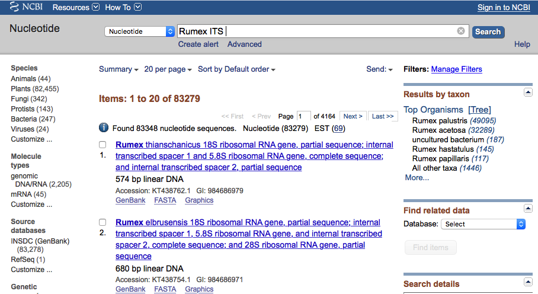

Trzeba jednak uważać na kilka potencjalnych problemów. Po pierwsze przynajmniej obecnie, baza GenBank nie jest tak ,,domyślna'' jak np. wyszukiwarka Google. Przykładowo jeśli zrobimy literówkę, i zamiast `Rumex ITS` wpiszemy `Ramex ITS` to nie ujrzymy podpowiedzi w rodzaju `Czy chodziło Ci o Rumex ITS?`, tylko baza nie zwróci żadnych wyników.

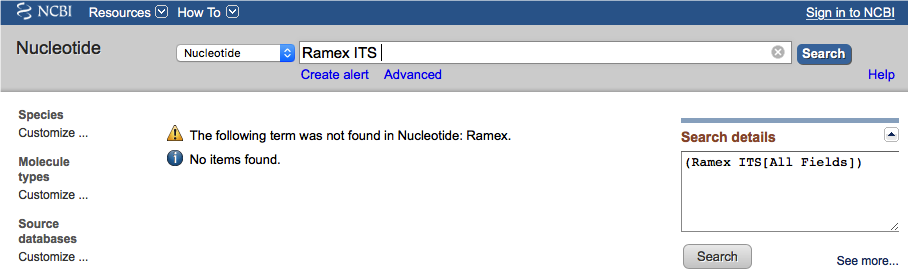

Jeśli wyszukiwanie nie zwraca wyników a jesteśmy pewni, że wpisaliśmy zapytanie prawidłowo, można spróbować inaczej je sformułować, na przykład zamiast używania skróconych nazw sekwencji wpisać pełną nazwę, lub jej fragment. Dzięki temu można czasem znaleźć to o co chodziło ale wyniki mogą też zaskakiwać. Przykładowo wpisanie zapytania `Rumex rbcL` zwraca 196 wyników:

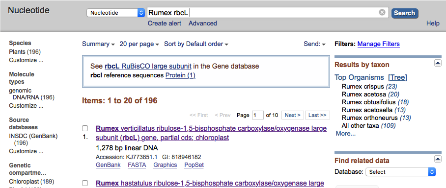

Wpisane długiej nazwy, którą widać w opisie pierwszych sekwencji (`Rumex ribulose-1,5-bisphosphate carboxylase/oxygenase large subunit`) nie przynosi żadnych wyników:

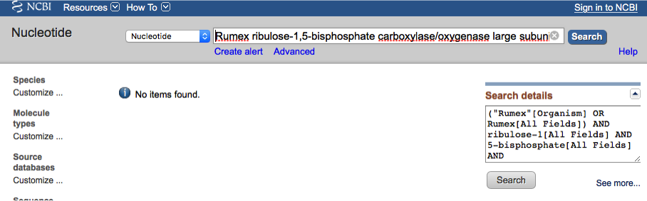

Natomiast zapytanie `Rumex biposphate large subunit` zwraca 147 sekwencji:

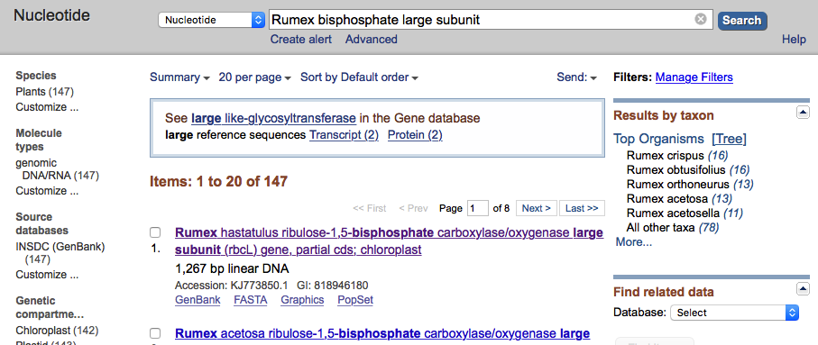


#### Blast

GenBank i inne podobne do niego bazy sprawdzają się dobrze, gdy wyszukujemy sekwencje po ich nazwie, opisie czy nazwie taksonu. Ale często trzeba podejść do problemu z drugiej strony - mamy sekwencję nukleotydów i chcemy znaleźć inne, podobne do niej. Jest tak na przykład gdy nie wiemy czy odpowiada ona jakiemuś konkretnemu genowi albo gdy chcemy sprawdzić u jakiego organizmu występuje sekwencja najbardziej podobna (np. jeśli badamy odcinek DNA niewiadomego pochodzenia). W takich sytuacjach z pomocą przychodzi [Blast](https://blast.ncbi.nlm.nih.gov) (Basic Local Alignment Search Tool). 

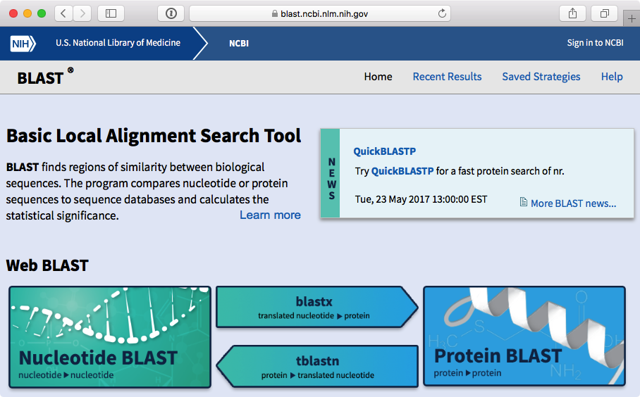

Jak widać serwis umożliwia wyszukiwanie sekwencji nukleotydowych a także białkowych. W najprostszym przypadku na stronie wyszukiwania w odpowiednim okienku wpisujemy szukaną sekwencję i wciskamy przycisk ,,Blast'' na dole strony. Po dłuższej lub krótszej chwili oczekiwania wyświetlane są wyniki. Na górze strony mają one postać graficzną:

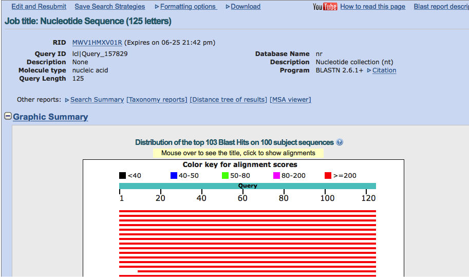


Poniżej widnieje lista z krótką informacją na temat znalezionych sekwencji

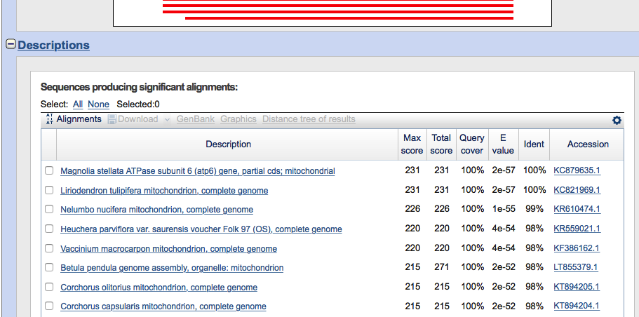

Pod nimi znajdują się dokładniejsze dane, schematyczne przedstawienie przyrównania sekwencji szukanej i znalezionej a także odsyłacze prowadzące do dalszych informacji dotyczących sekwencji w bazie GenBank.

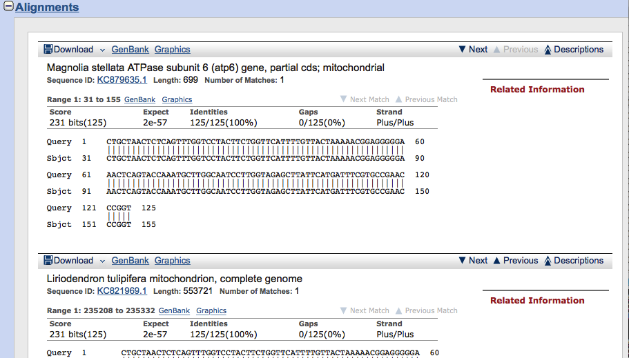

Do dokładniejszego omówienia korzystania z obu baz a także pobierania z nich danych wrócimy w części praktycznej. 

### Zbieranie sekwencji

Do badań filogenetycznych sekwencje zapisuje się zwykle w plikach tekstowych w formacie **FASTA**. Zapis danych w pliku tekstowym ma wiele zalet. Może być edytowany w dowolnym edytorze tekstu (np. Vim, Emacs, Notepad++, Atom, TextMate, Jed, Pico), a także łatwo używać do pracy z nimi licznych dostępnych w systemach Uniksowych (np. w Linuksie) narzędzi ułatwiających na przykład wyciąganie z nich konkretnych danych. Z niektórymi z nich zapoznamy się w części praktycznej. Uwaga: Word NIE jest edytorem tekstu, plik zapisany w formacie Worda NIE jest plikiem tekstowym. 

Plik zawierający sekwencje nukleotydów w formacie  FASTA może wyglądąć np. tak:

```
>KC879635_Magnolia_stellata             
CTGCTAACTCTCAGTTTGGTCCTACTTCTGGTTCATTTTGTTACTAAAAACGGAGGGGGAA
ACTCAGTACCAAATGCTTGGCAATCCTTGGTAGAGCTTATTCATGATTTCGTGCCGAACCC
GGTAAACGAACAAATAGGTGGTCTTTCCGGAAATGTTCAACAAAAGTTTTCCCCTCGCATC
TCGGTCACTTCTACTTTTTCGTTATTTCGTAATCCCCAGGGTATGATACCTTATAGCTTCA
CAGTCACAAGTCATTTTCTCATTACTTTGGGTCTCTCATTTCCGATTTTTATTGGCATTAC
TATAGTGGGATTTCAAAGAAATGGGCTTCATTTTTTAAGCATCTCATTACCCGCAGGAGTC
CCACTGCCGTTAGCACCTTTTTTAGTACTCCTTGAGCTAATCCCTCATTGTTTTCGCGCAT
TAAGCTCAGGAATACGTTTATTTGCTAATATGATGGCCGGTCATAGTTCAGTAAAGATTTT
AAGTGGGTCCGCTTGGACTATGCTATGTATGAATGATCTTTTTTATTTCATAGGAGATCCT
GGTCCTTTATTTATAGTTCTTGCATTAACCGGTCCGGAATTAGGTGTAGCTATATCACAAG
CTCATGTTTCTACGATCTCAATCTGTATTTAC
>AF095276_Solanum_tuberosum             
CTACTAACTCTCAGTTTGGTCCTACTTTTGGTTTATTTTGTTACTAAAAAGGGAGGAGGAA
ACTCAGTACCAAATGCTTGGCAATCCTTGGTAGAGCTTATTTATGATTTCGTGCTGAACCC
GGTAAACGAACAAATAGGTGGTCTTTCCGGAAATGTTAAACAAAAGTTTTCCCCTCGCATC
TCGGTCACTTTTACTTTTTCGTTATTTTGTAATCCCCAGGGTATGATACCTTATAGCTTCA
CAGTTACAAGTCATTTTCTCATTACTTTGGGTCTCTCATTTTCTATTTTTATTGGCATTAC
TATAGTGGGATTTCAAAAAAATGGGCTTCATTTTTTAAGCTTCTTATTACCCGCGGGAGTC
CCGCTGCCATTAGCACCTTTTTTAGTACTCCTTGAGCTAATCCCTTATTGTTTTCGAGCAT
TAAGCTCAGGAATACGTTTATTTGCTAATATGATGGCCGGTCATAGTTCAGTAAAGATTTT
AAGTGGGTTCGCTTGGACTATGCTATGTATGAATGATCTTTTCTATTTCATAGGGGATCTT
GGTCCTTTATTTATAGTTCTTGCATTAACCGGTCTGGAATTAGGTGTAGCTATATCACAAG
CTCATGTTTCTACGATCTTAATCTGTATTTAC
>JN098455_Mimulus_guttatus              
CTACTCACTCTCAGTTTGGTCCTACTTTTTGTTCATTTTGTTACTAAAAAGGGAGGAGGAA
ACTCAGTACCAAATGCTTGGCAATCCTTGGTAGAGCTTATTTATGATTTCGTGCCGAACCT
GGTAAACGAACAAATAGGTGGTCTTTCCGGAAATGTGAAACAAAAGTTTTTCCCTTGCATC
TCGGTTACTTTTACTTTTTCGTTATTTCGTAATCTTCAGGGTATGATACCTTATAGCTTCA
CAGTTACAAGTCATTTTCTCATTACTTTGGGTCTCTCATTTTCTCTTTTTATTGGCATTAC
TATAGTGGGATTTCAAAAAAATGGGCTTCATTTTTTAAGCTTCTCATTACCCGCAGGAGTC
CCACTGCCGTTAGCACCTTTTTTAGTACTACTTGAGCTAATCCCTCATTGTTTTCGCGCAT
TAAGCTTAGGAATACGTTTATTTGCTAATATGATGGCCGGTCATAGTTCAGTAAAGATTTT
AAGTGGGTCCGCTTGGACTATGCTATGTATGAATGATCTTTTCTATTTCATAGGGGATCCT
GGTCCTTTATTTATAGTTCTTGCATTAACCGGTCTGGAATTAGGTGTAGCTATATCACAAG
CTCATGTTTCTACGATCTCAATCTGTATTTAC
```

Każda sekwencja nukleotydów poprzedzona jest linią zaczynającą się znakiem `>`. Po tym znaku powinien znajdować się opis sekwencji. W powyższym przykładzie jest on dość lakoniczny, zawiera tylko numer dostępowy GenBank oraz nazwę taksonu, ale można tam zawrzeć też dużo więcej informacji. Tak na przykład wygląda nagłówek jednej z sekwencji pobranej z bazy GenBank:

`>KX282989.1 Rumex vesicarius voucher EDNA15-0042869 ribulose-1,5-bisphosphate carboxylase/oxygenase large subunit (rbcL) gene, partial cds; chloroplast`

Po linii z opisem zapisana jest sekwencja nukleotydów lub aminokwasów. Może ona znajdować się w jednej lub wielu liniach, zasada jest taka, że wszystkie linie aż do następnego znaku `>` na początku linii powinny zawierać tylko i wyłącznie sekwencję. Niekoniecznie musi ona zawierać wyłącznie litery oznaczające nukleotydy lub aminokwasy, mogą tam także znajdować się dodatkowe oznaczenia np. niejednoznacznych lub nieznanych nukleotydów czy miejsc delecji. Stosuje się tu konwencję oznaczeń [IUPAC](http://www.iupac.org). 


| **Symbol IUPAC** |    **znaczenie**
|:----------------:|:-------------------:
|        A         |       Adenina
|        C         |      Cytozyna
|        G         |       Guanina
|    T (lub U)     | Tymina (lub Uracyl)
|        R         |       A lub G
|        Y         |       C lub T
|        S         |       G lub C
|        W         |       A lub T
|        K         |       G lub T
|        M         |       A lub C
|        B         |    C lub G lub T
|        D         |    A lub G lub T
|        H         |    A lub C lub T
|        V         |     A or C or G
|        N         | nieznany nukleotyd
|     - lub .      |   brak nukleotydu


Czasem pomiędzy końcem sekwencji a nagłówkiem kolejnej dodawana jest pusta linia co może zwiększać czytelność dla człowieka.

Format FASTA jest najprostszy i najpopularniejszy ale istnieją także inne, np. phylip, nexus, fastq.

## Dopasowanie sekwencji 

Jak wspomniałem wcześniej sekwencje używane do badan filogenetycznych powinny być homologiczne. Dopasowanie wybranych sekwencji polega na tym aby ustawione w kolejnych liniach sekwencje miały w kolejnych kolumnach **homologiczne** względem siebie **nukleotydy**. 

Dopasowanie sekwencji składa się zwykle z dwóch etapów:

  * Wstępne dopasowanie automatyczne dokonywane przez odpowiednie programy
  * Poprawki dokonywane przez człowieka

Do wstępnego automatycznego wyrównania stosowanych jest wiele programów, które używają różnych algorytmów. W dodatku na sposób i efektywność działania każdego z nich duży wpływ mają parametry, które ustawia się przy ich uruchamianiu. Dlatego na pytania w rodzaju ,,_który program jest najlepszy do dopasowania sekwencji?_'' nie ma dobrej odpowiedzi. Bardzo duże znaczenie ma tu rodzaj dopasowywanych sekwencji i ustawienia programów. Do najpopularniejszych programów tego typu należą m. in. `clustalw`, `muscle`, `mafft`, `probcons`. 

Jeśli porównywane sekwencje są stosunkowo mało zmienne i nie mają indeli (insercji i/lub delecji) automatyczne dopasowanie może nie wymagać ręcznych poprawek albo są one ograniczone do przycięcia końców sekwencji tak aby miały równą długość. Jeśli jednak tak nie jest,etap ręcznych poprawek może być długi i żmudny a  końcowy efekt może być w większym lub mniejszym stopniu niepewny. 

Do pracy nad wstępnie wyrównanym zestawem sekwencji używać można edytorów tekstu, najlepiej z odpowiednimi skryptami/wtyczkami ułatwiającymi czytelne przedstawienie wyrównywanych sekwencji co związane jest z ich odpowiednim wyświetleniem oraz zwykle kolorowaniem. Na poniższej ilustracji przedstawiony jest edytor Vim (MacVim) z odpowiednimi udogodnieniami zaprogramowanymi przez autora tego tekstu:


Częściej jednak, używa się w tym celu dedykowanych programów, które zwykle są wzbogacone w wiele dodatkowych funkcji ułatwiających pracę z plikami FASTA jak wyrównywanie sekwencji, zmiana na sekwencje odwrócone komplementarne, eksport do innych formatów  a także dodatkowymi czynnościami jak wyszukiwanie sekwencji w bazach czy tworzenie drzewek filogenetycznych. Przykładami są program AliView i Jalview:

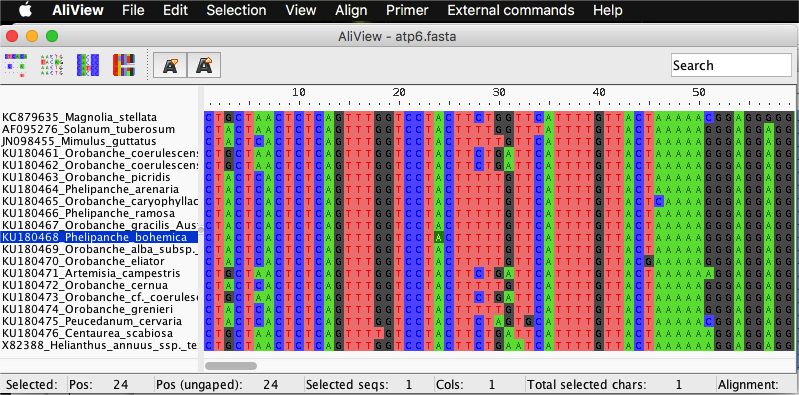

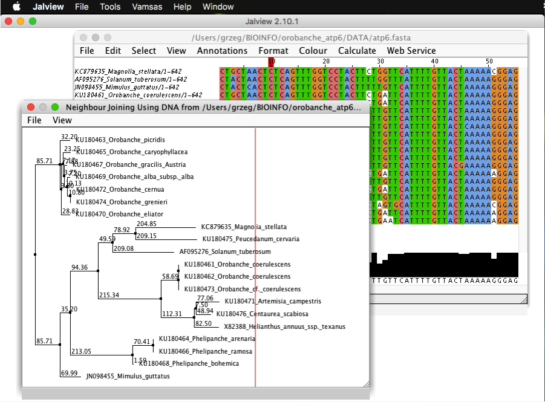

## Wybór modelu ewolucji molekularnej 

Kolejnym etapem w drodze do stworzenia drzewa filogenetycznego powinien być wybór modelu ewolucji molekularnej. Modele ewolucji molekularnej a dokładniej modele substytucji (podstawień) nukleotydów, opisują w jaki sposób mogły ewoluować badane sekwencje. Główne znaczenie ma tu prawdopodobieństwo zmian jednych nukleotydów w inne. W najprostszych modelach szansa na zajście każdej z możliwych substytucji jest taka sama, w bardziej złożonych, jak łatwo się domyślić, prawdopodobieństwa różnią się.  

Wybór modelu odpowiedniego dla badanego zestawu sekwencji odbywa się za pomocą odpowiednich programów. Niektóre z nich dedykowane są wyłącznie do tego zadania, na przykład `jModelTest 2`, ale niektóre programy przeznaczone do obliczania drzew, (np. `IQTree`) mogą automatycznie dobrać model.

## Konstruowanie drzew i szacowanie ich wiarygodności

Mając dopasowane sekwencje nukleotydów oraz znaleziony model podstawień nukleotydów można przystąpić do konstruowania drzewa. Także na tym etapie napotykamy na dość duży wybór metod i programów, które służą wyliczeniu najbardziej prawdopodobnych związków filogenetycznych pomiędzy badanymi organizmami, które w kolejnym kroku będzie można przedstawić w formie graficznej.

Najbardziej znane metody używane przy konstruowaniu drzew to:
   
  * UPGMA (Unweighted Pair-Group Method using arithmetic Averages)
<!---
  * Metoda minimalnej ewolucji (ME - Minimum Evolution)
-->
  * Metoda najbliższego sąsiada (NJ - NeighborJoining)
  * Metoda największej oszczędności (MP - Maximum Parsimony)
  * Metoda największej wiarygodności (ML - Maximum Likelihood)
  * Metody bayesowskie (Bayesian Methods)

Możemy je wykorzystać w programach, które zazwyczaj implementują jedną z metod, choć często z pewnymi modyfikacjami i dodatkami. Należą do nich `PhyML`, `IQ-tree`, `RAxML`, `PHYLIP`, `PAUP*`, `mrBAYES`, `BEAST`. Istnieją także ,,kombajny'', jak np. `MEGA`, które pozwalają liczyć drzewa na kilka sposobów.

Konstruowaniu drzew towarzyszy zazwyczaj szacowanie ich wiarygodności. W większości przypadków stosuje się tu metodę **bootstrap** (samopróbkowania), dla metod bayesowskich wyliczane jest prawdopodobieństwo bayesowskie.

Po zakończeniu obliczeń otrzymujemy wynik zazwyczaj w formie pliku tekstowego, który jest sformatowany w taki sposób, że zawiera informacje na temat relacji pomiędzy badanymi taksonami a także inne parametry drzew (np. wartości bootstap). 

## Wizualizacja drzew

Forma graficzna drzewa filogenetycznego jest znacznie bardziej przejrzysta dla człowieka niż prezentowany powyżej zapis tekstowy. Pozwała łatwo uchwycić pokrewieństwa i odległości ewolucyjne pomiędzy badanymi organizmami, choć ich prawidłowe odczytanie wymaga jednak nieco wiedzy i wprawy. 


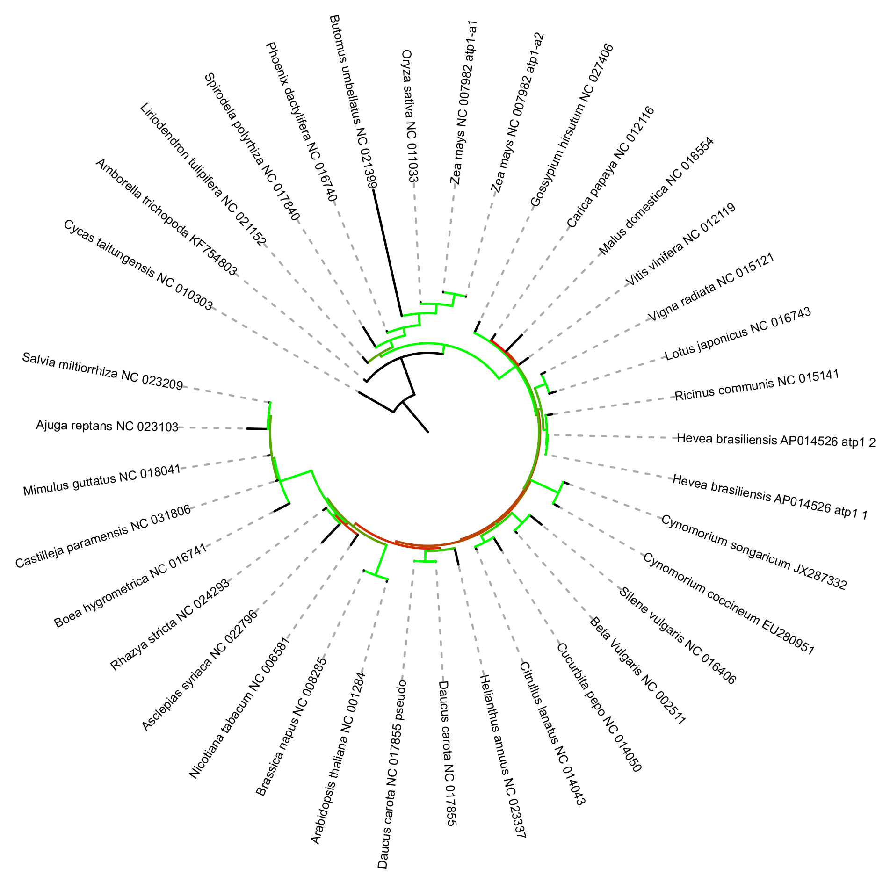


