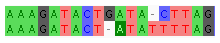
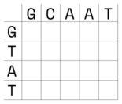
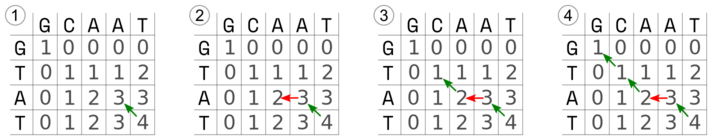
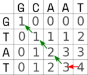

# Dopasowanie sekwencji - zasady i algorytmy

Etap dopasowania sekwencji jest kluczowy dla powodzenia całej procedury tworzenia drzew filogenetycznych. Zadanie polega na tym aby tak dopasować poszczególne nukleotydy (i miejsca gdzie ich brak) aby były względem siebie w kolumnach homologiczne - czyli miały wspólne pochodzenie. Jej trudność i stopień wiarygodności otrzymanych rezultatów zależy przede wszystkim od zróżnicowania porównywanych sekwencji a zwłaszcza od tego czy zawierają one liczne indele (insercje i delecje). 


## Ogólne zasady dopasowania

Rozpatrzmy na początek dwie sekwencje:

```
CCCGATAAGGATCAATCACATACAGTT
CCCAGGATCAATCACATACAACAGTT
```

Można zauważyć, że mają identyczną część wspólną, więc łatwo je ze sobą zestawić. Znaki `-` oznaczają brakujący nukleotyd, który odpowiada indelowi:


```
CCCGATAAGGATCAATCACATACA---GTT
CCC----AGGATCAATCACATACAACAGTT
```

Ale po bliższym przyjrzeniu się, pojawiają się też inne możliwości:


```
CCCGATAAGGATCAATCACATA---CAGTT
CCC-A---GGATCAATCACATACAACAGTT
```

albo:

```
CCC-G-AT-AAGGATCAATCA--CATACAGTT
CCCAGGATCAA---TCA--CATACA-ACAGTT
```

itd...

Jak widać, nawet dwie sekwencje można dopasować na wiele sposobów. Intuicja zapewne podpowiada nam, że spośród pokazanych, ten pierwszy jest ,,najwłaściwszy''. Ale dlaczego właśnie ten a nie inny? To zestawienie jest ,,najprostsze'' - do wyjaśnienia różnic pomiędzy sekwencjami wystarczy przyjąć powstanie dwóch indeli co jest bardziej prawdopodobne niż powstanie ich trzech czy siedmiu. Ale to jest tylko najbardziej prawdopodobne wyjaśnienie co nie musi oznaczać, że jest prawdziwe.
Ten prosty przykład, w którym przecież nie uwzględniliśmy możliwości substytucji nukleotydów pokazuje, że dopasowanie sekwencji rzeczywiście może być skomplikowane a wynik nie jest pewny. Nie istnieje żaden złoty zestaw reguł, który pozwoliłby uzyskać zawsze najlepsze dopasowanie - gdyby taki istniał nie byłoby konieczności ręcznych poprawek wykonywanych po dopasowaniu automatycznym. Chodzi o to, aby znaleźć takie dopasowanie, które odpowiadałoby najbardziej prawdopodobnej ewolucji obu sekwencji. Kluczowe znaczenie w dokonywaniu dopasowań jest szacowanie prawdopodobieństwa wydarzeń. Przyjmuje się np., że powstanie substytucji jest bardziej prawdopodobne niż powstanie indelu a z kolei powstanie długiego indelu jest częstsze niż powstanie kilku mniejszych. W szacowaniu prawdopodobieństwa poszczególnych wydarzeń pomaga znajomość procesów biorących udział w powstawaniu mutacji. Na przykład indele mogą powstawać na różne sposoby, m.in.: 

  * pojedyncze nukleotydy mogą wypaść lub być wstawione w wyniku prostych błędów replikacji DNA: `ACGAGA` -> `ACAGAGA`
  * nierówny _crossing-over_ w mejozie może spowodować wstawienie (lub wypadnięcie) szeregu nukleotydów: `ACGAGA` -> `ACGCCATAAGA`
  * ,,poślizg'' polimerazy DNA może spowodować powtórzenie danej sekwencji: `ACGAGA` -> `ACGAGA` -> `ACGAGAAGA` 
  * dłuższe fragmenty nici mogą zostać wstawione w wyniku translokacji z innej części tej samej nici czy innego chromosomu a także jako efekt działania transpozonów czy wirusów.
  
Istnieje także możliwość, że brakujący lub nadmiarowy nukleotyd pojawił się w sekwencji w wyniku błędu sekwencjonowania lub niewłaściwej interpretacji chromatogramu. Zwłaszcza ,,podejrzane'' są indele o liczbie różnej niż trzy (długość) kodonu w przypadku badania funkcjonujących genów. Jak wiadomo, tego typu mutacje zmieniają sens dalszej części sekwencji co skutkuje zazwyczaj pozbawieniem funkcjonalności białka, które gen koduje. Dlatego w przypadku pojawienia się tego typu indeli w sekwencjach warto, o ile to możliwe, upewnić się, że nie jest to wynik błędu, na przykład poprzez ponowną analizę chromatogramów.

## Jak można przedstawić dopasowanie?

Najprostszy sposób prezentacji dopasowania sekwencji widać poniżej. Sekwencje znajdują się bezpośrednio pod sobą, w odpowiednich miejscach występują znaki `-` oznaczające brakujące nukleotydy (lub aminokwasy). W niektórych programach, zwłaszcza z interfejsem graficznym stosuje się kolorowanie poszczególnych zasad co pozwala na łatwiejszą wizualną identyfikację miejsc dopasowanych i niedopasowanych. 



Dopasowane miejsca mogą być także oznaczone w specjalny sposób, np. za pomocą znaku `*`:

```
AAAGATACTGATA-CTTAG
ATAGATACT-ATATTTTAG
* ******* ***  ****
```

Pomiędzy sekwencjami można także dodać dodatkową linię, w której znak `|` wskazuje na dopasowanie. Ten sposób nadaje się zwłaszcza do prezentacji przyrównania dwóch sekwencji, przy ich większej liczbie jest raczej nieczytelny. Wykorzystywany jest np. przy prezentacji wyników przez [BLAST](https://blast.ncbi.nlm.nih.gov/Blast.cgi):

```
AAAGATACTGATA-CTTAG
| ||||||| |||  ||||
ATAGATACT-ATATTTTAG
```

Można także dodatkowo oznaczyć kropkami miejsca gdzie nukleotydy nie pasują do siebie:

```
AAAGATACTGATA-CTTAG
|.||||||| ||| .||||
ATAGATACT-ATATTTTAG
```

Oczywiście istnieją jeszcze inne sposoby prezentacji wyników dopasowania, których jednak nie będę tu przedstawiał.

## Systemy punktacji

Wspomniane powyżej zasady przyrównania sekwencji, jakkolwiek przydatne przy ręcznych poprawkach dopasowania sekwencji, muszą zostać skonkretyzowane jeśli mają zostać zastosowane w programach komputerowych. Temu właśnie służą **systemy punktacji**, które pozwalają porównać jakość dopasowań za pomocą liczb. W takim ujęciu porównuje się poszczególne miejsca dopasowania przyznając każdemu z nich odpowiednią liczbę punktów. W najprostszym przypadku można przyjąć, że jeśli dwa nukleotydy są takie same, to przyznany zostaje jeden punkt, jeśli się różnią to punkt nie zostaje przyznany. W najprostszym przypadku zakładamy, że różne substytucje są równie prawdopodobne, ale możemy też przyjąć inne założenia z przyczyn o których będzie mowa przy okazji omawiania modeli substytucji.

Dla przerw (odpowiadających indelom)  można przyjąć, że liczba karnych punktów za dany indel odpowiada liczbie miejsc w przerwie pomnożonej przez wartość kary. Można także przyznać karę za otwarcie przerwy, czyli samą obecność indelu i karę za każdy kolejny brakujący nukleotyd co pozwala na odróżnienie jednego długiego indelu od wielu krótszych.

Jeśli badamy funkcjonujące geny to oprócz analizy nukleotydów warto przyjrzeć się sekwencjom aminokwasów, które wynikają z różnych dopasowań. Bardziej prawdopodobne są mutacje, które nie zmieniają znaczenia kodonu (degeneracja kodu genetycznego) a jeśli zmieniają to w taki sposób, który nie wpływa na strukturę białka. Oczywiście sprawdzenie tego ostatniego wymaga użycia dodatkowych narzędzi.

Bardziej złożone są systemy punktacji przy przyrównywaniu aminokwasów. Opierają się one na właściwościach kodu genetycznego, cechach fizykochemicznych aminokwasów lub na badaniach empirycznych. Przedstawia się je zwykle w postaci macierzy zawierających punkty dla poszczególnych kombinacji aminokwasów. Macierze oparte na badaniach empirycznych uważane są za bardziej wiarygodne, należą do nich macierze **PAM** (Point Accepted Mutation) i **BLOSUM** (BLOcks SUbstitution Matrix).

## Dopasowanie metodą programowania dynamicznego

Poszukiwanie optymalnego dopasowania polega w ogólnym zarysie na porównywaniu wszystkich możliwych dopasowań. Oczywiście proces ten jest tym bardziej czasochłonny im sekwencje są dłuższe. Można to robić metodą _brute force_, czyli składać sekwencje kolejno na wszelkie możliwe sposoby i za każdym razem obliczać jakość dopasowania. Jest to jednak sposób, który choć gwarantuje znalezienie optymalnego rozwiązania, jest bardzo mało efektywny co jest związane z tym, że wielokrotnie przeprowadzane są te same obliczenia. Jeśli obliczymy wartość jednego dopasowania a potem będziemy oceniać inne dopasowanie, różniące się od poprzedniego tylko położeniem jednonukleotydowej przerwy to i tak trzeba będzie obliczyć wartości dopasowania dla wszystkich pozostałych miejsc.

Proces ten ułatwiają metody programowania dynamicznego (dynamicznej optymalizacji) polegające na tym, że złożony problem dzieli się na wiele mniejszych, które rozwiązuje się osobno. Rozwiązania mniejszych problemów zostają zapamiętane, kiedy ponownie się na nie natrafia, nie rozwiązuje się ich ponownie ale wykorzystuje wcześniejszy wynik. Pozwala to na znaczną oszczędność w obliczeniach. W bioinformatyce programowanie dynamiczne stosuje się w przy wielu złożonych problemach jak np. przewidywanie struktury białek i RNA, wiązania białek z DNA czy właśnie przyrównanie sekwencji nukleotydów.   Zobaczmy zatem jak to działa na nieco uproszczonym przykładzie.

Przypuśćmy, że mamy do dopasowania dwie sekwencje:


Zaczynamy od stworzenia tablicy (macierzy). Na górze, w nagłówkach kolumn tabeli, umieszczamy jedną sekwencję, z boku, w kolejnych rzędach, drugą sekwencję:



 Przyjmujemy punktację:

  * dopasowane zasady: 1
  * niedopasowane zasady: 0
  * indel: -1

Teraz czas na wypełnienie tablicy wartościami.


  1. W lewym górnym rogu zaznaczamy kwadrat obejmujący cztery sąsiednie komórki. Wypełniamy wartości komórek górnych i znajdującej się po lewej stronie w drugim rzędzie wartościami wg. powyższej punktacji. `G-G` -> 1, `G-C` -> 0, `T-G` -> 0. Komórka w dolnym prawym rogu pozostaje na razie pusta.
  2. Obliczamy wartość dla pustej komórki: znajdujemy najwyższą wartość w sąsiadujących komórkach w szarym kwadracie. Jest to wartość 1 (pomarańczowa strzałka). Następnie dodajemy do niej punkty za dopasowanie (w tym przypadku jest to 0 ponieważ T nie pasuje do C) i wpisujemy otrzymany wynik (1).
  3. Przesuwamy szary kwadrat w prawo i uzupełniamy brakujące wartości analogicznie to punktu powyżej.
  4. Podobnie postępujemy z kolejnymi komórkami tabeli. Tu dochodzimy do końca rzędu, ponieważ w ostatniej komórce zasady pasują do siebie, do przepisanej 1 dodajemy 1, otrzymując 2.
  5. Przesuwamy kwadrat o rząd niżej i uzupełniamy brakujące wartości.
  6. W kolejnym kroku trzy wartości w kwadracie są takie same, przepisujemy 1.
  7. Ponieważ `A` pasuje do `A` ponownie zwiększamy wartość w prawej dolnej komórce
  8. Kontynuujemy wypełnianie tabeli do końca  


Po wypełnieniu tablicy czas na ,,odczytanie'' dopasowania. Polega ono na znalezieniu ścieżki o największej liczbie punktów od prawego dolnego do lewego górnego rogu macierzy. Poruszamy się zatem w odwrotnym kierunku niż przy wpisywaniu wartości. Kierunek ruchu wyznacza największa liczba sąsiadująca z daną komórką ale tym razem będziemy przyznawać punkty karne za indele (-1), które oznaczone są poziomymi lub pionowymi czerwonymi strzałkami. Oczywiście nie wolno poruszać się w prawo ani w dół.  



 1) Zaczynamy od ostatniej komórki o wartości 4, sąsiaduje ona z komórkami o wartości 3. Wybieramy drogę na ukos, nieobciążoną karą za indel. Mamy 4 + 3 = 7 punktów. Nasze dopasowanie wygląda tak (pionowa kreska oznacza dopasowane zasady, jej brak wskazuje na brak dopasowania):
  
```
  A T
  | |
  A T
```
  
 2) Teraz komórka o najwyższej wartości znajduje się po lewej, co będzie oznaczało indel i punkty karne: 7 + 2 - 1 = 8. Uzupełniamy zatem wynik dopasowania:
  
```
  A A T
    | |
  - A T
```
  
 3) W kolejnym kroku kierujemy się ukośnie w górę na lewo. 8 + 1 = 9.
 
```
  C A A T
      | |
  T - A T
```
  
 4) Dochodzimy do początku tabeli. 9 + 1 = 10. Otrzymujemy dopasowanie końcowe:

```
  G C A A T
  |     | |
  G T - A T
```

Zauważ, że można też wykreślić alternatywną ścieżkę, o takiej samej liczbie punktów:



W tym wypadku otrzymane dopasowanie będzie wyglądało tak:

```
  G C A A T
  |   |   |
  G T A - T
```
Trudno powiedzieć, które z uzyskanych dopasowań jest lepsze, w takim przypadku wybór jest arbitralny.

Jak wspomniałem powyżej pokazany algorytm jest bardzo uproszczony a co za tym idzie, niedoskonały. Nie uwzględnia na przykład możliwości indeli na końcach dopasowań. Toteż realnie stosowane algorytmy są bardziej złożone.

[TODO? - może wrzucić bardziej złożony przykład.]

## Dopasowanie globalne i lokalne

Proste przyrównywanie sekwencji i ocena ich jakości za pomocą nieskomplikowanych systemów punktacji może prowadzić na manowce. Rozważmy na przykład dwie sekwencje:

```
>seq1
AAGACTTCACTAACGTGATTGATAGCATCGAATACTGACGAGACG
>seq2
TACTGACTAGCTTCGAATACTGGGATCGTTGAAAATCACCTCCG
```

Można je przyrównać w ten sposób:

```
-A---A--GACTTC-ACTAACGTGATTGATAGCATCGAATACTGACGAGACG
 |   |    |||| | ||  | ||| | |   |   |   |        ||
TACTGACTAGCTTCGAATACTGGGATCGTTGAAAATCACCTC--------CG
```

Jeśli teraz przyjmiemy system punktacji: 1 za dopasowaną parę nukleotydów, -1 za indel. Otrzymamy: 

20 dopasowań - 15 indeli = 5 punktów

Teraz przyjrzyjmy się alternatywnemu dopasowaniu:

```
AAGACTTCACTAACGTGATTGATAGCATCGAATACT--GA-CGA--GA----------CG
          || | |||    |||| |||||||||  || ||   ||          ||
----------TA-C-TGA--C-TAGCTTCGAATACTGGGATCG-TTGAAAATCACCTCCG
```

Co prawda widać, że jest tu więcej pasujących par zasad, ale także znacznie więcej indeli. Policzmy więc punkty: 

27 dopasowań - 32 ideli = -5 punktów

Z prostego liczenia punktów wynikałoby, że to drugie dopasowanie jest znacznie gorsze. Ale czy tak jest w rzeczywistości?
Przyjrzyjmy się środkowej części dopasowania. Widać tam wyraźne nagromadzenie pasujących do siebie nukleotydów. Widać, że ten fragment w obu sekwencjach jest mało zmienny. Odpowiada on fragmentowi konserwatywnemu w obu sekwencjach, który otoczony jest przez fragmenty zmienne. Biorąc pod uwagę sens dopasowania sekwencji, polegający na tym aby dopasowane nukleotydy były względem siebie homologiczne, to drugie dopasowanie jest właściwsze. 

Powyższy problem związany jest z dwoma podstawowymi typami dopasowań: globalnym i lokalnym.

Algorytmy **dopasowania globalnego** służą tworzeniu przyrównania sekwencji na całej długości. Podobnie jak w pokazanym powyżej przykładzie algorytmu programowania dynamicznego, przy szukaniu optymalnej ścieżki w macierzy, poruszamy się od lewego dolnego rogu do prawego górnego. Dopasowanie globalne sprawdza się zatem dobrze gdy przyrównujemy sekwencje o zbliżonej liczbie nukleotydów, podobne (homologiczne) do siebie na całej długości. Przykładem algorytmu przyrównania globalnego jest [algorytm Needlemana-Wunscha](https://en.wikipedia.org/wiki/Needleman%E2%80%93Wunsch_algorithm) opublikowany w 1970 roku.

Jak widać na powyższym przykładzie takie postępowanie nie zawsze się dobrze sprawdza. Na przykład kiedy przyrównujemy sekwencje, które są do siebie podobne tylko w niektórych fragmentach, albo gdy w długim odcinku DNA szukamy miejsca podobnego do danej, znacznie krótszej sekwencji znacznie lepiej sprawdza się **dopasowanie lokalne**. W tym przypadku priorytetem jest wyszukiwanie krótszych odcinków w obu sekwencjach, które są do siebie dobrze dopasowane.  Może natomiast prowadzić do uzyskania kilku dopasowań. Klasycznym przykładem algorytmu dopasowania lokalnego jest [algorytm Smitha-Watermana](https://en.wikipedia.org/wiki/Smith%E2%80%93Waterman_algorithm) zaprezentowany w 1981 r. Bazuje on na algorytmie Needlemana-Wunscha ale różni się od niego sposobem punktacji przy wypełnianiu matrycy a także sposobem poszukiwania ścieżki powrotnej. Rozpoczyna się nie od końca tablicy, ale w miejscu o najwyższej punktacji i niekonieczne prowadzi do jej początku ale do miejsca gdzie kończy się lokalne dopasowanie.

## Dopasowanie wielu sekwencji 

Dopasowanie wielu sekwencji jest zadaniem, co oczywiste, znacznie bardziej skomplikowanym niż powyżej rozpatrywane przyrównanie pary z nich. Istnieją różne algorytmy, które mają za zadanie ten proces usprawnić i możliwie ograniczyć czas niezbędny do obliczeń. Poniżej krótko charakteryzuję kilka z nich, należy jednak pamiętać, że w poszczególnych programach są one w różny sposób implementowane i modyfikowane. 

  * **Metoda progresywna**: Sekwencje są porównywane parami (metodą programowania dynamicznego). Następnie na podstawie ich podobieństw tworzone jest drzewo filogenetyczne, zwane drzewem przewodnim lub naprowadzającym (ang. _guide tree_). Następnie z blisko spokrewnionych sekwencji tworzy się sekwencję konsensusową. Zawiera ona wspólne/najczęściej spotykane nukleotydy w kolejnych miejscach. Dopasowuje się do niej kolejną, pod względem podobieństwa sekwencję, lub sekwencję konsensusową z innej, pobliskiej filogenetycznie grupy sekwencji. Proces trwa aż zostaną przyrównane wszystkie sekwencje. Opiera się na przyrównywaniu globalnym.
  * **Przyrówanie iteracyjne**: Jest to [metoda heurystyczna](https://pl.wikipedia.org/wiki/Heurystyka_(informatyka)), zatem nie dająca gwarancji uzyskania optymalnego wyniku. Opiera się na iteracyjnym (powtarzającym się) udoskonalaniu pierwotnego dopasowania. Przy każdej iteracji kolejność przyrównywanych sekwencji jest inna. Podobnie jak metoda progresywna opiera się na przyrównywaniu globalnym.
  * **Przyrówanie blokowe**: W przeciwieństwie do dwóch powyższych metod opiera się na przyrównywaniu lokalnym. Polega na poszukiwaniu fragmentu sekwencji, która nie zawiera przerw i jest wspólna dla wszystkich sekwencji (blok).
  * **Metoda dziel i zwyciężaj (_divide and conquer_)**: Metoda heurystyczna. Sekwencje są dzielone na krótkie odcinki, które są możliwie dokładnie dopasowywane, po czym są z nich z powrotem składane sekwencje wyjściowe. Istotnym krokiem jest znalezienie odpowiednich miejsc ,,cięcia'' sekwencji.

 Do znanych programów komputerowych służących dopasowywaniu wielu sekwencji należą: Clustal W, MAFFT, MUSCLE, T-Coffee czy nowszy PRANK. Ich bardziej kompletną listę można znaleźć np. na [Wikipedii](https://en.wikipedia.org/wiki/List_of_sequence_alignment_software)

## Ręczne redagowanie dopasowania

W zależności od stosowanych algorytmów (programów) oraz sekwencji na których pracują, wyniki dopasowania mogą być mniej lub bardziej optymalne. Zwłaszcza dotyczy do sytuacji gdy sekwencje są wysoce zmienne i zawierają liczne indele. Ludzki mózg w wielu przypadkach pozwala dostrzec pewne podobieństwa między sekwencjami, których nie potrafią zidentyfikować algorytmy. Dlatego przy dopasowywaniu sekwencji konieczne są zwykle poprawki nanoszone bezpośrednio przez badacza. Duże znaczenie ma tu nie tylko wiedza dotycząca mechanizmów ewolucji sekwencji ale także praktyczne doświadczenie. 

Przydatne programy, które mogą ułatwić taką pracę to np. dostępne na główne systemy operacyjne (Linux, macOS, Windows) programy z interfejsem graficznym: [AliView](http://www.ormbunkar.se/aliview/), [JalView](http://www.jalview.org/), [UGENE](http://ugene.net/) czy [MEGA](http://www.megasoftware.net/), która jednak posiada wersję z GUI tylko dla Windows i macOS. Posiadają one także możliwość uruchamiania zewnętrznych programów, m. in. dopasowujących sekwencje, co znacznie ułatwia cały proces.

