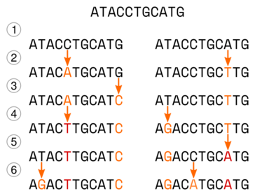
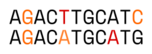
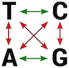
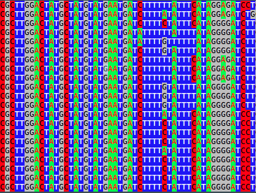
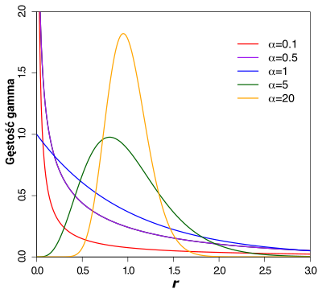

# Modele ewolucji molekularnej

## Do czego służą modele ewolucji molekularnej?

Jeśli chcemy rozwikłać pokrewieństwa ewolucyjne między badanymi organizmami, co jest zasadniczym celem badań filogenetycznym, powinniśmy dysponować jakąś metodą oceny odległości ewolucyjnych między nimi. Organizmy o mniejszej odległości będą uważane za bliżej spokrewnione między sobą niż taksony bardziej od siebie oddalone. Najprostszym sposobem, który przychodzi do głowy jest proste porównanie sekwencji i wyliczenie w ilu miejscach się one różnią - im więcej różnic tym większa odległość ewolucyjna. Tak obliczoną odległość możemy określić jako _p_ i wyrazić ją w procentach lub w proporcji, wtedy mieszczą się w wartościach między 0 a 1. Na przykład jeśli dwie sekwencje o długości 100 miejsc będą się różnić w 17 miejscach, to _p_=17% lub _p_=0,17.
Takie podejście co prawda pozwala ocenić różnice między sekwencjami ale niekoniecznie odzwierciedla rzeczywiste odległości ewolucyjne, zwłaszcza jeśli porównywane są sekwencje z dużą liczbą różnic. Niekoniecznie jest to intuicyjnie oczywiste ale wynika to ze sposobu w jaki zmieniają się nici DNA w czasie.

Rozważmy hipotetyczną ewolucję dwu sekwencji, przedstawioną na poniższym rysunku:

Początkowo wygląda ona tak `ATACCTGCATG`. 

(1) - Dochodzi do specjacji, powstają dwa gatunki, sekwencje są na początku identyczne, ale dalej ewoluują niezależnie od siebie

(2) - W obu sekwencjach dochodzi do mutacji (C->A, A-T). 

(3) - W lewej sekwencji ostatni nukleotyd mutuje (G->C). 

(4) - W lewej sekwencji piąty nukleotyd, który już wcześniej mutował, ponownie zmienia się (A->T), w prawej sekwencji w drugiej pozycji także dochodzi do substytucji (T->G). 

(5) - W prawej sekwencji doszło do substytucji (T->A).

(6) - W obu sekwencjach dochodzi do substytucji (T->G, C->A), zauważ, że w lewej mutacji doszło do zmiany analogicznej do tej, która wydarzyła się w sekwencji prawej w kroku 4. 

W sumie w obu sekwencjach doszło do ośmiu substytucji. Dopasujmy teraz obie sekwencje do siebie:

Jak widać mutacje są widoczne w czterech pozycjach i sześciu nukleotydach z czego dwa mutowały dwukrotnie. Zaznaczmy teraz miejsca gdzie widoczne są różnice: 

Okazuje się, że sekwencje różnią się tylko w dwu miejscach, mimo że w sumie wydarzyło się w nich osiem mutacji. Powyższy przykład pokazuje mechanizm ,,ukrywania się'' mutacji. Porównując dwie sekwencje, jeśli widzimy różnicę między nukleotydami w danym miejscu, nie jesteśmy w stanie stwierdzić, czy jest ona wynikiem jednej czy wielu mutacji. Co więcej, następujące po sobie mutacje mogą najpierw sprawić, że nukleotydy będą się różnić a później, że będą takie same (choć niekoniecznie takie jak na początku). Im więcej czasu upływa i im więcej zachodzi mutacji w badanych sekwencjach, tym większy odsetek zmian zostaje ,,zatarty''. O ile możemy przyjąć, że liczba mutacji w czasie rośnie w sposób liniowy, to liczba obserwowanych różnic rośnie liniowo tylko na początku (dla małej liczby różnic) a później coraz wolniej, ponieważ coraz więcej zmian wydarza się w tych samych miejscach. Liczba różnic zmienia się, dla sekwencji o równych proporcjach rodzajów nukleotydów, do wartości 3/4 liczby nukleotydów, przy czym zmierza do tej granicy coraz wolniej. Trzeba też pamiętać o tym, że zasady prawdopodobieństwa wskazują, że dla dwu losowo wybranych sekwencji DNA o tej samej długości 1/4 miejsc powinna być zgodna.

[TODO: zrobić symulację mutacji i różnic między sekwencjami]

Jak widać, prosta metoda obliczania różnic między sekwencjami jest zawodna. Konieczne zatem okazało się stworzenie modeli, które w bardziej realistyczny sposób pozwalałyby oszacować odległości ewolucyjne.
Poniżej znajduje się opis kilku, najpopularniejszych o różnym stopniu skomplikowania. 
<!---
your comment goes here
and here
-->

## Model Junkes-Cantor (JC, JC69)

Najprostszy model, nazwany od nazwisk autorów **modelem Junkesa-Cantora** (w skrócie **JC**, lub **JC69** uwzględniając rok publikacji: 1969) oparty jest na założeniu, że nukleotydy mogą ulegać podmianie każdy z każdym z takim samym prawdopodobieństwem. Można to przedstawić za pomocą macierzy:

||||||               
|:---:|:--------------:|:--------------:|:--------------:|:--------------:|
|     |  T             |  C             |           A    |           G    |
|  T  | \\(     -    \\) | \\( \alpha \\)   | $$ \alpha $$   | $$ \alpha $$   |  
|  C  | $$ \alpha $$   | $$     -    $$ | $$ \alpha $$   | $$ \alpha $$   |   
|  A  | $$ \alpha $$   | $$ \alpha $$   | $$     -    $$ | $$ \alpha $$   |   
|  G  | $$ \alpha $$   | $$ \alpha $$   | $$ \alpha $$   | $$     -    $$ |   

Wartość $$ \alpha $$ oznacza prawdopodobieństwo zmiany jednego nukleotydu w drugi w określonej jednostce czasu na przykład na rok. Wynika z tego, że prawdopodobieństwo zmiany danego nukleotydu w jakikolwiek inny nukleotyd w danym okresie czasu wynosi:

\\( r=3\alpha \\)

Z kolei odległość między dwoma sekwencjami po czasie $$ t $$ będzie wynosić:

$$ d=3\alpha t$$

Wartości, tu oznaczone znakiem `-`, na przekątnych wynoszą ujemną sumę wartości w rzędach. W powyższym przypadku będzie to  $$-3\alpha$$ a np. dla modelu 
K80 (poniżej) jest to $$ -\alpha -2\beta $$ itd.

<!--
Rozważmy teraz dwie sekwencje, które początkowo są identyczne ale później ewoluują niezależnie gromadząc różnice. Proporcję identycznych nukleotydów (w tych samych miejscach) w danym momencie oznaczmy jako $$ q_{t} $$. Proporcja miejsc z różnymi nukleotydami wyniesie zatem $$ p_{t}=1-q_{t} $$.
Skoro szansa, że dany nukleotyd zmutuje po upływie kolejnej jednostki czasu ($$ t+1 $$) wynosi $$ r^2 $$, zatem prawdopodobieństwo, że się nie zmieni równe jest: 

$$ (1-r)^2 = 1^2 + 2r + r^2 $$ 

Ponieważ wartość $$ r $$ jest mała, można $$ r^2 $$ pominąć i uprościć wzór do postaci:

$$ 1-2r $$.

Jakie z kolei jest prawdopodobieństwo, że dwa różne nukleotydy (np. `A` i `T`) w obu sekwencjach staną się takie same? Może się to zdarzyć na dwa sposoby:

  1. `A` zmienia się w `T` a `T` się nie zmienia
  2. `T` zmienia się w `A` a `A` się nie zmienia
 
Ignorujemy tu możliwość, że oba nukleotydy mutują w taki sam trzeci nukleotyd. Szansa każdego z dwu przypadków jest taka sama i jest ona iloczynem dwu wydarzeń: zmiany jednego nukleotydu i braku tej zmiany w drugim. Możemy ją wyrazić wzorem: $$ \alpha (1-r) $$. 

Ponieważ $$ r=3\alpha $$ to $$ \alpha (1-r) = \frac{r(1-r)}{3} $$.

Po dodaniu obu prawdopodobieństw otrzymujemy: $$ \frac{2r(1-r)}{3} = \frac{2r - 2r^2}{3} $$. 

Jeśli zignorujemy $$ r^2 $$ wzór na ujednolicenie pozycji w obu sekwencjach wyniesie (w przybliżeniu): $$ \frac{2}{3}r $$

Wzór na udział takich samych nukleotydów w poszczególnych pozycjach obu sekwencji po upływie jednostki czasu powinien równać się sumie prawdopodobieństwa braku zmiany pomnożonej przez udział nukleotydów identycznych oraz prawdopodobieństwa ujednolicenia nukleotydów pomnożonych przez udział miejsc z różnymi nukleotydami:

$$ p_{t+1}=(1-2r)q_{t} + \frac{2}{3}r(1-q_{t}) $$

Przekształćmy to równanie tak, aby otrzymać wzór na zmianę wartości $$ q $$ w odcinku czasu:

$$ p_{t+1}=q_{t} - 2r q_{t} + \frac{2}{3}r - \frac{2}{3}rq_{t} $$

$$ p_{t+1}=q_{t} - \frac{6}{3}r q_{t} - \frac{2}{3}r q_{t} + \frac{2}{3}r  $$

$$ p_{t+1}=q_{t} - \frac{8}{3}r q_{t} + \frac{2}{3}r  $$

$$ p_{t+1} - q_{t} = \frac{2r}{3}- \frac{8r}{3}q_{t} $$

Otrzymany wzór możemy przekształcić w równanie różniczkowe:

$$ \frac{dq}{dt} = \frac{2r}{3} - \frac{8r}{3}q $$

Dla wartości początkowych _q_ = 1 i _t_=0 rozwiązaniem tego równania będzie:

$$ q = 1 - \frac{3}{4}(1 - e^{\frac{-8rt}{3}}) $$

$$ 2rt $$ jest spodziewaną liczbą mutacji dla dwu sekwencji. Po oznaczeniu jej literą  $$d $$ i przekształceniu wzoru tak aby móc ją wyliczyć z wartości $$ p $$ otrzymamy równanie:

$$ d = -\frac{3}{4}ln (1 - \frac{4}{3} p) $$

Teraz można wzór zmodyfikować dla obserwowanej wartości $$ p $$ ($$ p = 1 -q $$), którą oznaczymy jako $$ \hat{p} $$ otrzymując wzór na spodziewany dystans między sekwencjami ($$ \hat{d} $$)

$$ \hat{d} = -\frac{3}{4}ln (1 - \frac{4}{3} \hat{p}) $$
-->

## Model Kimura (K80)

Model Kimury zakłada, że prawdopodobieństwo wystąpienia tranzycji i transwersji jest różne. Tranzycje to zmiana puryny w inną purynę (`A` ↔ `G`) lub pirymidyny w pirymidynę (`T` ↔ `C`), transwersje polegają na zmianie puryny w pirymidynę lub odwrotnie (`A` ↔ `C`, `T` ↔ `G`, `A` ↔ `T`, `C` ↔ `G`).

Na poniższej ilustracji tranzycje zaznaczono zielonymi strzałkami a transwersje czerwonymi:

Macierz prawdopodobieństw substytucji dla modelu Kimury wygląda następująco:

||||||               
|:---:|:--------------:|:--------------:|:--------------:|:--------------:|
|     |  T             |  C             |           A    |           G    |
|  T  | $$     -    $$ | $$ \alpha $$   | $$ \beta $$    | $$ \beta $$    |  
|  C  | $$ \alpha $$   | $$     -    $$ | $$ \beta $$    | $$ \beta $$    |   
|  A  | $$ \beta $$    | $$ \beta $$    | $$     -    $$ | $$ \alpha $$   |   
|  G  | $$ \beta $$    | $$ \beta $$    | $$ \alpha $$   | $$     -    $$ |   

Prawdopodobieństwo tranzycji oznaczono jako $$ \alpha $$ a transwersji literą $$ \beta $$

Ponieważ badania rzeczywistych częstości substytucji wskazują, że zwykle tranzycje są częstsze niż transwersje, $$ \alpha $$ przyjmuje zazwyczaj większą wartość niż $$ \beta $$.

W powyższym modelu spodziewana liczba tranzycji przypadających na miejsce w sekwencji wynosi $$ \alpha t $$, natomiast transwersji równe jest  $$ 2\beta $$, toteż dystans miedzy sekwencjami po czasie $$ t $$ wyniesie $$ d=(\alpha + 2\beta)t $$.

## Model Felenstein (F81)

Ten model jest rozwinięciem modelu JC, uwzględnia jednak fakt, że w realnie występujących sekwencjach poszczególne rodzaje nukleotydów występują w różnych częstościach, które oznaczymy tu jako: $$ \pi_{T} $$, $$ \pi_{C} $$, $$ \pi_{A} $$ oraz $$ \pi_{G} $$, prawdopodobieństwo zmian pozostaje stałe:

||||||               
|:---:|:--------------:|:--------------:|:--------------:|:--------------:|
|     |  T             |  C             |           A    |           G    |
|  T  | $$     -    $$ | $$ \alpha\pi_{C} $$   | $$ \alpha\pi_{A} $$    | $$ \alpha\pi_{G} $$    |  
|  C  | $$ \alpha\pi_{T} $$   | $$     -    $$ | $$ \alpha\pi_{A} $$    | $$ \alpha\pi_{G} $$    |   
|  A  | $$ \alpha\pi_{T} $$    | $$ \alpha\pi_{C} $$    | $$     -    $$ | $$ \alpha\pi_{G} $$   |   
|  G  | $$ \alpha\pi_{T} $$    | $$ \alpha\pi_{C} $$    | $$ \alpha\pi_{A} $$   | $$     -    $$ |   

## Model Hasegawa, Kishino i Yano (HKY, HKY85)

Kolejny model z przedstawionych, uwzględnia zarówno różnice występowania poszczególnych rodzajów nukleotydów jak i różnice prawdopodobieństw tranzycji i transwersji:  

||||||               
|:---:|:--------------:|:--------------:|:--------------:|:--------------:|
|     |  T             |  C             |           A    |           G    |
|  T  | $$     -    $$ | $$ \alpha\pi_{C} $$   | $$ \beta\pi_{A} $$    | $$ \beta\pi_{G} $$    |  
|  C  | $$ \alpha\pi_{T} $$   | $$     -    $$ | $$ \beta\pi_{A} $$    | $$ \beta\pi_{G} $$    |   
|  A  | $$ \beta\pi_{T} $$    | $$ \beta\pi_{C} $$    | $$     -    $$ | $$ \alpha\pi_{G} $$   |   
|  G  | $$ \beta\pi_{T} $$    | $$ \beta\pi_{C} $$    | $$ \alpha\pi_{A} $$   | $$     -    $$ |   

## Model Tamura i Nei (TN93)

Model TN93 jest podobny do modelu HKY ale rozróżnia częstość występowania tranzycji `T` ↔ `C` oraz `A` ↔ `G`.  

||||||               
|:---:|:--------------:|:--------------:|:--------------:|:--------------:|
|     |  T             |  C             |           A    |           G    |
|  T  | $$     -    $$ | $$ \alpha_{1}\pi_{C} $$   | $$ \beta\pi_{A} $$    | $$ \beta\pi_{G} $$    |  
|  C  | $$ \alpha_{1}\pi_{T} $$   | $$     -    $$ | $$ \beta\pi_{A} $$    | $$ \beta\pi_{G} $$    |   
|  A  | $$ \beta\pi_{T} $$    | $$ \beta\pi_{C} $$    | $$     -    $$ | $$ \alpha_{2}\pi_{G} $$   |   
|  G  | $$ \beta\pi_{T} $$    | $$ \beta\pi_{C} $$    | $$ \alpha_{2}\pi_{A} $$   | $$     -    $$ |   

## Model _General Time Reversible_ (GTR)

Nazwa tego modelu wskazuje, że ma on charakter ogólny i zakłada odwracalność (substytucji) w czasie. Odwracalność w tym przypadku oznacza, że substytucje dla danej pary nukleotydów wydarzają się z takim samym prawdopodobieństwem w obie strony. A więc np. szansa, że `A` zmieni się w `T` jest taka sama jak mutacja `T` w `A`. Natomiast ogólność oznacza, że model uwzględnia indywidualne wartości frekwencji poszczególnych nukleotydów a także prawdopodobieństw mutacji pomiędzy parami zasad. Macierz dla modelu GTR wygląda zatem tak:

||||||               
|:---:|:--------------:|:--------------:|:--------------:|:--------------:|
|     |  T             |  C             |           A    |           G    |
|  T  | $$     -    $$ | $$ \alpha\pi_{C} $$   | $$ \beta\pi_{A} $$    | $$ \gamma\pi_{G} $$    |  
|  C  | $$ \alpha\pi_{T} $$   | $$     -    $$ | $$ \delta\pi_{A} $$    | $$ \epsilon\pi_{G} $$    |   
|  A  | $$ \beta\pi_{T} $$    | $$ \delta\pi_{C} $$    | $$     -    $$ | $$ \eta\pi_{G} $$   |   
|  G  | $$ \gamma\pi_{T} $$    | $$ \epsilon\pi_{C} $$    | $$ \eta\pi_{A} $$   | $$     -    $$ |   

Można powiedzieć, że model GTR jest najbardziej uniwersalny z przedstawionych i pozwala na opis ewolucji najbardziej zbliżony do rzeczywistego.

## Zróżnicowane tempo substytucji w różnych odcinkach sekwencji (G (gamma - $$ \Gamma $$) oraz I)

Większość z powyższych modeli pozwala zróżnicować tempo ewolucji w poszczególnych miejscach sekwencji DNA ze względu na rodzaj substytucji ale nie uwzględnia ich położenia. W rzeczywistości badana sekwencja, zwłaszcza jeśli zawiera kodujące obszary, może ewoluować z różną szybkością w poszczególnych odcinkach. Może to wynikać z tego, że mutacje zdarzają się z różną częstotliwością w różnych odcinkach DNA ale także z działania doboru naturalnego. Mutacje, które wydarzą się w miejscach kodujących kluczowe fragmenty białka, często powodują jego inaktywację lub nieprawidłowe funkcjonowanie, w związku z czym nosiciele takich mutacji giną lub zostawiają mniej potomstwa niż konkurenci. W konsekwencji mutacje w tych miejscach zostają usunięte z populacji i nie pozostawiają śladów w DNA następnych pokoleń. Tak więc, porównując homologiczne sekwencje różnych organizmów, zazwyczaj stwierdzimy, że niektóre odcinki będą bardziej zmienne, inne mniej. 

Co więcej, może się okazać, że w badanych sekwencjach niektóre pozycje w ogóle nie będą wykazywały zmienności. Można to zauważyć na poniższej ilustracji pokazującej fragment sekwencji mitochondrialnego genu _atp6_ badanych gatunków roślin.

Zwłaszcza dotyczy to sekwencji kodujących, co wynika z właściwości kodu genetycznego. Jak wiadomo, zmiany w kodonach na 1, 2 i 3 miejscu mają różny wpływ na ich znaczenie. Na przykład prolinę kodują cztery kodony różniące się w trzeciej pozycji. Zatem każda zmiana 1 i 2 pozycji kodonu powoduje zmianę jego znaczenia, natomiast żadna zmiana na ostatnim miejscu nie ma na niego wpływu. Jeśli zatem od obecności proliny w konkretnym miejscu zależy prawidłowe działanie jakiegoś kluczowego dla organizmu białka, możemy się spodziewać, że w kodującym ją kodonie na 1 i 2 miejscu nie znajdziemy zmienności, natomiast może być ona widoczna na 3 miejscu. 

Uwzględnienie powyższych zjawisk pozwala na bardziej realistyczne oszacowanie odległości ewolucyjnych. Jeśli w badanych sekwencjach występują fragmenty o zróżnicowanym tempie zmian lub w ogóle nie ewoluujące i nie uwzględnimy tego w obliczeniach, otrzymamy niedoszacowane wartości odległości ewolucyjnych. Jest ono tym większe, im większe są odległości. Dlatego w analizach filogenetycznch oprócz dobrania odpowiedniego modelu substytucji, uwzględnia się także rozkład gamma (G, $$ \Gamma $$) pozwalający uwzględnić zmienne tempo ewolucji oraz parametr I opisujący udział miejsc niezmiennych. O ile oczywiście badane sekwencje tego wymagają. Jeśli w publikacji znajdziemy opis stosowanego modelu, który będzie wyglądał np. tak: `GTR+G+I` albo: `GTR+InvGamma` będzie to oznaczało, że zastosowano model `GTR` z uwzględnieniem zmiennego tempa ewolucji w sekwencji oraz miejsc niezmiennych.  

### Rozkład gamma (G, $$ \Gamma $$)

Parametr gamma oznaczany łacińską literą G lub grecką $$ \Gamma $$ pozwala uwzględnić zmienne tempo ewolucji w różnych fragmentach badanych nici DNA. Stosuje się w tym celu rozkład gamma opisany wzorem:

$$ f(r,a) = const \cdot r^{\alpha - 1} e^{-\alpha r} $$ 

Gdzie $$ r $$ - tempo podstawień względem średniego dla całej sekwencji, $$ \alpha $$ - parametr określający kształt krzywej (rozkładu).

Poniższa ilustracja pokazuje kilka wykresów rozkładu gamma dla różnych wartości $$ \alpha $$. 

Można na nim zauważyć jaki wpływ mają jej różne wartości na kształt krzywej a co za tym idzie na charakterystkę zmienności ewolucyjnej różnych pozycji w sekwencji DNA:

$$ \alpha $$ < 1 - wartości rozkładu są tym większe im znajdują się bliżej $$ r $$ = 0, co wskazuje na duży udział pozycji mało zmiennych i niezmiennych

$$ \alpha $$ = 1 - krzywa równoważna wykładniczej

$$ \alpha $$ > 1 - wykresy przyjmują kształt ,,dzwonowaty''- widać maksimum które wraz z rosnącymi wartościami $$ \alpha $$, znajduje coraz bliżej  $$ r $$ = 1, przyjmuje coraz wyższe wartości a także ,,pik'' się zwęża. Oznacza to, że wysokie wartości $$ \alpha $$ wskazują na bardzo małe zróżnicowanie tempa ewolucji dla różnych pozycji sekwencji.

Co prawda nie ma biologicznego powodu dla którego zmienność tempa ewolucji miałaby akurat pasować do rozkładu gamma, jednak jego zastosowanie pozwala na wygodne, bo wymagające sprecyzowania jednego parametru ($$ \alpha $$), przybliżenie rzeczywistości. 

### Parametr I (Invariable sites)

Jak sama nazwa wskazuje, parametr I określa udział miejsc, które nie wykazują zmienności. Należy przy tym pamiętać, że niekoniecznie rzeczywiście nie podlegają one ewolucji. Jeśli będziemy badać taksony blisko ze sobą spokrewnione a dane miejsce w sekwencji DNA ewoluuje powoli, to może nie wykazywać zmienności, ponieważ ,,nie zdążyło'' jeszcze zmutować.
