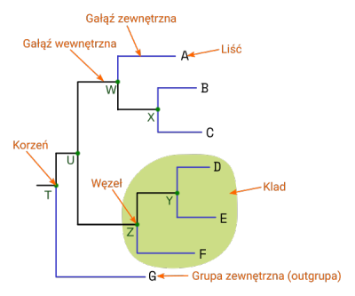
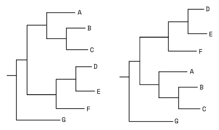
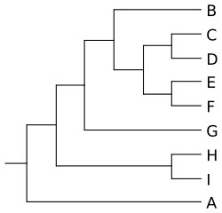
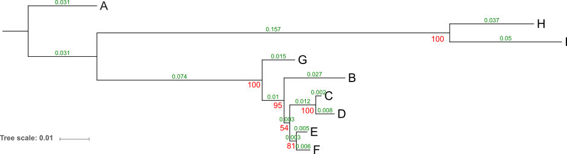
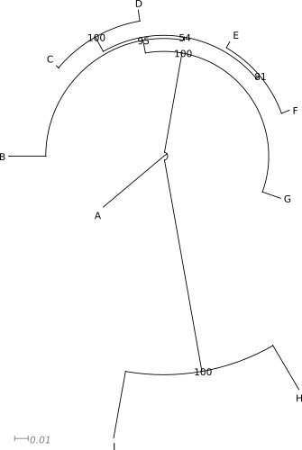
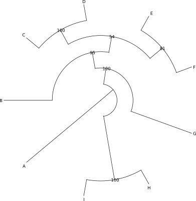
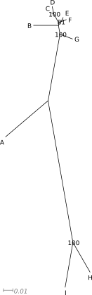

# Drzewa filogenetyczne

## Odległości ewolucyjne i macierze odległości

Dla dopasowanych sekwencji można wyliczyć macierze zawierające odległości pomiędzy wszystkimi badanymi sekwencjami. W najprostszym przypadku mogą to być liczby różnic pomiędzy nimi:

```
      A      B      C      D      E      F      G      H      I      
A	
B    112      
C    105     33      
D    102     38     9      
E    99      30     18     21      
F    97      31     19     20     9      
G    96      41     30     35     27     25      
H    96      126    116    113    113    113    108      
I    121     138    134    128    132    135    130    39      
```

Można też je przedstawić w formie różnic przypadających na jedną zasadę:

```
    A       B       C       D       E       F       G       H      I      
A	
B   0,141   
C   0,133   0,039   
D   0,129   0,045   0,011   
E   0,126   0,036   0,021   0,025   
F   0,124   0,037   0,022   0,024   0,011   
G   0,119   0,049   0,036   0,042   0,033   0,030   
H   0,160   0,203   0,188   0,183   0,183   0,183   0,177   
I   0,182   0,208   0,202   0,193   0,199   0,202   0,193   0,068   

```

Bardziej realistyczne macierze odzwierciedlające odległości ewolucyjne uwzględniają modele ewolucyjne. Na przykład macierz odległości liczona z użyciem modelu JC (Jukes-Cantor) może wyglądać tak:

```
    A       B       C       D       E       F       G       H       I       
A
B   0,157   
C   0,147   0,040	
D   0,142   0,046   0,011	
E   0,138   0,037   0,022   0,025	
F   0,135   0,038   0,023   0,024   0,011	
G   0,129   0,051   0,037   0,043   0,033   0,031   
H   0,180   0,237   0,216   0,210   0,210   0,209   0,202   
I   0,208   0,244   0,236   0,224   0,232   0,236   0,223   0,071   
	
```

Obliczanie macierzy odległości ewolucyjnych jest kluczowym krokiem przy konstruowaniu drzew filogenetycznych.

## Struktura drzewa filogenetycznego

Zanim przejdziemy do algorytmów wykorzystywanych przy konstruowaniu drzew filogenetycznych, zwanych też **dendrogramami**, przyjrzyjmy się pokrótce ich podstawowym formom i strukturze. 

Drzewa filogenetyczne najczęściej przedstawiane są w dwu formach: Ukośnej i prostokątnej.


Podstawowe elementy drzewa filogenetycznego to: liście, gałęzie i węzły.



  * **Gałęzie** pokazują związki pomiędzy nimi. Ich długość może (w zależności od rodzaju drzewa) odpowiadać zmianom w sekwencjach nagromadzonych podczas ewolucji. Można wyróżnić gałęzie wewnętrzne prowadzące do węzłów i gałęzie zewnętrzne zakończone liśćmi.
  * **Węzły** to miejsca łączenia się gałęzi - reprezentują jednostki taksonomiczne (gatunki, osobniki, odmiany itd.). Węzły wewnętrzne (nie będące liśćmi) reprezentują hipotetycznego wspólnego przodka kladu (zob. niżej)
  * **Liście** są końcowymi (terminalnymi) węzłami, odpowiadają badanym sekwencjom/taksonom

Grupa taksonów pochodzących od wspólnego przodka nazywana jest **kladem**. Niekoniecznie poszczególne klady wyróżnia się wizualnie na drzewie, ale jest to termin stosowany w opisie zależności filogenetycznych.

Wzorzec rozgałęzienia drzewa nazywany jest **topologią drzewa**. Drzewa o takiej samej topologii mogą mieć inną reprezentację graficzną, wynikającą np. z obracania gałęzi względem węzła. Przykładowo poniższe dwa drzewa mają taką samą topologię mimo innego wyglądu:



**Drzewa nieukorzenione** przedstawiają wzajemne podobieństwa ale nie pozwalają określić w jakiej kolejności poszczególne taksony się od siebie oddzielały. **Drzewa ukorzenione** posiadają węzeł, który odpowiada ostatniemu wspólnemu przodkowi badanych taksonów. Często wyznacza się go (jest to tzw. ,,ukorzenianie drzewa'') wskazując na **grupę zewnętrzną**, zwaną także **outgrupą** (ang. _outgroup_). Jest to takson (lub grupa taksonów), który jest dalej spokrewniony z pozostałymi badanymi, niż one między sobą. Innymi słowy, oddzielił się on najwcześniej podczas ewolucji. Przykładowo, gdybyśmy badali genetycznie gatunki _Homo_, grupą zewnętrzną mógłby być szympans. 

Ukorzenianie drzewa pozwala ustalić kolejność oddzielania się poszczególnych kladów i liści w toku ewolucji. Grupa zewnętrzna może być wyznaczona przez niektóre algorytmy budujące drzewo ale nie zawsze jest ona zgodna z rzeczywistym przebiegiem ewolucji. Dlatego, jeśli zależy nam na prawidłowym ukorzenieniu drzewa należy do zestawu badanych sekwencji dodać także należącą do taksonu o którym z góry wiemy, że jest outgrupą. Później, gdy otrzymamy drzewo nieukorzenione, lub ukorzenione niewłaściwie, wskazujemy w odpowiednim programie grupę zewnętrzną, dzięki czemu możemy drzewo prawidłowo ukorzenić. 

Jeśli nie mamy określonej outgrupy ale wiemy, gdzie na drzewie powinien znajdować się wspólny przodek, można ukorzenić drzew wskazując to miejsce. Na przykład jeśli drzewo zawiera sekwencje grzybów i roślin, wiemy że wspólny przodek powinien znajdować się pomiędzy tymi dwoma kladami. Ukorzeniamy zatem drzewo tam, gdzie rozdzielają się te dwie grupy organizmów. 


Jak wcześniej wspomniałem, długość gałęzi drzewa może odzwierciedlać odległość ewolucyjną badanych sekwencji, wtedy drzewo nazywamy **filogramem**. **Kladogram** natomiast pokazuje jedynie pokrewieństwa między badanymi taksonami. Wizualnie można go poznać po tym, że wszystkie gałęzie kończą się wzdłuż jednej linii (pionowej lub poziomej). 


Niektóre metody konstruowania drzew generują nie jedno, ale wiele drzew o takiej samej, lub podobnej jakości (prawdopodobieństwie). Zwykle w takich przypadkach tworzy się **drzewo konsensusowe** (uzgodnione). Jest to drzewo, które powinno odzwierciedlać wspólne cechy grupy drzew, które służą do jego tworzenia.  Do konstrukcji takiego drzewa można podejść w różny sposób. Pierwszy z nich zakłada, że rozgałęzienia dychotomiczne na drzewie konsensusowym pojawiają się wtedy, gdy znajdują się na wszystkich wyjściowych drzewach, w innym wypadku tworzone są wielokrotne rozgałęzienia. Nieco mniej rygorystyczne podejście polega na przyjęciu pewnego progu - np. jeśli dane dychotomiczne rozgałęzienie pojawi się u przynajmniej 50% drzew to jest ono umieszczane na drzewie konsensusowym.. 

## Konstruowanie drzew

Konstruowanie drzew polega na znalezieniu, na podstawie podobieństw i różnic sekwencji nukleotydów, aminokwasów czy innych cech, najbardziej prawdopodobnych pokrewieństw badanych organizmów, a także  kolejności wyodrębniania się w toku ewolucji poszczególnych taksonów.  Znanych jest szereg algorytmów wykorzystywanych w tym celu. Poniżej znajduje się krótka charakterystyka kilku z nich. 

### UPGMA (Unweighted Pair-Group Method using arithmetic Averages)

Najpierw obliczana jest macierz odległości ewolucyjnych między badanymi sekwencjami. Następnie wybierane są dwie sekwencje o najmniejszej odległości od siebie i tworzony jest między nimi węzeł a obie sekwencje traktuje się jako nową jednostkę (klaster) dla której oblicza się odległości do wszystkich pozostałych sekwencji. Najbliższą sekwencję znów łączy się z poprzednio wydzielonym klastrem i w ten sposób postępuje się aż wszystkie badane taksony zostaną połączone w drzewo. Ostatnią przyłączoną do drzewa sekwencję traktuje się jako grupę zewnętrzną. 

<!--
  * Metoda minimalnej ewolucji (ME - Minimum Evolution)
-->

### Metoda najbliższego sąsiada (NJ - Neighbor Joining)

Metoda polega na znalezieniu drzewa, które ma najmniejszą sumaryczną długość. 

Najpierw obliczana jest macierz odległości między sekwencjami. Następnie obliczane są wartości $$ Q  $$ dla każdej pary sekwencji. 

Wartość $$ Q  $$ wynosi:

$$ Q(i,j)=(n-2)d(i,j)-\sum_{k=1}^n d(i,k) - \sum_{k=1}^n d(j,k)  $$

Gdzie $$ n  $$ jest liczbą sekwencji, $$ d(i,j)  $$ jest odległością pomiędzy sekwencjami $$ i  $$ oraz $$ j  $$.

Zostaje też utworzone początkowe ,,drzewo'', w którym wszystkie sekwencje połączone są z jednym węzłem - ma więc formę gwiazdy.

W kolejnym kroku znajdywane są sekwencje pomiędzy którymi wartość $$ Q  $$ jest najmniejsza. Zostaje utworzony między nimi nowy węzeł (ancestralny) odpowiadający hipotetycznemu przodkowi. Obliczane są odległości pomiędzy połączonymi liśćmi a węzłem ancestralnym a także pomiędzy nim a pozostałymi sekwencjami. 

Znów poszukiwane są sekwencje o najmniejszych odległościach i łączone ze sobą. Operacje są powtarzane aż do utworzenia drzewa o najmniejszej długości. Nie jest ono ukorzenione.
  
### Metoda największej oszczędności (MP - Maximum Parsimony)

W metodzie największej oszczędności poszukiwane jest drzewo, którego powstanie wymagałoby najmniejszej liczby zmian w sekwencjach (brzytwa Ockhama). Czyli poszukiwane jest jak najkrótsze drzewo, które wyjaśniałoby różnice między badanymi sekwencjami.  
<!---
Według zasady MP, jeśli np. w danym miejscu `A` występuje w taksonach A i B, natomiast `T` znajdujemy u C i D to przyjmuje się, że A i B są ze sobą bliżej spokrewnione niż z C i D, które mają swojego wspólnego przodka.
-->
Metoda ta ma także także zastosowanie w budowaniu drzew na postawie cech morfologicznych, które można przedstawić jako 1 (obecna) i 0 (nieobecna).

Poszczególne kolumny w dopasowanych sekwencjach odpowiadają stanowi danej cechy. Przyjmuje się, że jeżeli w danej kolumnie występują przynajmniej dwa rodzaje nukleotydów (lub innych stanów) a każdy z nich jest obecny co najmniej dwa razy to niesie ona przydatną dla analizy informację, czyli  jest **informatywna**. W innym przypadku uznaje się ją za **nieinformatywną** i nie jest brana pod uwagę w dalszych analizach. Po zebraniu informatywnych kolumn analizuje się drzewa pod kątem znalezienia takiego, którego utworzenie można wyjaśnić zakładając jak najmniejszą liczbę zmian (mutacji).

W przeciwieństwie do poprzednio omawianych algorytmów, w tym przypadku drzewo jest nie tyle generowane co raczej wyszukiwane spośród wszystkich możliwych drzew dla danego zestawu danych. Jeśli liczba badanych sekwencji jest niewielka, można utworzyć wszystkie możliwe drzewa i obliczyć ich parametry. Dla dużych zestawów sekwencji, liczba kombinacji rośnie drastycznie, toteż wykorzystuje się różne metody heurystyczne pozwalające ograniczyć wymagane obliczenia.

### Metoda największej wiarygodności (ML - Maximum Likelihood)

Celem metody największej wiarygodności jest znalezienie najbardziej prawdopodobnego drzewa - czyli takiego, które jest najbardziej prawdopodobne dla danego zestawu sekwencji, przy uwzględnieniu przyjętego modelu ewolucji molekularnej. Podobnie jak w przypadku metody MP, generowanych jest wiele drzew z pośród których, szuka się tego, które najlepiej spełnia przyjęte założenia. 

Ocena drzewa polega w skrócie na tym, że oblicza się dla niego prawdopodobieństwa wystąpienia danego zestawu nukleotydów dla kolejnych kolumn a następnie mnoży się je (albo po transformacji logarytmicznej sumuje) uzyskując prawdopodobieństwo dla całego drzewa. Drzewo, dla którego jest ono największe, jest uznane za drzewo o największej wiarygodności. 

Metoda ta jest dość wymagająca pod względem obliczeniowym, zwłaszcza, że uwzględnia model ewolucji molekularnej. W związku z szybkim rozwojem technologii komputerowych, ta wada jest jednak z czasem coraz mniej istotna. Uwzględnianie modeli ewolucji, jest dodatkowym elementem pozwalającym na zwiększenie wiarygodności otrzymanych drzew, należy przy tym pamiętać, że przyjęcie różnych modeli może skutkować otrzymaniem różnych wyników. 

### Metody bayesowskie (Bayesian Methods)

Kluczowym elementem metod bayesowskich jest liczenie prawdopodobieństwa _a posteriori_, uwzględniającego posiadane dane. Dla dwóch różnych wydarzeń dla których szukamy związku można przedstawić je wzorem:

$$  P(B|A)={\frac {P(A|B)P(B)}{P(A|B)P(B)+P(A|B')P(B')}}={\frac {P(A|B)P(B)}{P(A)}}  $$

Gdzie:

  * $$ A  $$ i $$ B  $$ - dwa różne wydarzenia
  * $$ B'  $$ - wydarzenie alternatywne względem $$ B  $$ 
  * $$ P(B|A)  $$ - liczone prawdopodobieństwo _a posteriori_ wydarzenia $$ B  $$ jeśli się wydarzy $$ A  $$. 
  * $$ P(A|B)  $$ - prawdopodobieństwo warunkowe wydarzenia $$ A  $$ jeśli  $$ B  $$
  * $$ P(B)  $$ - prawdopodobieństwo _a priori_ wydarzenia  $$ B  $$ 
  * $$ P(B')  $$ - prawdopodobieństwo wydarzenia alternatywnego względem  $$ B  $$

Zobaczmy jak to działa na przykładzie.

Przypuśćmy, że badamy pacjenta na obecność wirusa. Test dał wynik pozytywny ale chcemy policzyć z jakim prawdopodobieństwem pacjent jest rzeczywiście zakażony. Używamy testu, który w przypadku obecności wirusa daje wynik pozytywny w 99%, natomiast u zdrowych ludzi daje (prawidłowy) wynik negatywny w 95% (czyli dla 5% mimo braku patogenu, da wynik fałszywy pozytywny). Wiemy też, że w badanej populacji odsetek osób zakażonych wynosi 2%.

  * $$ B  $$ - pacjent jest naprawdę zakażony
  * $$ B'  $$ - pacjent nie jest zakażony
  * $$ A  $$ - test dał wynik pozytywny
  * $$ P(B)  $$ - prawdopodobieństwo, że losowy człowiek jest zakażony wirusem = 0,02 
  * $$ P(B')  $$ - prawdopodobieństwo, że losowy człowiek nie jest zakażony wirusem = 0,98 
  * $$ P(B|A)  $$ - liczone przez nas prawdopodobieństwo, że pacjent jest chory jeśli test dał wynik pozytywny
  * $$ P(A|B)  $$ - prawdopodobieństwo, że test dał wynik pozytywny, jeśli pacjent jest zakażony = 0,99
  * $$ P(A|B')  $$ - prawdopodobieństwo, że test dał wynik pozytywny, jeśli pacjent nie jest zakażony = 0,05

Postawmy teraz dane do wzoru:

$$ P(B|A)={\frac {P(A|B)P(B)}{P(A|B)P(B)+P(A|B')P(B')} }= {\frac {0,99 \cdot 0,02}{0,99 \cdot 0,02 + 0,05 \cdot 0,98} } = {\frac {0,0198}{0,0198 + 0,049}} = 0,289 $$ 

Czyli wbrew temu co może nam podpowiadać intuicja, nawet jeśli w opisanej sytuacji test wyszedł pozytywnie, istnieje mniej niż 30% szans, że pacjent jest naprawdę zakażony.

Metody bayesowskie zdobyły w ostatnich latach dużą popularność jako stosunkowo szybkie i dające wiarygodne wyniki. Polegają na wyszukiwaniu najbardziej prawdopodobnych drzew dla danego zestawu sekwencji. Proces ten przebiega cyklicznie wg. schematu: Zostaje wybrane drzewo, liczone jest dla niego prawdopodobieństwo. Drzewo jest modyfikowane pod względem topologii lub długości gałęzi i liczone jest dla niego prawdopodobieństwo. Jeśli jest ono wyższe niż poprzednio, kolejny cykl zaczyna się od niego. W końcu zostaje znaleziona grupa drzew o najwyższym prawdopodobieństwie, dla których tworzone jest drzewo konsensusowe. W filogenetycznych badaniach bayesowskich przy obliczaniu prawdopodobieństw _a posteriori_ wykorzystuje się dane dotyczące topologii drzewa, długości gałęzi i modelu ewolucji molekularnej. Tak naprawdę, poszukiwanie optymalnych drzew przebiega jednocześnie wieloma ,,ścieżkami'', które od czasu do czasu wymieniają się danymi. Pozwala to uniknąć pułapki lokalnego optymalnego drzewa. 


## Szacowanie wiarygodności

Konstruowaniu drzew towarzyszy zazwyczaj szacowanie ich wiarygodności. W większości przypadków stosuje się tu metodę **bootstrap** (samopróbkowania) a dla metod bayesowskich wyliczane jest prawdopodobieństwo bayesowskie.

Samopróbkowanie w podstawowej formie polega na tym, że po utworzeniu optymalnego drzewa, z zestawu dopasowanych sekwencji losuje się kolumny zasad i tworzy się z nich kolejne zestawy ,,sekwencji'' o takiej samej długości jak sekwencje wyjściowe. Jest to losowanie ze zwracaniem, co oznacza, że te same kolumny mogą zostać wylosowane wielokrotnie a inne nie pojawiają się w ogóle w generowanych zestawach. 

Na przykład dla przyrównania:

```
0123456789
CAGTCCGATG
TAATCTGATA
TAGTTTGATA
TAGTTTGATA
TAGTTTGATA
TAGTTTGATA
```

można stworzyć m. in. takie pseudosekwencje:

```
1735320955   8327248441   3124291662
AATCTGCGCC   TTGAGCTCCA   TAGCGGAGGG
AATTTATATT   TTAAACTCCA   TAACAAAGGA
AATTTGTATT   TTGAGTTTTA   TAGTGAAGGG
AATTTGTATT   TTGAGTTTTA   TAGTGAAGGG
AATTTGTATT   TTGAGTTTTA   TAGTGAAGGG
AATTTGTATT   TTGAGTTTTA   TAGTGAAGGG itd...
```

Dla każdego ,,pseudoprzyrównania'' liczone jest drzewo w taki sam sposób jak drzewo główne, a następnie sprawdzana jest obecność poszczególnych kladów na obu drzewach. Każdemu kladowi, który występuje na drzewie oryginalnym i wygenerowanym w procesie samopróbkowania przypisywany jest punkt. Im większa suma punktów, tym dany klad na drzewie jest bardziej wiarygodny. Wartości bootstrap przedstawia się zwykle w zakresie wartości 0-100, przy węzłach, co odpowiada procentowi wygenerowanych drzew w których występował dany klad. 

Liczba bootstrapów, który jest zazwyczaj jednym z parametrów ustawianych w programach generujących drzewa, powinna wynosić minimum 100 a najlepiej osiągać 1000-2000. Ponieważ dla każdego zestawu pseudosekwencji generowane jest drzewo, w zależności od stosowanej metody, proces samopróbkowania może zająć mniej lub więcej czasu. Im metoda bardziej wymagająca obliczeniowo, tym wartości bootstrap będą liczone dłużej. 

W przypadku metody bayesowskiej, prawdopodobieństwo _a posteriori_ jest liczone przy okazji generowania drzew, wynikają z udziału drzew w których obecny jest badany klad. Ocena wiarygodności poszczególnych węzłów nie wymaga więc dodatkowych złożonych obliczeń. Jako wartości prawdopodobieństwa mieszczą się zakresie 0-1. Wartości liczone w ten sposób (przy uwzględnieniu innej skali) są zwykle wyższe niż uzyskane dla danego zestawu sekwencji za pomocą bootstrapu, należy jednak pamiętać, że wynikają one z wartości uzyskanych w dużej mierze z drzew znajdujących się blisko drzewa optymalnego i nie są to wartości w pełni porównywalne.


## Format Newick i wartości dodatkowe na drzewie

Po zakończeniu obliczeń otrzymujemy wynik zazwyczaj w formie pliku tekstowego, który jest sformatowany w taki sposób, że zawiera informacje na temat relacji pomiędzy badanymi taksonami a także inne parametry drzew (np. wartości bootstap). 


Poniżej znajduje się przykładowy plik kladogramu zapisanego w formacie `newick`.

```
((((B,((C,D),(E,F))),G),(H,I)),A);
```

Po przekształceniu go w formę graficzną uzyskujemy taki obraz:



Porównując powyższy plik w formacie `newick` z kladogramem można zrozumieć zasadę kodowania informacji w pierwszym z nich. W parze nawiasów zamykane się taksony należącego do wspólnego kladu.

W formacie `newick` można też zapisać inne dane, na przykład dotyczące długości gałęzi i wartości bootstrapu:

```
(A:0.0611905636,((B:0.0271634370,((C:0.0024799833,D:0.0082762103)100:0.011585,
(E:0.0047747513,F:0.0060564542)81:0.002943)54:0.002522)95:0.009753,
G:0.0145402289)100:0.073576,(H:0.0374628169,I:0.0498809623)100:0.157039);
```

Poniżej znajduje się odpowiedni dendrogram:



Na zielono zaznaczono długości gałęzi (odpowiadające liczbie mutacji na miejsce), zaokrąglone do trzech miejsc po przecinku.
Na czerwono wartości bootstrap. W lewym dolnym rogu widać skalę drzewa, którą można odnieść do długości gałęzi (zwłaszcza gdy ich wartości nie są zaznaczone).


## Wizualizacja drzew

Forma graficzna drzewa filogenetycznego jest znacznie bardziej przejrzysta dla człowieka niż prezentowany powyżej zapis tekstowy. Pozwała łatwo uchwycić pokrewieństwa i odległości ewolucyjne pomiędzy badanymi organizmami, choć ich prawidłowe odczytanie wymaga jednak nieco wiedzy i wprawy. 

Trzeba pamiętać, że opierając się na tych samych danych, można utworzyć bardzo różnie wyglądające drzewa. 

Poniżej znajduje się zawartość pliku w formacie `newick` opisująca drzewo i kilka przykładów je przedstawić:

```
((((B:0.027163437,((C:0.0024799833,D:0.00827621):0.011585,
(E:0.004774751,F:0.006056454):0.002943):0.002522):0.009753,G:0.014540229):0.073576,
(H:0.037462816,I:0.049880963):0.157039):0.003059528,A:0.058131035);
```







Nie ma ,,najlepszej'' formy drzewa. To jakiej należy użyć, zależy od tego co i w jaki sposób chcemy pokazać, liczby danych, rodzaju odbiorcy itp. W pewnych sytuacjach najlepiej sprawdzi się forma drzewa ,,prostokątnego'' w innej drzewo ,,okrągłe''. 

Na stronie [Interactive Tree of Life](http://itol.embl.de/itol.cgi) można znaleźć, jak sama nazwa wskazuje, ,,drzewo życia" które można modyfikować on-line, m. in. zmieniając jego formę, wyświetlane informacje itp.


